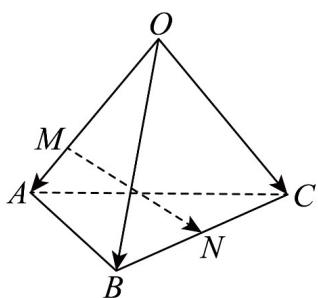
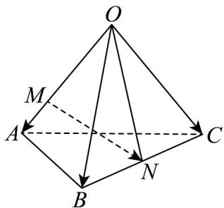

> [!faq]- 《专题1.2 空间向量基本定理（高效培优讲义）》官方解析
>
> > [!success]- **【答案】**  A. $\frac{1}{2} a - \frac{2}{3} b + \frac{1}{2} c$ B. $-\frac{2}{3} a + \frac{1}{2} b + \frac{1}{2} c$ C. $\frac{1}{2} a + \frac{1}{2} b - \frac{1}{2} c$ D. $\frac{2}{3} a + \frac{2}{3} b - \frac{1}{2} c$
>
> > [!note]- **【分析】**
> > 连接 $ON, MN = ON - OM = \frac{1}{2} \left( OB + OC \right) - \frac{2}{3} OA = -\frac{2}{3} a + \frac{1}{2} b + \frac{1}{2} c$
>
> > [!note]- **【解析】**
> > 
> >
> > 故选 **B**.
