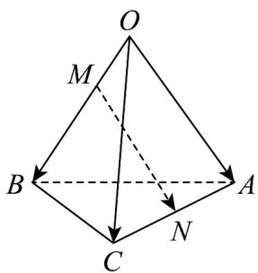

<!-- question-source:start -->
【变式2】如图，在四面体 $OABC$ 中， $OA = a, OB = b, OC = c$ . 点 $M$ 在 $OB$ 上，且 $OM = \frac{1}{2} MB$ ，点 $N$ 是 $AC$ 的

中点，则 $MN =$ （

A. $\frac{1}{2} a - \frac{1}{3} b + \frac{1}{2} c$ B. $-\frac{1}{2} a + \frac{1}{3} b - \frac{1}{2} c$ C. $\frac{1}{2} a - \frac{2}{3} b + \frac{1}{2} c$ D. $-\frac{1}{2} a + \frac{2}{3} b - \frac{1}{2} c$
<!-- question-source:end -->

![[高中/课堂同步/题库/人教A版高中数学同步讲义(2026)/03_选择性必修第一册/第一章 空间向量与立体几何/专题1.2 空间向量基本定理（高效培优讲义）/题型02_基底的运用/questions/answers/Q00079817A1.md]]
