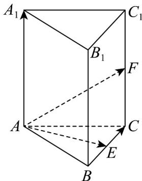

> [!faq]- 《专题1.2 空间向量基本定理（高效培优讲义）》官方解析
>
> > [!success]- **【答案】** A. 2b-c-2a B. 2a-b-2c C. 2c-2a-b D. 2a+b-2c
>
> > [!note]- **【分析】**
> > 根据给定的基底，结合几何图形表示出 $BC$
>
> > [!note]- **【解析】**
> > 在直三棱柱 $ABC-A_{1}B_{1}C_{1}$ 中，
> >
> > 故选：A
> >
> > 
