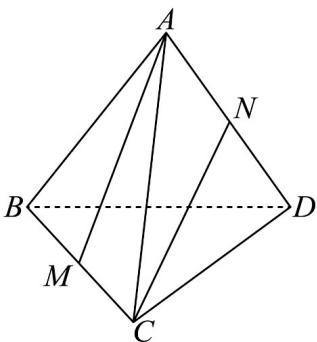

<!-- question-source:start -->
【变式2】如图，在棱长为1的正四面体（四个面都是正三角形）ABCD中，M，N分别为BC，AD的中点，
且 $\stackrel{\square\square}{MA}$ 在 $\stackrel{\square\square}{CN}$ 方向上的投影向量为 $\mu CN$ ，则 $\mu$ 的值为（）

A. $\frac{2}{3}$ B. $\frac{1}{3}$ C. $\frac{2}{5}$ D. $\frac{1}{4}$
<!-- question-source:end -->

![[高中/课堂同步/题库/人教A版高中数学同步讲义(2026)/03_选择性必修第一册/第一章 空间向量与立体几何/专题1.2 空间向量基本定理（高效培优讲义）/题型04_用空间向量基本定理解决相关的几何问题/questions/answers/Q00079825A1.md]]
