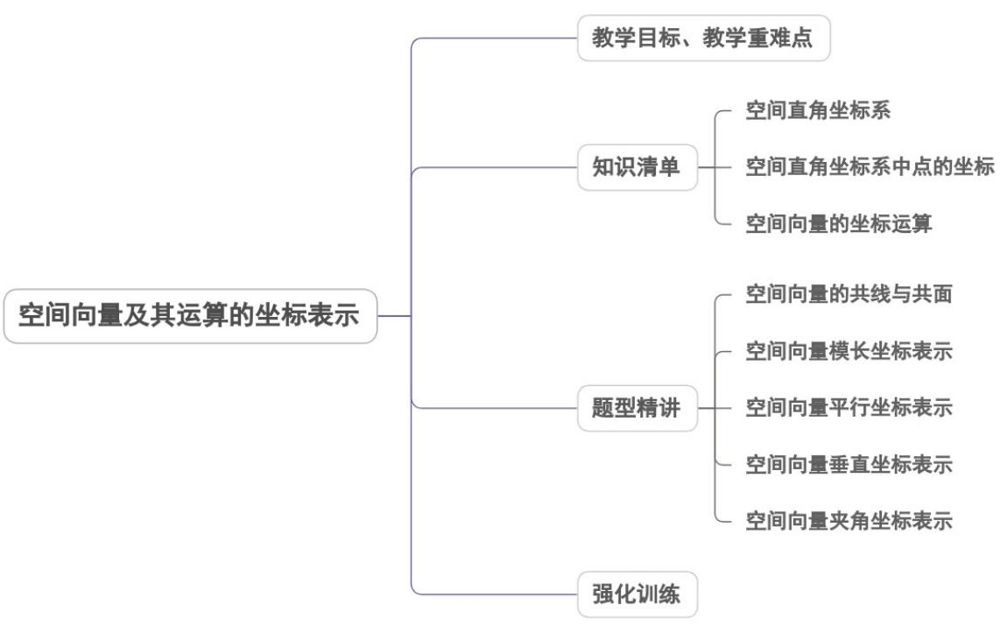

<!-- source-part:1 pages:1-36 -->

## 专题1.3 空间向量及其运算的坐标表示

## 内容概览

## 教学目标、教学重难点

<table><tr><td>教学目标</td><td>理解和掌握空间向量的坐标表示及意义,会用向量的坐标表达空间向量的相关运算.会求空间向量的夹角、长度以及有关平行、垂直的证明.</td></tr><tr><td>教学重难点</td><td>1.重点利用空间向量的坐标表示,将形与数有机结合.2.难点利用空间向量的坐标表示计算与证明是学习空间向量及运算的关键.也是解决空间几何的重要手段与工具</td></tr></table>

## 知识清单

## 知识点 01 空间直角坐标系

## 1. 空间直角坐标系

从空间某一定点 $O$ 引三条互相垂直且有相同单位长度的数轴，这样就建立了空间直角坐标系 $Oxyz$ ，点 $O$ 叫

做坐标原点，x 轴、y 轴、z 轴叫做坐标轴，这三条坐标轴中每两条确定一个坐标平面，分别是 xOy 平面、

$yOz$ 平面、 $zOx$ 平面.

## 2.右手直角坐标系

在空间直角坐标系中，让右手拇指指向 $x$ 轴的正方向，食指指向 $y$ 轴的正方向，如果中指指向 $z$ 轴的正方向，

则称这个坐标系为右手直角坐标系.

## 3. 空间点的坐标

空间一点 $A$ 的坐标可以用有序数组 $(x, y, z)$ 来表示，有序数组 $(x, y, z)$ 叫做点 $A$ 的坐标，记作 $A(x, y, z)$

其中 x 叫做点 A 的横坐标，y 叫做点 A 的纵坐标，z 叫做点 A 的竖坐标.

## 【即学即练】

1. 关于空间向量，以下说法正确的是（）

【答案】

A．若 $\left\{a,b,c\right\}$ 构成空间的一个基底，则 $a+b$ ， $a+b+c$ ，c 必共面

B．若空间中任意一点O，有 $\frac{1}{3}OP=\frac{1}{6}OA+\frac{1}{6}OB+\frac{1}{2}OC$ ，则P，A，B，C四点共面

C．若空间向量 a、b 满足 $a \cdot b < 0$ ，则 a 与 b 夹角为钝角

D．点 $M(3,2,1)$ 关于平面 yOz 对称的点的坐标是 $(-3,2,1)$

【答案】ABD

【分析】根据空间向量共面定义判断 $^{A}$ ，由共面向量定理判断 $^{B}$ ，由向量夹角的范围判断 $^{C}$ ，由空间直角坐标

系判断D.

【详解】A选项， $\left\{a,b,c\right\}$ 构成空间的一个基底，则 $a,b,c$ 不共面，

因为 $\left(a + b\right) + c = a + b + c$ ，则 $a + b$ ， $a + b + c$ ， $c$ 必共面，故A正确；

$\text{B 选项，在 } OP = \frac{1}{6} OA + \frac{1}{3} OB + \frac{1}{2} OC \quad \frac{1}{6} + \frac{1}{3} + \frac{1}{2} = 1$ ，所以 P, A, B, C 四点共面，故 $^{\text{B 正确}}$ ；

选项 $^{C}$ ，当 $a \cdot b < 0$ 时，则 $<a, b>$ 是钝角或 $180^{\circ}$ ，故 $^{C}$ 错误；

选项D，关于平面 $yOz$ 对称的点，纵坐标和竖坐标不变，横坐标变为相反数，

所以点 $M(3,2,1)$ 关于平面 $yOz$ 对称的点的坐标是 $(-3,2,1)$ ，故D正确.

故选：ABD.

2. 已知空间直角坐标系中，O 为坐标原点，点 $A(2,-5,4)$ ，则向量 OA 的坐标为（）

【答案】
A. $(2,-5,4)$ B. $(-2,5,-4)$ C. $(-2,-5,-4)$ D. $(2,5,4)$

【答案】A

【分析】根据给定条件，利用向量的坐标表示得解·

【详解】依题意， $OA = (2, - 5,4)$

故选：A

## 知识点 02 空间直角坐标系中点的坐标

## 1. 空间直角坐标系中点的坐标的求法

通过该点，作两条轴所确定平面的平行平面，此平面交另一轴于一点，交点在这条轴上的坐标就是已知点相
应的一个坐标.特殊点的坐标：原点 $(0,0,0)$ ；x,y,z轴上的点的坐标分别为 $(x,0,0),(0,y,0),(0,0,z)$ ；坐
标平面 xOy, yOz, xOz 上的点的坐标分别为 $(x,y,0),(0,y,z),(x,0,z)$ .

## 2. 空间直角坐标系中对称点的坐标

在空间直角坐标系中，点 $P(x,y,z)$ ，则有点 $P$ 关于原点的对称点是 $P_{1}(-x, - y, - z)$

点 $P$ 关于横轴 $(x$ 轴)的对称点是 $P_{2}(x, - y, - z)$ ；点 $P$ 关于纵轴 $(y$ 轴)的对称点是 $P_{3}(-x,y, - z)$

点 $P$ 关于竖轴 $(z$ 轴)的对称点是 $P_{4}(-x, - y,z)$ ；点 $P$ 关于坐标平面 $xOy$ 的对称点是 $P_{5}(x,y, - z)$

点 $P$ 关于坐标平面 $yOz$ 的对称点是 $P_{6}(-x,y,z)$ ；点 $P$ 关于坐标平面 $xOz$ 的对称点是 $P_{7}(x,-y,z)$ 。

## 【即学即练】

1. 在空间直角坐标系 $Oxyz$ 中，点 $A(0, - 1,1),B(-1, - 1, - 2)$ ，点A关于 $y$ 轴对称的点为 $C$ ，点 $B$ 关于平面 $xOz$

对称的点为 $D$ ，则向量 $CD$ 的坐标为（ ）A $(-1,2,-1)$ B $(1,-2,1)$ C $(-1,0,1)$ D $(1,0,-1)$

【答案】B

【分析】根据空间直角坐标关于坐标轴、平面的对称性性质求出 C 、 D 的坐标，即可得解

【详解】因为 $A(0,1,-1)$ ，则点 A 关于 y 轴对称的点为 $C(0,1,1)$ ，

又 $B(1,1,2)$ ，则点 B 关于平面 xOz 对称的点为 $D(1,-1,2)$ .

所以 $CD = (1, -1, 2) - (0, 1, 1) = (1, -2, 1)$ .

故选：B.

2. 已知点 $A(3, -1, 0)$ ，若向量 $AB = (2, 5, -3)$ ，则点 $B$ 的坐标是（）

【答案】
A. $(5, 4, -3)$ B. $(1, -6, 3)$ C. $(-1, 6, -3)$ D. $(2, 5, -3)$

【答案】A

【分析】根据题意，设 $B(x,y,z)$ ，再由向量AB的坐标，列出方程，即可得到结果。

【详解】设 $B(x,y,z)$ ，因为 $A(3, - 1,0)$ ，且 $\overline{AB} = (2,5, - 3)$

则 $\left\{ \begin{array}{l}x - 3 = 2\\ y + 1 = 5\\ z = -3 \end{array} \right.$ ，所以 $\left\{ \begin{array}{l}x = 5\\ y = 4\\ z = -3 \end{array} \right.$ ，即 $B(5,4, - 3)$

故选：A

## 知识点 03 空间向量的坐标运算

(1) 空间两点的距离公式

若 $A(x_{1},y_{1},z_{1}),B(x_{2},y_{2},z_{2})$ ，则① $AB = OB - OA = (x_2,y_2,z_2) - (x_1,y_1,z_1) = (x_2 - x_1,y_2 - y_1,z_2 - z_1)$

即:一个向量在直角坐标系中的坐标等于表示这个向量的有向线段的终点的坐标减去起点的坐标。

$$
| \stackrel {\square \square \square} {A B} | = \sqrt {A B ^ {2}} = \sqrt {\left(x _ {2} - x _ {1}\right) ^ {2} + \left(y _ {2} - y _ {1}\right) ^ {2} + \left(z _ {2} - z _ {1}\right) ^ {2}}, \text {或} d _ {A, B} = \sqrt {\left(x _ {2} - x _ {1}\right) ^ {2} + \left(y _ {2} - y _ {1}\right) ^ {2} + \left(z _ {2} - z _ {1}\right) ^ {2}}
$$

## (2) 空间线段中点坐标

空间中有两点 $A(x_{1},y_{1},z_{1}),B(x_{2},y_{2},z_{2})$ ，则线段 $AB$ 的中点 $C$ 的坐标为 $\left(\frac{x_1 + x_2}{2},\frac{y_1 + y_2}{2},\frac{z_1 + z_2}{2}\right)$

## (3) 向量加减法、数乘的坐标运算

若 $a = (x_{1},y_{1},z_{1}),b = (x_{2},y_{2},z_{2})$ ，则① $a + b = (x_1 + x_2,y_1 + y_2,z_1 + z_2)$ ；② $a - b = (x_{1} - x_{2},y_{1} - y_{2},z_{1} - z_{2})$ $③ \lambda a = (\lambda x_1,\lambda y_1,\lambda z_1)(\lambda \in R)$

## (4) 向量数量积的坐标运算

若 $a = (x_{1},y_{1},z_{1}),b = (x_{2},y_{2},z_{2})$ ，则 $a\cdot b = x_1x_2 + y_1y_2 + z_1z_2$ 即：空间两个向量的数量积等于他们的对应坐

标的乘积之和。

## (5) 空间向量长度及两向量夹角的坐标计算公式

$$
\text {若} a = \left(a _ {1}, a _ {2}, a _ {3}\right), b = \left(b _ {1}, b _ {2}, b _ {3}\right) \quad , \text {则(1)} | a | = \sqrt {a \cdot a} = \sqrt {a _ {1} ^ {2} + a _ {2} ^ {2} + a _ {3} ^ {2}}, | b | = \sqrt {b \cdot b} = \sqrt {b _ {1} ^ {2} + b _ {2} ^ {2} + b _ {3} ^ {2}}
$$

$$
\cos \left\langle \vec {a} \cdot \vec {b} \right\rangle = \frac {\vec {a} \cdot \vec {b} _ {\rightarrow}}{| \vec {a} | \cdot | b |} = \frac {a _ {1} b _ {1} + a _ {2} b _ {2} + a _ {3} b _ {3}}{\sqrt {a _ {1} ^ {2} + a _ {2} ^ {2} + a _ {3} ^ {2}} \cdot \sqrt {b _ {1} ^ {2} + b _ {2} ^ {2} + b _ {3} ^ {2}}} (a \neq 0, b \neq 0)
$$

## (6) 空间向量平行和垂直的条件

若 $a = (a_{1}, a_{2}, a_{3}), b = (b_{1}, b_{2}, b_{3})$ ，则

$$
a / / b \Leftrightarrow a = \lambda b \Leftrightarrow x _ {1} = \lambda x _ {2}, \quad y _ {1} = \lambda y _ {2}, z _ {1} = \lambda z _ {2} (\lambda \in R) \Leftrightarrow \frac {x _ {1}}{x _ {2}} = \frac {y _ {1}}{y _ {2}} = \frac {z _ {1}}{z _ {2}} (x _ {2} y _ {2} z _ {2} \neq 0)
$$

② $a \perp b \Leftrightarrow a \cdot b = 0 \Leftrightarrow x_{1}x_{2} + y_{1}y_{2} + z_{1}z_{2} = 0$

## 【即学即练】

1. 若空间向量 $a = (2,1,0), b = (1,0,1)$ ，则向量 $a$ 在向量 $b$ 上的投影向量的坐标是（） $\mathrm{A}_{\cdot}(4,-1,0) \quad \mathrm{B}_{\cdot}(-1,0,-1) \quad \mathrm{C}_{\cdot}(-2,1,0) \quad \mathrm{D}_{\cdot}(1,0,1)$

【答案】D

【分析】代入投影向量坐标公式，即可求解·

【详解】向量 $a$ 在向量 $b$ 上的投影向量的坐标是 $\frac{a \cdot b}{|b|^2} \cdot b = \frac{2}{2} \cdot (1, 0, 1) = (1, 0, 1)$ .

故选：D

2．已知向量 $a=(2,-1,1)$ ， $b=(1,x,1)$ ， $c=(1,-2,-1)$ ，当 $a\perp b$ 时，向量 b 在向量 c 上的投影的数量为

【答案】 $-\sqrt{6}$

【分析】由向量数量积的几何意义即可求·

【详解】向量量 $a=(2,-1,1)$ ， $b=(1,x,1)$ ， $a\perp b$ ，

所以 $a \cdot b = 2 - x + 1 = 0$ ，解得 $x = 3$ ，所以 $b = (1,3,1)$ ， $c = (1, -2, -1)$

所以向量 $b$ 在向量 $c$ 上的投影的数量为 $\left|b\right|\cos \left\langle b,c\right\rangle = \frac{\left|b\right|\left|c\right|\cos \left\langle b,c\right\rangle}{\left|c\right|} = \frac{b\cdot c}{\left|c\right|} = \frac{1 - 6 - 1}{\sqrt{1 + 4 + 1}} = -\sqrt{6}$

故答案为： $-\sqrt{6}$

## 题型精讲

![[高中/课堂同步/题库/人教A版高中数学同步讲义(2026)/03_选择性必修第一册/第一章 空间向量与立体几何/专题1.3 空间向量及其运算的坐标表示（高效培优讲义）/题型01_空间向量的共线与共面/题型01_空间向量的共线与共面.md]]
![[高中/课堂同步/题库/人教A版高中数学同步讲义(2026)/03_选择性必修第一册/第一章 空间向量与立体几何/专题1.3 空间向量及其运算的坐标表示（高效培优讲义）/题型02_空间向量模长坐标表示/题型02_空间向量模长坐标表示.md]]
![[高中/课堂同步/题库/人教A版高中数学同步讲义(2026)/03_选择性必修第一册/第一章 空间向量与立体几何/专题1.3 空间向量及其运算的坐标表示（高效培优讲义）/题型03_空间向量平行坐标表示/题型03_空间向量平行坐标表示.md]]
![[高中/课堂同步/题库/人教A版高中数学同步讲义(2026)/03_选择性必修第一册/第一章 空间向量与立体几何/专题1.3 空间向量及其运算的坐标表示（高效培优讲义）/题型04_空间向量垂直坐标表示/题型04_空间向量垂直坐标表示.md]]
![[高中/课堂同步/题库/人教A版高中数学同步讲义(2026)/03_选择性必修第一册/第一章 空间向量与立体几何/专题1.3 空间向量及其运算的坐标表示（高效培优讲义）/题型05_空间向量夹角坐标表示/题型05_空间向量夹角坐标表示.md]]
![[高中/课堂同步/题库/人教A版高中数学同步讲义(2026)/03_选择性必修第一册/第一章 空间向量与立体几何/专题1.3 空间向量及其运算的坐标表示（高效培优讲义）/强化训练/强化训练.md]]
