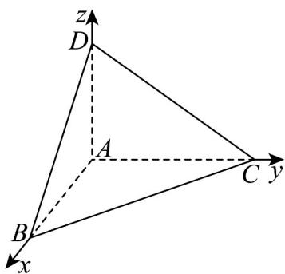

> [!faq]- 《专题1.3 空间向量及其运算的坐标表示（高效培优讲义）》官方解析
>
> > [!success]- **【答案】** C
>
> > [!note]- **【分析】**
> > 设三棱锥 A-BCD 的侧棱长为 a，依题建系，设单位向量 n 是平面 $\alpha$ 的一个法向量，可得
> >
> > $n = x\overline{AB} +y\overline{AC} +z\overline{AD}$ ，由题设条件，得到 $\left|n\cdot \overline{AB}\right| = 2$ ，代入整理得 $|x| = \frac{2}{a^2}$ ，同理 $|y| = \frac{1}{a^2},|z| = \frac{1}{a^2}$ ，利用向
> >
> > 量坐标运算求得 $\vec{n}=(\frac{2}{a},\frac{1}{a},\frac{1}{a})$ 或 $\vec{n}=(-\frac{2}{a},-\frac{1}{a},-\frac{1}{a})$ ，结合 $|n|=1$ 求出侧棱长.
>
> > [!note]- **【解析】**
> > 设三棱锥 $A - BCD$ 的侧棱长为 $a$
> >
> > 以 A 为原点， $AB, AC, AD$ 的方向分别为 x, y, z 轴的正方向建立空间直角坐标系，
> >
> > 
> >
> > 设单位向量 n 是平面 $\alpha$ 的一个法向量，由空间向量基本定理知，
> >
> > 存在唯一的有序实数组 $(x,y,z)$ ，使得 $n = xAB + yAC + zAD$
> >
> > 依题意， $\stackrel{\mathrm{AB}}{\mathrm{AB}}$ 在 $n$ 上的投影向量的长度为 2，则 $\left| n \cdot \stackrel{\mathrm{AB}}{\mathrm{AB}} \right| = 2$
> >
> > 即 $\left|\left(xAB+yAC+zAD\right)\cdot AB\right|=2$ ，即 $|x|a^{2}=2$ ，解得 $|x|=\frac{2}{a^{2}}$
> >
> > 同理得 $|y| = \frac{1}{a^2}, |z| = \frac{1}{a^2}$ ，因 $n = x(a, 0, 0) + y(0, a, 0) + z(0, 0, a) = (ax, ay, az)$ ，
> >
> > 又因 $B, C, D$ 三点在平面 $\alpha$ 的同一侧，于是 $\vec{n} = \left(\frac{2}{a}, \frac{1}{a}, \frac{1}{a}\right)$ 或 $\vec{n} = \left(-\frac{2}{a}, -\frac{1}{a}, -\frac{1}{a}\right)$ ，
> >
> > 由 $\left|\vec{n}\right|=\frac{\sqrt{2^{2}+1^{2}+1^{2}}}{a}=\frac{\sqrt{6}}{a}=1$ ，解得 $a=\sqrt{6}$
> >
> > 故选 **C**.
