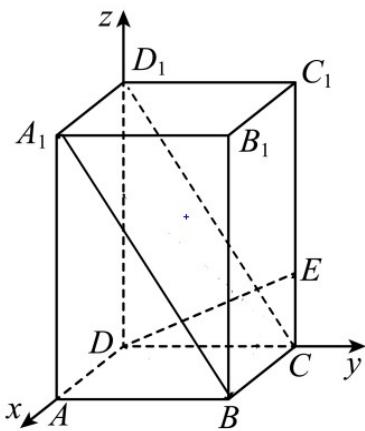

> [!faq]- 《专题1.3 空间向量及其运算的坐标表示（高效培优讲义）》官方解析
>
> > [!success]- **【答案】** $4 \sqrt{5}$
>
> > [!note]- **【分析】**
> > 建立空间直角坐标系， $\overline{CE}=\frac{1}{4}\overline{CC_{1}}$ ，写出D,E,B点的坐标，根据 $DE\perp BP$ ，利用空间数量积求解，
> >
> > 得到答案·
>
> > [!note]- **【解析】**
> > 根据题意建立如图所示空间直角坐标系， $AB=2,AA_{1}=4$ ，
> >
> > 则 $D(0,0,0), B(2,2,0)$ ,
> >
> > 由 $\overline{CE}=\frac{1}{4}\overline{CC_{1}}$ ，则 $E(0,2,1)$ ，设 $P(x,y,z)$ ，由题意可知， $0\leq x\leq2,0\leq y\leq2,0\leq z\leq4$ ，
> >
> > 则 $DE = (0,2,1)$ ， $BP = (x - 2,y - 2,z)$
> >
> > 由 $DE \perp BP$ ，则 $DE \cdot BP = 2(y - 2) + z = 0$
> >
> > 故 $P$ 的轨迹为矩形，且顶点为 $A_{1}, B, C, D_{1}$
> >
> > 又 $CD_{1}=2\sqrt{5}, BC=2$ ，故 $S=4\sqrt{5}$
> >
> > 
> >
> > 故答案为： $4\sqrt{5}$
