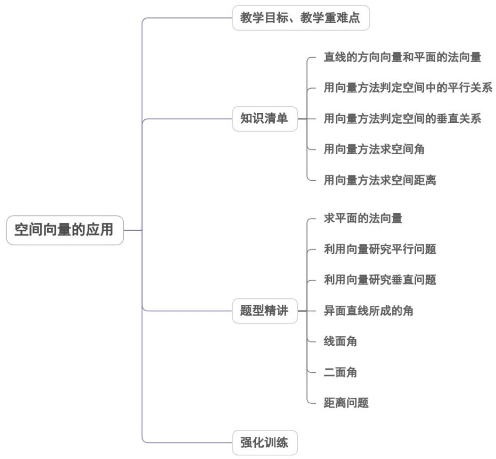
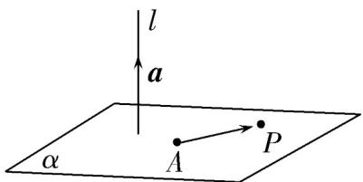
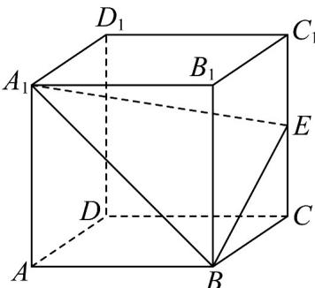
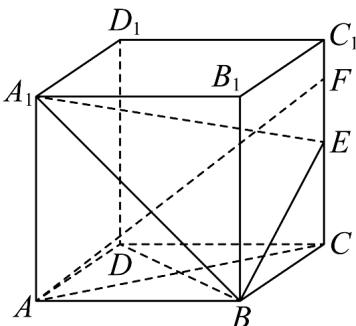
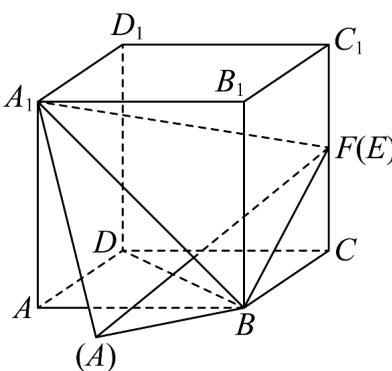
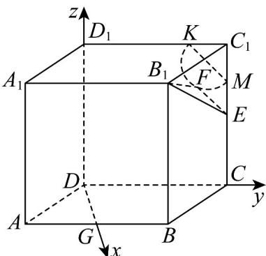
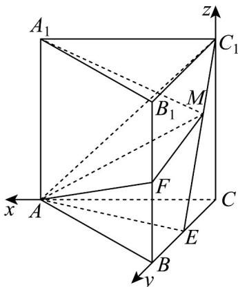
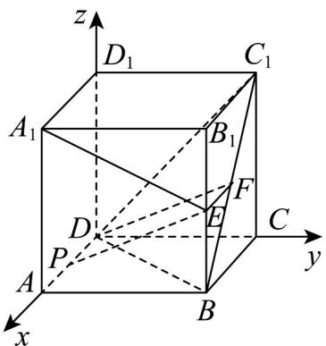

<!-- source-part:1 pages:1-50 -->

## 专题1.4 空间向量的应用

## 内容概览

教学目标、教学重难点

直线的方向向量和平面的法向量

用向量方法判定空间中的平行关系

## 教学目标、教学重难点

<table><tr><td>教学目标</td><td>1.理解与掌握直线的方向向量,平面的法向量.2.会用方向向量,法向量证明线线、线面、面面间的平行关系;会用平面法向量证明线面和面面垂直,并能用空间向量这一工具解决与平行、垂直有关的立体几问题.3.会用向量法求线线、线面、面面的夹角及与其有关的角的三角函数值;会用向量法求点点、点线、点面、线线、线面、面面之间的距离及与其有关的面积与体积.</td></tr><tr><td>教学重难点</td><td>1.重点能根据所给的条件利用空间向量这一重要工具进行空间几何体的平行、垂直关系的证明明.2.难点通过本节课的学习,提升平面向量、空间向量的知识相结合的综合能力,准确将平面向量、空间向量的概念,定理等内容与平面几何、空间立体几何有机的隔合在一起,提升解决问题的能力,将形与数,数与量有机的结合起来,为提升数学能力奠定基础.</td></tr></table>

## 知识清单

## 知识点 01 直线的方向向量和平面的法向量

## 1. 直线的方向向量：

$$
A B = a
$$

点 $A$ 是直线 $l$ 上的一个点， $a$ 是直线 $l$ 的方向向量，在直线 $l$ 上取 $AB = a$ ，取定空间中的任意一点 $O$ ，则点 $P$

在直线 l 上的充要条件是存在实数 t，使 $OP = OA + ta$ 或 $OP = OA + tAB$ ，这就是空间直线的向量表达式.

## 2. 平面的法向量定义：

直线 $l \perp \alpha$ ，取直线 $l$ 的方向向量 $a$ ，我们称向量 $a$ 为平面 $\alpha$ 的法向量。给定一个点 $A$ 和一个向量 $a$ ，那么过点

A，且以向量 a 为法向量的平面完全确定，可以表示为集合 $\left\{P \mid a \cdot AP = 0\right\}$ .

3. 平面的法向量确定通常有两种方法：

（1）几何体中有具体的直线与平面垂直，只需证明线面垂直，取该垂线的方向向量即得平面的法向量；

(2) 几何体中没有具体的直线，一般要建立空间直角坐标系，然后用待定系数法求解，一般步骤如下：

(i) 设出平面的法向量为 $n = (x, y, z)$ ;

(ii) 找出（求出）平面内的两个不共线的向量的坐标 $a = (a_{1}, b_{1}, c_{1})$ ， $b = (a_{2}, b_{2}, c_{2})$ ;

(iii) 根据法向量的定义建立关于 $x$ 、 $y$ 、 $z$ 的方程 $\left\{ \begin{array}{l} n \cdot \underline{a} = 0 \\ n \cdot b = 0 \end{array} \right.$ ;

(iv) 解方程组，取其中的一个解，即得法向量。由于一个平面的法向量有无数个，故可在代入方程组的解

中取一个最简单的作为平面的法向量.

## 【即学即练】

1. 已知空间中，点 $A(1,2,-1), B(-2,1,-1), C(-1,2,0)$ ，则平面 $ABC$ 的一个法向量为（） $\mathrm{A}_{\cdot}(2,1,3)$ $\mathrm{B}_{\cdot}(1,-3,2)$ $\mathrm{C}_{\cdot}(1,3,2)$ $\mathrm{D}_{\cdot}(-1,2,2)$

【答案】B

【分析】求出 $AB$ ， $AC$ ，设平面 $ABC$ 的一个法向量为 $n = (x, y, z)$ ，由 $n \perp AB$ ， $n \perp AC$ ，列方程组，解方程

即可得出答案·

【详解】由题 $AB = (-3, -1, 0)$ ， $AC = (-2, 0, 1)$

设平面 ABC 的一个法向量为 $\stackrel{\Gamma}{n} = (x, y, z)$

则 $\left\{ \begin{array}{l}n\perp AB\\ n\perp AC \end{array} \right.\Rightarrow \left\{ \begin{array}{l}n\cdot AB = 0\\ n\cdot AC = 0 \end{array} \right.\Rightarrow \left\{ \begin{array}{l} - 3x - y = 0\\ -2x + z = 0 \end{array} \right.,$

令 x=1 ，y=-3,z=2 ，得 $n=(1,-3,2)$ .

故选：B.

2．在空间直角坐标系中，O 为坐标原点，P 为其内一点， $A(1,1,2), B(-2,1,0)$ ，平面 $PAB \perp$ 平面 OAB，则平

面 $PAB$ 的一个法向量可以为：（ ）．A. $(-5,24,21)$ B. $(-6,10,9)$ C. $(-7,11,13)$ D. $(-8,13,12)$

【答案】D

【分析】设 $\overline{OQ} = \lambda \overline{OA} + \mu \overline{OB}$ ， $\overline{OQ}$ 为平面 PAB 的法向量，由面面垂直的性质定理得 $OQ \perp AB$ ，列式求出 $\lambda,\mu$ 得解·

【详解】设 $Q$ 为空间内一点，且 $\overline{O} Q = \lambda \overline{OA} +\mu \overline{OB} = (\lambda -2\mu ,\lambda +\mu ,2\lambda)$

由于平面 $PAB \perp$ 平面 OAB ，所以平面 PAB 的法向量垂直 AB 且平行平面 OAB （或在平面 OAB 内部），

故不妨取 $OQ$ 为其法向量，则 $OQ \perp AB$ ， $AB = (-3,0,-2)$

所以 $\stackrel{\square\square}{O}Q\cdot\stackrel{\square\square}{A}B=0\Rightarrow6\mu=7\lambda$ ，取 $\lambda=6,\mu=7$ 代入 $\stackrel{\square\square}{O}Q$ 得到 $\stackrel{\square\square}{O}Q=(-8,13,12)$ ，故 D 正确.

故选：D.

## 知识点 02 用向量方法判定空间中的平行关系

空间中的平行关系主要是指：线线平行、线面平行、面面平行。

(1) 线线平行设直线 $l_{1}, l_{2}$ 的方向向量分别是 $a, b$ ，则要证明 $l_{1} // l_{2}$ ，只需证明 $a // b$ ，即 $a = kb (k \in \mathbf{R})$

(2) 线面平行 线面平行的判定方法一般有三种：

①设直线 $l$ 的方向向量是 $a$ ，平面 $\alpha$ 的向量是 $u$ ，则要证明 $l / / \alpha$ ，只需证明 $a \perp u$ ，即 $a \cdot u = 0$ ：

② 根据线面平行的判定定理：要证明一条直线和一个平面平行，可以在平面内找一个向量与已知直线的方向

向量是共线向量.

③根据共面向量定理可知，要证明一条直线和一个平面平行，只要证明这条直线的方向向量能够用平面内两

个不共线向量线性表示即可.

(3) 面面平行①由面面平行的判定定理，要证明面面平行，只要转化为相应的线面平行、线线平行即可.

②若能求出平面 $\alpha$ ， $\beta$ 的法向量 $u, v$ ，则要证明 $\alpha // \beta$ ，只需证明 $u // v$ 。

【即学即练】

1. 在直四棱柱 $ABCD - A_{1}B_{1}C_{1}D_{1}$ 中，底面 $ABCD$ 是菱形， $\angle BAD = \frac{\pi}{3}$ ， $AB = AA_{1} = 2$ ， $E$ 为 $CC_{1}$ 的中点，点 $F$

满足 $\stackrel{\square\square\square\square}{DF}=\lambda\stackrel{\square\square\square\square}{DC}+\mu\stackrel{\square\square\square\square\square}{DD_{1}}$ ， $\lambda\in[0,1]$ ， $\mu\in[0,1]$ ，下列结论正确的是（）

A. 若 $\lambda = 1$ ，则 $AF \perp BD$

B．若 $\lambda + \mu = 1$ ，则四面体 $A_{1} - BEF$ 的体积是定值

C．若 $\lambda=1,\quad\mu=\frac{1}{2}$ ，则存在点 $P\in A_{1}B$ ，使得 $AP+PF$ 的最小值为 $9+2\sqrt{10}$

D．若 $B_{1}F\perp EF$ ，则点F的轨迹长为 $\frac{\sqrt{2}}{2}\pi$

【答案】ABD

【分析】若 $\lambda=1$ ，则 F 在 $CC_{1}$ 上，利用线面垂直的判定定理、性质定理可判断 A；若 $\lambda+\mu=1$ ，则 F, C, $D_{1}$ 三

点共线，利用线面平行的判定定理得出 $CD_{1} / /$ 平面 $A_{1}BE$ ，得 $CD_{1}$ 上的点到平面 $A_{1}BE$ 的距离都相等，再由

$V_{A_1 - BEF} = V_{F - A_1BE} = V_{C - A_1BE} = V_{A_1 - BCE}$ ，可判断B；若 $\lambda = 1$ ， $\mu = \frac{1}{2}$ ，则点 $F$ 与 $E$ 点重合，把 $\triangle A_1AB$ 沿着 $A_{1}B$ 进行

翻折，使得 $A_{1}, A, B_{1}, F$ 四点共面，此时 $AP + PF$ 有最小值 $AF$ ，由余弦定理可判断 ${}^{\mathsf{C}}$ ；取 $AB$ 的中点 $G$ ，以 $D$

为原点，分别以 $DG, DC, DD_{1}$ 所在的直线为 $x, y, z$ 轴建立空间直角坐标系，设 $F(0, y, z)$ 利用 $\overline{B}_{1}F \cdot EF = 0$ 可判

断 $^{D}$ 正确·

【详解】对于 A，若 $\lambda=1$ ，则 $\overline{DF}-\overline{DC}=\overline{CF}=\mu\overline{DD}_{1}$ ，即 F 在 $CC_{1}$ 上，

连接 AF, BD, AC，因为底面 ABCD 是菱形，所以 $AC \perp BD$

因为 $CC_{1} \perp$ 底面ABCD， $BD \subset$ 平面ABCD，所以 $CC_{1} \perp BD$

又 $AC \cap CC_{1} = C$ ， $AC, CC_{1} \subset$ 平面 $ACF$ ，所以 $BD \perp$ 平面 $ACF$

$AF \subset$ 平面 $ACF$ ，所以 $AF \perp BD$ ，故 $^{A}$ 正确；

对于 B，若 $\lambda + \mu = 1$ ，则 F, C, $D_{1}$ 三点共线，连接 $CD_{1}, A_{1}F, BF, EF, A_{1}C$

因为 $A_{1}D_{1}//BC, A_{1}D_{1}=BC$ ，所以四边形 $A_{1}D_{1}CB$ 是平行四边形， $A_{1}B//CD_{1}$

因为 $CD_{1} \not\subset$ 平面 $A_{1}BE$ ， $A_{1}B \subset$ 平面 $A_{1}BE$ ，所以 $CD_{1} //$ 平面 $A_{1}BE$ ，

可得 $CD_{1}$ 上的点到平面 $A_{1}BE$ 的距离都相等，

可得 $V_{A_1 - BEF} = V_{F - A_1BE} = V_{C - A_1BE} = V_{A_1 - BCE}$ ，取 $AD$ 的中点 $N$ ，连接 $BN,BD$

可得 $\triangle ABD$ 是边长为 $2$ 的等边三角形， $BN \perp AD$

又 $A_{1}A \perp$ 平面ABCD， $BN \subset$ 平面ABCD，所以 $A_{1}A \perp BN$ ，又 $A_{1}A \cap AD = A$

$A_{1}A, AD \subset A_{1}D_{1}DA$ 平面，可得 $BN \perp$ 平面 $A_{1}D_{1}DA$

$BN \perp$ 平面 $B_{1}C_{1}CB$ ，因为 $S_{\triangle BCE} = \frac{1}{2} BC \times CE = 1$ ，

$V_{A_{1}-BCE}=\frac{1}{3}S_{\triangle BCE}\times BN=\frac{1}{2}\times\sqrt{3}=\frac{\sqrt{3}}{2}$ ，可得 $V_{A_{1}-BEF}=\frac{\sqrt{3}}{2}$ ，故 $^{B}$ 正确；

对于 C，若 $\lambda=1$ ， $\mu=\frac{1}{2}$ ，则 $\overline{DF}=\overline{DC}+\frac{1}{2}\overline{DD}_{1}$ ，即 $\overline{DF}-\overline{DC}=\overline{CF}=\frac{1}{2}\overline{DD}_{1}$

即点 $F$ 与 $E$ 点重合，把 $\triangle A_{1}AB$ 沿着 $A_{1}B$ 进行翻折，使得 $A_{1}, A, B_{1}, F$ 四点共面，

此时 $AP + PF$ 有最小值 $AF$ ，在 $\triangle A_{1}FB$ 中， $A_{1}A = \sqrt{13}, BF = \sqrt{5}, A_{1}B = 2\sqrt{2}$

所以 $A_{1}F^{2} = A_{1}B^{2} + BF^{2}$ ，所以 $\angle A_1BF = \frac{\pi}{2}$ ，所以 $\angle ABF = \frac{3\pi}{4}$

在 $\triangle AFB$ 中，由余弦定理得 $\cos \angle ABF = \frac{AB^2 + BF^2 - AF^2}{2AB\times BF} = \frac{4 + 5 - AF^2}{4\sqrt{5}} = -\frac{\sqrt{2}}{2}$

解得 $AF = \sqrt{9 + 2\sqrt{10}}$ ，故 C 错误；

对于 $\mathsf{D}$ ，取 $AB$ 的中点 $G$ ，连接 $DG$ ， $AD = 2, AG = 1, \angle DAB = \frac{\pi}{3}$

由余弦定理得 $DG = \sqrt{3}$ ，则 $DG \perp AB$ ，以 $D$ 为原点，分别以 $DG, DC, DD_{1}$ 所在的直线为 $x, y, z$ 轴建立空间直角坐标系，设 $F(0, y, z)$ ， $B_1(\sqrt{3}, 1, 2), E(0, 2, 1)$ ， $B_1F = (-\sqrt{3}, y - 1, z - 2), EF = (0, y - 2, z - 1)$ ，因为 $B_1F \perp EF$ ，所以 $B_1F \cdot EF = (y - 1)(y - 2) + (z - 1)(z - 2) = 0$ ，即 $\left(y - \frac{3}{2}\right)^2 + \left(z - \frac{3}{2}\right)^2 = \frac{1}{2}$ ，可得点 $F$ 的轨迹是在平面 $DCC_1D_1$ 内，以 $\left(0, \frac{3}{2}, \frac{3}{2}\right)$ 为圆心， $\frac{\sqrt{2}}{2}$ 为半径的半圆，且 $C_1K = C_1M = \frac{1}{2}$ ，所以点 $F$ 的轨迹长为 $2\pi \times \frac{\sqrt{2}}{2} \times \frac{1}{2} = \frac{\sqrt{2}}{2}\pi$ ，故 D 正确。

故选：ABD.

2. 已知点 $A(1,0,1)$ ，点 $B(3,4,-1)$ ，平面 $\alpha$ 的一个法向量为 $n = (1,2,-1)$ ，则直线 $AB$ 与平面 $\alpha$ 的关系是（）

【答案】
A. $AB \perp \alpha$ B. $AB \subset \alpha$ C. $AB // \alpha$ D. $AB$ 与 $\alpha$ 相交但不垂直

【答案】A
【分析】根据平面 $\alpha$ 的法向量与直线 AB 的方向向量的关系即可求解
【详解】因为直线 l 经过点 $A(1,0,1), B(3,4,-1)$ ，
所以 $\overline{AB} = (2, 4, -2)$ ，又因为平面 $\alpha$ 的一个法向量为 $n = (1, 2, -1)$ ，

且 $2n = AB$ ，所以平面 $\alpha$ 的一个法向量与直线 $l$ 的方向向量平行，

则 $l \perp \alpha$ ， $AB \perp \alpha$ ；

故选：A.

## 知识点 03 用向量方法判定空间的垂直关系

空间中的垂直关系主要是指：线线垂直、线面垂直、面面垂直。

(1) 线线垂直设直线 $l_{1}, l_{2}$ 的方向向量分别为 $a, b$ ，则要证明 $l_{1} \perp l_{2}$ ，只需证明 $a \perp b$ ，即 $a \cdot b = 0$

(2) 线面垂直①设直线 $l$ 的方向向量是 $a$ ，平面 $\alpha$ 的向量是 $u$ ，则要证明 $l \perp \alpha$ ，只需证明 $a // u$ 。

②根据线面垂直的判定定理转化为直线与平面内的两条相交直线垂直.

## (3) 面面垂直

①根据面面垂直的判定定理转化为证相应的线面垂直、线线垂直．②证明两个平面的法向量互相垂直．

【即学即练】

1. 已知平面 $\alpha$ 的法向量为 $n = (1,2,-1), AB = (2,4-2)$ ，则直线 $AB$ 和平面 $\alpha$ 的位置关系是（ ）A. $AB \perp \alpha$ B. $AB // \alpha$ C. $AB \subset \alpha$ D. $AB$ 与 $\alpha$ 相交但不垂直

【答案】A

【分析】得出 $AB//n$ ，即可判断·

【详解】由题意得， $AB=2n$ ，则 $AB//n$ ，则 $AB\perp\alpha$ 。

故选：A

2．如图，四棱锥 P-ABCD 中，BC//AD，AD=CD=2BC=2，平面 PAD⊥平面 PBC.

(1)若 $PB \perp BC$ ，证明： $AP \perp BP$ ；

(2)若 $PA \perp PC$ ， $\angle BCD = \frac{\pi}{3}$ ，求 $PA$ 长度的取值范围.

【答案】(1)证明见详解；

(2) $(0,\sqrt{3})\cup(3,2\sqrt{3})$ .

【分析】（1）通过证明 $PB$ 垂直平面 $PAD$ 与平面 $PBC$ 的交线，利用平面与平面垂直的性质定理来证明线面

垂直，再利用线面垂直的性质定理证得两直线垂直；

(2) 建立空间直角坐标系，将垂直关系、线段长度都转化成坐标运算，设 $P(a,b,c)$ ，通过 $PA \perp PC$ 解得 a = 2

或-1，分别代入计算可得结果·

【详解】（1）设平面 $ADP \cap$ 平面 BCP = l，

∵ BC ∥ AD, AD ⊂ ADP, BC ∉ 平面 ADP, ∴ BC ∥ 平面 ADP

又∵ $BC \subset$ 平面 BCP ，平面 $ADP \cap$ 平面 BCP = l ，∴ $BC \parallel l$

$$
\because P B \perp B C, B C \parallel l \quad \therefore P B \perp l
$$

又∵平面 $ADP \perp$ 平面 BCP ，平面 $ADP \cap$ 平面 $BCP = l, PB \subset$ 平面 BCP ，

$\therefore PB \perp$ 平面 ADP

又∵ $AP \subset$ 平面 ADP ，

$$
\therefore P B \perp A P _ {\text {即}} A P \perp B P.
$$

(2) 在 $\triangle BCD$ 中由余弦定理可得 $BD = \sqrt{3}$ ，则有 $BD^{2} + BC^{2} = CD^{2}$ ，

$$
\therefore \angle C B D = \frac {\pi}{2}, _ {\text {即}} D B \perp B C.
$$

又∵ BC // AD, ∴ DB ⊥ AD.

以点 D 为原点，以 DA, DB，平面 ABCD 的垂线所在直线分别为 x, y, z 轴，建立如图坐标系，则 $A(2,0,0), B(0,\sqrt{3},0), C(-1,\sqrt{3},0)$

设 $P(a,b,c)$ ，则 $DP=(a,b,c)$ ， $DA=(2,0,0)$ ，

设平面 PAD 的一个法向量为 $n_{1}=(x,y,z)$

则 $\left\{ \begin{array}{l} n_{1} \cdot D A = 0 \\ n_{1} \cdot DP = 0 \end{array} \right.$ ，即 $\left\{ \begin{array}{l} 2x = 0 \\ ax + by + cz = 0 \end{array} \right.$ ，令 $y = c$ ，则 $n_{1}^{u} = (0, c, -b)$ .

同理可求平面 $PBC$ 的一个法向量为 $\overline{n_2} = (0, c, \sqrt{3} - b)$

由于平面 $PAD \perp$ 平面 $PBC$ ，则 $n_1 \cdot n_2 = 0$ ，故 $c^2 + b(b - \sqrt{3}) = 0$ ，则 $b \in (0, \sqrt{3})$ .

又∵ $PA \perp PC$ ， $\overset{\sqcup\sqcup\sqcup}{PA} = (2 - a, -b, -c), \overset{\sqcup\sqcup\sqcup}{PC} = (-1 - a, \sqrt{3} - b, -c)$

$\therefore PA \cdot PC = (a - 2)(a + 1) + b(b - \sqrt{3}) + c^{2} = 0$ ，解得 a = 2 或 -1.

若 $a = 2$ ，则 $PA = \sqrt{b^2 + c^2} = \sqrt{\sqrt{3}b}\in (0,\sqrt{3})$

若 a = -1 ，则 $PA = \sqrt{9 + b^{2} + c^{2}} = \sqrt{9 + \sqrt{3}b} \in (3, 2\sqrt{3})$ .

综上所述，PA 长度的取值范围 $\left(0,\sqrt{3}\right)\cup\left(3,2\sqrt{3}\right)$ .

## 知识点 04 用向量方法求空间角

## (1) 求异面直线所成的角

已知 a, b 为两异面直线，A, C 与 B, D 分别是 a, b 上的任意两点，a, b 所成的角为 $\theta$ ,

则 $\cos\theta=\frac{\left|\begin{matrix}AC\cdot BD\\ \end{matrix}\right|}{\left|\begin{matrix}AC\end{matrix}\right|\cdot\left|\begin{matrix}BD\end{matrix}\right|}$

## (2) 求直线和平面所成的角

设直线 $l$ 的方向向量为 $a$ ，平面 $\alpha$ 的法向量为 $u$ ，直线与平面所成的角为 $\theta$ ， $a$ 与 $u$ 的角为 $\varphi$

则有 $\sin \theta = |\cos \varphi| = \frac{|a\cdot u|}{|a|\cdot|u|}$

## (3) 求二面角

如图，若 $PA \perp \alpha$ 于 $A, PB \perp \beta$ 于 $B$ ，平面 $PAB$ 交 $l$ 于 $E$ ，则 $\angle AEB$ 为二面角 $\alpha - l - \beta$ 的平面角， $\angle AEB + \angle APB = 180^{\circ}$

若 $n_{1}, n_{2}$ 分别为面 $\alpha, \beta$ 的法向量， $\cos\left\langle\vec{n}_{1}, n_{2}\right\rangle = \frac{\vec{n}_{1} \cdot \vec{n}_{2}}{\left|\vec{n}_{1}\right| \cdot \left|\vec{n}_{2}\right|}$ 则二面角的平面角 $\angle AEB = \left\langle\vec{n}_{1}, n_{2}\right\rangle$ 或 $\pi - \left\langle\vec{n}_{1}, n_{2}\right\rangle$

即二面角 $\theta$ 等于它的两个面的法向量的夹角或夹角的补角.

①当法向量 $n_{1}$ 与 $n_{2}$ 的方向分别指向二面角的内侧与外侧时，二面角 $\theta$ 的大小等于 $n_{1}, n_{2}$ 的夹角 $\left\langle n_{1}, n_{2} \right\rangle$ 的大小.

②当法向量 $n_{1},n_{2}$ 的方向同时指向二面角的内侧或外侧时，二面角 $\theta$ 的大小等于 $n_{1},n_{2}$ 的夹角的补角 $\pi-\left\langle n_{1},n_{2}\right\rangle$

的大小.

## 【即学即练】

1. 在三棱锥 $P - ABC$ 中， $AC \perp BC$ ， $AP \perp CP$ ， $AP = CP = 2$ ， $D$ 是 $AB$ 的中点，且平面 $PAC \perp$ 平面 $ABC$ .

(1)证明： $AP\bot$ 平面 $BCP$ ；

(2)已知平面 $\alpha$ 经过直线 $PC$ ，且 $AB // \alpha$ ，直线 $PD$ 与平面 $\alpha$ 所成角的正弦值为 $\overline{3}$ ，求三棱锥 $P - ABC$ 的体积·

$$
\frac {\sqrt {6}}{3}
$$

【答案】(1)证明见解析

(2) $\frac{4}{3}$ 或 $\frac{4}{3}\sqrt{2}$

【分析】（1）由平面 $PAC \perp$ 平面 ABC，得到 $BC \perp$ 平面 PAC，再结合 $AP \perp CP$ 即可求证；

(2) 建系，设 $BC = 2m$ 求得平面法向量及直线方向向量，代入夹角公式即可求解 $m$ ，利用体积公式计计算

得出结果·

【详解】（1）因为平面 $PAC \perp$ 平面 $ABC$ ，平面 $PAC \cap$ 平面 $ABC = AC, BC \subset$ 平面 $ABC, AC \perp BC$

所以 $BC \perp$ 平面 PAC .

又 $AP \subset$ 平面 $PAC$ ，所以 $BC \perp AP$ 。

又 $AP \perp CP, BC, CP \subset$ 平面 $BCP, BC \cap CP = C$

所以 $AP \perp$ 平面 BCP .

(2) 记 AC 的中点为 O，连接 PO,DO

因为 $AP = CP$ ，所以 $PO \perp AC$

因为平面 $PAC \perp$ 平面 ABC ，所以 $PO \perp$ 平面 ABC .

因为 O, D 分别是 AC, AB 的中点，所以 $OD \parallel BC$ ，又 $BC \perp AC$ ，所以 $OD \perp AC$ 。

以 O 为坐标原点，OA,OD,OP 所在直线分别为 x,y,z 轴，建立如图所示的空间直角坐标系

设 $BC = 2m$ ，则 $A\left(\sqrt{2},0,0\right),B\left(-\sqrt{2},2m,0\right),C\left(-\sqrt{2},0,0\right),P\left(0,0,\sqrt{2}\right),D\left(0,m,0\right)$

所以 $\overline{PD}=\left(0,m,-\sqrt{2}\right),\overline{CP}=\left(\sqrt{2},0,\sqrt{2}\right),\overline{AB}=\left(-2\sqrt{2},2m,0\right)$

由题知 $AB / / \alpha, PC \subset \alpha$ ，设平面 $\alpha$ 的法向量为 $n = (x, y, z)$

则 $\left\{ \begin{array}{l} n \cdot \overline{CP} = 0, \\ n \cdot AB = 0, \end{array} \right.$ 即 $\left\{ \begin{array}{l} \sqrt{2} x + \sqrt{2} z = 0, \\ -2\sqrt{2} x + 2my = 0, \end{array} \right.$ 令 $x = m$ ，则 $y = \sqrt{2}, z = -m$ ，则 $n = (m, \sqrt{2}, -m)$ .

则 $\left|\cos\vec{P}PD,n\vec{P}\right|=\frac{\left|\overrightarrow{PD}\cdot n\right|}{\left|PD\right|\left|n\right|}=\frac{2\sqrt{2}m}{\sqrt{m^{2}+2}\times\sqrt{2m^{2}+2}}=\frac{\sqrt{6}}{3}$

化简可得 $m^{4}-3m^{2}+2=0$ ，解得 m=1 或 $m=\sqrt{2}$ ，

三棱锥 $P - ABC$ 的体积 $V = \frac{1}{3} PO \cdot S_{\triangle ABC} = \frac{4}{3} m$ ，所以体积为 $\frac{4}{3}$ 或 $\frac{4}{3}\sqrt{2}$

2．如图，在直三棱柱 $ABC-A_{1}B_{1}C_{1}$ 中， $AC=BC=CC_{1}=2,AC\perp BC,E,F$ 分别为 $BC,BB_{1}$ 的中点.

(1)证明： $C_1E\perp$ 平面 $ACF$

(2)在线段 $EC_{1}$ 上是否存在点 $M$ ，使得直线 $A_{1}M$ 与平面 $AC_{1}E$ 所成角的正弦值为 $\frac{2}{21}\sqrt{14}$ ?若存在，求平面 $AFM$

与平面 $AC_{1}E$ 夹角的余弦值；若不存在，请说明理由·

【答案】(1)证明见解析

(2)存在， $\frac{\sqrt{30}}{10}$

【分析】（1）根据给定条件，以 $C$ 为原点建立空间直角坐标系，利用空间位置关系的向量证明推理得证

(2) 求出平面 $AC_{1}E$ 的法向量，利用线面角的向量求法求出点 M 坐标，再求出平面 AFM 的法向量，利用面

面角的向量求法求解·

【详解】（1）在直三棱柱 $ABC-A_{1}B_{1}C_{1}$ 中， $AC\perp BC$ ，则直线CA,CB, $CC_{1}$ 两两垂直，

以 C 为原点，直线 $CA, CB, CC_{1}$ 分别为 x, y, z 轴建立空间直角坐标系，

则 $A(2,0,0),B(0,2,0),C(0,0,0),A_{1}(2,0,2),B_{1}(0,2,2),C_{1}(0,0,2),E(0,1,0),F(0,2,1)$

$$
\stackrel {{\square \square \square}} {{C _ {1} E}} = (0, 1, - 2), \stackrel {{\square \square \square}} {{A C}} = (- 2, 0, 0), \stackrel {{\square \square \square}} {{A F}} = (- 2, 2, 1)
$$

于是 $C_1E \cdot AC = 0 \times (-2) + 1 \times 0 + (-2) \times 0 = 0$ ， $C_1E \perp AC$

$$
C _ {1} E \cdot A F = 0 \times (- 2) + 1 \times 2 + (- 2) \times 1 = 0 \quad C _ {1} E \perp A F
$$

而 AC 和 AF 是平面 ACF 内两条相交直线，

所以 $C_{1}E \perp$ 平面 ACF.

(2) 设点 M 存在， $EM = tEC_{1} = (0, -t, 2t)$ ， $M(0, 1 - t, 2t), t \in [0, 1]$

$$
\stackrel {{\square \square \square}} {{A _ {1} M}} = (- 2, 1 - t, 2 t - 2), \stackrel {{\square \square \square}} {{A C _ {1}}} = (- 2, 0, 2), \stackrel {{\square \square \square}} {{A E}} = (- 2, 1, 0)
$$

设平面 $AC_{1}E$ 法向量为 $n = (x,y,z)$ ，则 $\left\{ \begin{array}{l} n \cdot AC_{1} = -2x + 2z = 0 \\ n \cdot AE = -2x + y = 0 \end{array} \right.$ ，

取 x=1 ，得 $n=(1,2,1)$

设 $A_{1}M$ 与平面 $AC_{1}E$ 所成角为 $\theta$ ， $\sin\theta=\frac{\left|\overrightarrow{A}\overrightarrow{M}\cdot\overrightarrow{n}\right|}{\left|A_{1}M\right|\left|n\right|}=\frac{2}{\sqrt{4+(1-t)^{2}+(2t-2)^{2}}\cdot\sqrt{6}}$

由 $\frac{2}{\sqrt{4+(1-t)^{2}+(2t-2)^{2}}\cdot\sqrt{6}}=\frac{2}{21}\sqrt{14}$ ，解得 $t=\frac{1}{2}$ ，

即 M 为 $EC_{1}$ 中点，坐标为 $(0, \frac{1}{2}, 1)$ ，

$\overline{AM} = (-2, \frac{1}{2}, 1), \overline{AF} = (-2, 2, 1)$ ，设面 $AFM$ 法向量 $m = (a, b, c)$ ，

则 $\left\{\begin{aligned}\vec{m}\cdot AM&=-2a+\frac{1}{2}b+c=0\\ \vec{m}\cdot AF&=-2a+2b+c=0\end{aligned}\right.$ ，取 $a=1$ ，得 $m=(1,0,2)$ ，

设平面 $AFM$ 与平面 $AC_{1}E$ 的夹角为 $\beta$ ，则 $\cos \beta = \frac{|n:m|}{|n||m|} = \frac{1 + 0 + 2}{\sqrt{6}\times\sqrt{5}} = \frac{\sqrt{30}}{10}$

所以平面 $AFM$ 与平面 $AC_{1}E$ 夹角的余弦值 $\frac{\sqrt{30}}{10}$

## 知识点 05 用向量方法求空间距离

1. 求点面距的一般步骤：①求出该平面的一个法向量；②找出从该点出发的平面的任一条斜线段对应的向量；

③求出法向量与斜线段向量的数量积的绝对值再除以法向量的模，即可求出点到平面的距离。

即：点 $A$ 到平面 $\alpha$ 的距离 $d = \frac{\left|AB\cdot n\right|}{|n|}$ ，其中 $B \in \alpha$ ， $n$ 是平面 $\alpha$ 的法向量。

2.线面距、面面距均可转化为点面距离，用求点面距的方法进行求解.

直线 $a$ 与平面 $\alpha$ 之间的距离： $d = \frac{\left|\overrightarrow{AB} \cdot \overrightarrow{n}\right|}{\left|n\right|}$ ，其中 $A \in a, B \in \alpha$ ， $n$ 是平面 $\alpha$ 的法向量。两平行平面 $\alpha, \beta$ 之间的距离： $d = \frac{\left|\overrightarrow{AB} \cdot \overrightarrow{n}\right|}{\left|n\right|}$ ，其中 $A \in \alpha, B \in \beta$ ， $n$ 是平面 $\alpha$ 的法向量。

3. 点线距设直线 $l$ 的单位方向向量为 $u$ ， $A \in l$ ， $P \notin l$ ，设 $AP = a$ ，则点 $P$ 到直线 $l$ 的距离 $d = \sqrt{\left|a\right|^2 - (a \cdot u)^2}$ .

【即学即练】

1. 已知棱长为 1 的正方体 $ABCD - A_{1}B_{1}C_{1}D_{1}$ 的所有顶点都在以 O 为球心的球面上，点 E 是棱 $BB_{1}$ 的中点，点 P 是棱 AD 上的动点，则下列说法正确的有（）

【答案】

A. 若 P 是棱 AD 的中点，则 $PE \parallel$ 平面 $BC_{1}D$ B. 点 P 到直线 $A_{1}E$ 的距离的最小值为 $\frac{4}{5}$ C. 棱 AD 上存在点 P，使得 $\angle D_{1}B_{1}P = \frac{\pi}{4}$ D. 若 P 是棱 AD 的三等分点，则过 P 的平面截球 O 所得的截面面积最小为 $\frac{2\pi}{9}$

【答案】 ACD

【分析】对于 $^{A}$ ，设 $BC_{1}$ 的中点为F，通过证明四边形EFDP为平行四边形，可证得 $PE//$ 平面 $BC_{1}D$ ；对于B，通过建系设点 $P(x,0,0)$ ，利用空间点到线的距离公式可求最小值；对于C，利用向量的坐标表示出夹角 $\angle D_{1}B_{1}P$ ，计算出当 $x=\frac{1}{2}$ 时， $\angle D_{1}B_{1}P=\frac{\pi}{4}$ ，即可判断；对于D，由题意可求 $|OP|$ ，再利用球的截面问题可直

接求截面面积的最小值·

【详解】如图，设 $BC_{1}$ 的中点为F，连接EF,DF，

是 中点，，且

$\because E \quad BB_{1} \quad \therefore EF // B_{1}C_{1} \quad EF = \frac{1}{2}B_{1}C_{1}$

对于 $\mathsf{A}$ ，若 $P$ 是 $AD$ 中点， $\therefore DP//BC$ ，且 $DP = \frac{1}{2} BC$

∴ EF // DP，且 EF = DP，所以四边形 EFDP 为平行四边形，

$\therefore PE//DF$ ，又 $PE\not\subset$ 平面 $BC_{1}D$ ， $DF\subset$ 平面 $BC_{1}D$

$\therefore PE//_{平面}BC_{1}D$ ，故 $^{A}$ 正确；

根据题意，以 $D$ 为原点，以直线 $DA, DC, DD_{1}$ 所在方向分别为 $x, y, z$ 轴建立空间直角坐标系，

设 $P(x,0,0),x\in [0,1]$ ， $A_{1}(1,0,1),E\left(1,1,\frac{1}{2}\right)$ ， $\begin{array}{l}\square \square \square \\ A_1E = (0,1, - \frac{1}{2})\\ A_1P = (x - 1,0, - 1) \end{array}$

所以点 $_{P}$ 到直线 $A_{1}E$ 的距离 $d=\sqrt{\left|\begin{matrix}\vec{A_{1}}\vec{P}\\ \vec{A_{1}}\vec{P}\end{matrix}\right|^{2}-\left(\begin{matrix}\vec{A_{1}}\vec{P}\cdot\vec{A_{1}}\vec{E}\\ \vec{A_{1}}\vec{E}\end{matrix}\right)^{2}}=\sqrt{(x-1)^{2}+\frac{4}{5}}$

即点 $P$ 到直线 $A_{1}E$ 的距离的最小值为 $\frac{2\sqrt{5}}{5}$ ，故B错误；

对于 $\mathbb{C}$ ， $B_{1}(1,1,1),D_{1}(0,0,1)$ ，所以 $\overline{B_1P} = (x - 1, - 1, - 1),\overline{B_1D_1} = (-1, - 1,0)$

则 $\cos \angle D_{1}B_{1}P = \frac{\boxed{B_{1}P\cdot B_{1}D_{1}}}{\left|B_{1}P\right|\left|B_{1}D_{1}\right|} = \frac{-x + 1 + 1}{\sqrt{2}\times\sqrt{(x - 1)^{2} + 2}}$ ，当 $x = \frac{1}{2}$ 时， $\cos \angle D_1B_1P = \frac{\sqrt{2}}{2}$ ，即 $\angle D_1B_1P = \frac{\pi}{4}$

所以棱 AD 上存在点 P，使得 $\angle D_{1}B_{1}P=\frac{\pi}{4}$ ，故 C 正确；

对于 ${}^{\mathrm{D}}$ ，当 $P$ 是棱 $AD$ 的三等分点时，点 $P\left(\frac{1}{3},0,0\right)$ 或 $P\left(\frac{2}{3},0,0\right)$ ，球心 $O\left(\frac{1}{2},\frac{1}{2},\frac{1}{2}\right)$

所以 $\left|OP\right|^{2}=\frac{19}{36}$ ，又正方体外接球半径 $R=\frac{\sqrt{3}}{2}$ ，

所以截面所得圆的最小半径 $r = \sqrt{R^{2} - |OP|^{2}} = \sqrt{\frac{3}{4} - \frac{19}{36}} = \frac{\sqrt{2}}{3}$ ，其面积为 $S = \pi r^{2} = \frac{2\pi}{9}$ ，故 D 正确.

故选：ACD.

2．在棱长为1的正方体 $ABCD - A_1B_1C_1D_1$ 中，点 $F$ 在底面 $ABCD$ 内运动（含边界），点 $E$ 是棱 $CC_{1}$ 的中点，则

( )

A. 若 $F$ 是棱 $AD$ 的中点，则 $EF \parallel$ 平面 $AB_{1}C$

B. 若 $EF \perp$ 平面 $B_{1}D_{1}E$ ，则 $F$ 是 $AC$ 上靠近 $C$ 的四等分点

C. 点 $E$ 到平面 $B_{1}D_{1}C$ 的距离为 $\frac{\sqrt{3}}{3}$

D．若 $F$ 在棱 $AB$ 上运动，则点 $F$ 到直线 $B_{1}E$ 的距离最小值为 $\frac{2}{5}\sqrt{5}$

【答案】ABD

【分析】利用面面平行证明线面平行，判断 $A$ ；建立空间直角坐标系，利用向量法判断线面垂直判断 $B$ ，利

用等体积法求得点到直线的距离 $C$ ，利用向量法求得点到直线的距离判断D.

【详解】对于 $^{A}$ ，如图，取DC的中点M，连接ME、MF，

因为点 M 、 F 是 CD 、 AD 的中点，所以 MF // AC ，

因为 $MF \notin$ 平面 $AB_{1}C$ ， $AC \subset$ 平面 $AB_{1}C$ ，所以 $MF \parallel$ 平面 $AB_{1}C$ ，

同理 $ME \parallel DC_{1}$ ，且 $DC_{1} \parallel AB_{1}$ ，所以 $ME \parallel AB_{1}$ 。

因为 $ME \not\subset$ 平面 $AB_{1}C$ ， $AB_{1} \subset$ 平面 $AB_{1}C$ ，所以 $ME \parallel$ 平面 $AB_{1}C$ ，

且 $ME \cap MF = M$ ，ME、 $MF \subset$ 平面 MEF，所以平面 $MEF \parallel$ 平面 $AB_{1}C$ ，

因为 $EF \subset$ 平面 MEF ，所以 $EF \parallel$ 平面 $AB_{1}C$ ，A 对；

对于 $^{B}$ ，若 F 是 AC 上靠近 C 的四等分点，

以 $D$ 为坐标原点， $DA$ 、 $DC$ 、 $DD_{1}$ 所在直线为坐标轴建立如图所示的空间直角坐标系，

则 $F\left(\frac{1}{4}, \frac{3}{4}, 0\right)$ ， $E\left(0, 1, \frac{1}{2}\right)$ ， $B_1(1, 1, 1)$ ， $D_1(0, 0, 1)$

所以 $EF=\left(\frac{1}{4},-\frac{1}{4},-\frac{1}{2}\right)$ ， $B_{1}D_{1}=(-1,-1,0)$ ， $B_{1}E=\left(-1,0,-\frac{1}{2}\right)$

$$
\stackrel {{\sqcup \sqcup}} {E F} \cdot \stackrel {{\sqcup \sqcup \sqcup}} {B _ {1} D _ {1}} = 0 \quad \stackrel {{\sqcup \sqcup}} {E F} \cdot \stackrel {{\sqcup \sqcup}} {B _ {1} E} = 0
$$

所以 $EF \perp B_{1}D_{1}$ ， $EF \perp B_{1}E$ ，且 $B_{1}D_{1} \cap B_{1}E = B_{1}$ ， $B_{1}D_{1}$ 、 $B_{1}E \subset$ 平面 $B_{1}D_{1}E$

所以 $EF \perp$ 平面 $B_{1}D_{1}E$ ，且过点 E 只有 1 条直线和平面 $B_{1}D_{1}E$ 垂直，

则点 F 是唯一的，点 F 是 AC 上靠近 C 的四等分点，故 B 正确；

对于 $C$ ，因为 $E$ 是棱 $CC_{1}$ 的中点，所以点 $E$ 到平面 $B_{1}D_{1}C$ 的距离为 $C_{1}$ 点到平面 $B_{1}D_{1}C$ 的距离的 $\frac{1}{2}$

由题意可得 $\triangle B_{1}D_{1}C$ 是等边三角形，且 $B_{1}D_{1} = \sqrt{2}$ ，设 $C_1$ 点到平面 $B_{1}D_{1}C$ 的距离为 $d$ ，

由 $V_{C_{1}-B_{1}D_{1}C}=V_{C-B_{1}D_{1}C_{1}}$ ，所以 $\frac{1}{3}S_{\triangle B_{1}D_{1}C}\times d=\frac{1}{3}S_{\triangle B_{1}D_{1}C_{1}}\times CC_{1}$ ，

所以 $\frac{1}{2}\times\sqrt{2}\times\sqrt{2}\times\sin\frac{\pi}{3}\times d=\frac{1}{2}\times1\times1\times1$ ，解得 $d=\frac{\sqrt{3}}{3}$ ，

所以点 E 到平面 $B_{1}D_{1}C$ 的距离为 $\frac{\sqrt{3}}{6}$ ，C 错；

对于 D，若点 F 在棱 AB 上运动，设 $F(1,y,0)$ ， $0 \leq y \leq 1$ ，

$$
\stackrel {\square \square \square} {F B _ {1}} = (0, 1 - y, 1) \quad , \quad \stackrel {\square \square \square} {B _ {1} E} = \left(- 1, 0, - \frac {1}{2}\right)
$$

则点到 $D_{1} = \sqrt{\frac{FB_{1}}{FB_{2}}^{2} - \left(\frac{FB_{1} - B_{1}E}{|B_{1}E|}\right)^{2}} = \sqrt{(1 - y)^{2} + 1 - \frac{1}{5}} = \sqrt{(y - 1)^{2} + \frac{4}{5}}$

当 y=1 时，d 的最小值为 $\overline{5}$ ，D 对.

故选：ABD

## 题型精讲

![[高中/课堂同步/题库/人教A版高中数学同步讲义(2026)/03_选择性必修第一册/第一章 空间向量与立体几何/专题1.4 空间向量的应用（高效培优讲义）/题型01_求平面的法向量/题型01_求平面的法向量.md]]
![[高中/课堂同步/题库/人教A版高中数学同步讲义(2026)/03_选择性必修第一册/第一章 空间向量与立体几何/专题1.4 空间向量的应用（高效培优讲义）/题型02_利用向量研究平行问题/题型02_利用向量研究平行问题.md]]
![[高中/课堂同步/题库/人教A版高中数学同步讲义(2026)/03_选择性必修第一册/第一章 空间向量与立体几何/专题1.4 空间向量的应用（高效培优讲义）/题型03_利用向量研究垂直问题/题型03_利用向量研究垂直问题.md]]
![[高中/课堂同步/题库/人教A版高中数学同步讲义(2026)/03_选择性必修第一册/第一章 空间向量与立体几何/专题1.4 空间向量的应用（高效培优讲义）/题型04_异面直线所成的角/题型04_异面直线所成的角.md]]
![[高中/课堂同步/题库/人教A版高中数学同步讲义(2026)/03_选择性必修第一册/第一章 空间向量与立体几何/专题1.4 空间向量的应用（高效培优讲义）/题型05_线面角/题型05_线面角.md]]
![[高中/课堂同步/题库/人教A版高中数学同步讲义(2026)/03_选择性必修第一册/第一章 空间向量与立体几何/专题1.4 空间向量的应用（高效培优讲义）/题型06_二面角/题型06_二面角.md]]
![[高中/课堂同步/题库/人教A版高中数学同步讲义(2026)/03_选择性必修第一册/第一章 空间向量与立体几何/专题1.4 空间向量的应用（高效培优讲义）/题型07_距离问题/题型07_距离问题.md]]
![[高中/课堂同步/题库/人教A版高中数学同步讲义(2026)/03_选择性必修第一册/第一章 空间向量与立体几何/专题1.4 空间向量的应用（高效培优讲义）/强化训练/强化训练.md]]
