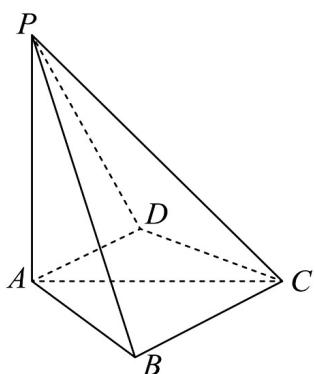

<!-- question-source:start -->
2．如图，四棱锥 P-ABCD 中， $PA \perp$ 底面 ABCD ， $AB \perp AD$ ， $PA = AC = 2$ ， $BC = 1$ ， $AB = \sqrt{3}$

(1)证明： $BC / /$ 与平面PAD；

(2)求平面 PBC 与平面 PAD 夹角的余弦值；

(3)若 Q 为线段 PC 的中点，求三棱锥 P-BDQ 的体积.
<!-- question-source:end -->

![[高中/课堂同步/题库/人教A版高中数学同步讲义(2026)/03_选择性必修第一册/第一章 空间向量与立体几何/专题1.4 空间向量的应用（高效培优讲义）/强化训练/questions/answers/Q00079912A1.md]]
