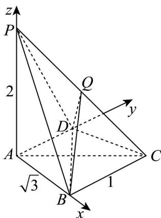

> [!faq]- 《专题1.4 空间向量的应用（高效培优讲义）》官方解析
>
> > [!success]- **【答案】** (1)证明见解析 (2) $\frac{2\sqrt{7}}{7}$ (3) $\frac{\sqrt{3}}{6}$
>
> > [!note]- **【分析】**
> > （1）求证 $AD // CB$ ，再利用线面平行的判定定理求证；
> >
> > (2) 以 A 为坐标原点建系，求出两个平面的法向量，再求其夹角的余弦值即可；
> >
> > $V_{P-BDQ}=V_{Q-BDP}=\frac{1}{2}V_{C-BDP}=\frac{1}{2}V_{P-BDC}$ 可求·
>
> > [!note]- **【解析】**
> > （1）因 $BC = 1$ ， $AB = \sqrt{3}$ ， $AC = 2$ ，则 $AB\bot BC$
> >
> > 又 $AB \perp AD$ ，A, B, C, D 四点共面，则 $AD \parallel CB$ ，
> >
> > 因 $BC \not\subset$ 平面 PAD ， $AD \subset$ 平面 PAD ，则 $BC \parallel$ 平面 PAD ·
> >
> > (2) 如图所示，以 $A$ 为坐标原点， $AB, AD, AP$ 所在直线分别为 $x$ 轴， $y$ 轴， $z$ 轴，建立空间直角坐标系，
> >
> > $$
> > \text {则} A (0, 0, 0), B (\sqrt {3}, 0, 0), C (\sqrt {3}, 1, 0), P (0, 0, 2)
> > $$
> >
> > 则 $\overset{\square\square\square}{BC}=\left(0,1,0\right),\overset{\square\square\square}{PB}=\left(\sqrt{3},0,-2\right)$
> >
> > 设平面 PBC 的法向量为 $m = (x, y, z)$
> >
> > 则 $\left\{\begin{aligned}&m\cdot PB=\sqrt{3}x-2z=0\\&m\cdot BC=y=0\end{aligned}\right.$ ，令 $x=2$ ，则 $m=\left(2,0,\sqrt{3}\right)$ ，
> >
> > 易知 $n = (1, 0, 0)$ 为平面 PAD 的一个法向量，
> >
> > $$
> > \cos \left\langle \stackrel {\rightarrow} {m}, n \right\rangle = \frac {m \cdot n}{| m | | n |} = \frac {2}{\sqrt {7}} = \frac {2 \sqrt {7}}{7}
> > $$
> >
> > 所以平面 $PBC$ 与平面 $PAD$ 夹角的余弦值为 $\frac{2\sqrt{7}}{7}$ ；
> >
> > (3) $S_{\triangle BCD} = \frac{1}{2} BC \cdot AB = \frac{1}{2} \times 1 \times \sqrt{3} = \frac{\sqrt{3}}{2}$
> >
> > 因 Q 为线段 PC 的中点，
> >
> > $$
> > V _ {P - B D Q} = V _ {Q - B D P} = \frac {1}{2} V _ {C - B D P} = \frac {1}{2} V _ {P - B D C} = \frac {1}{6} S _ {\triangle B C D} \cdot P A = \frac {1}{6} \times \frac {\sqrt {3}}{2} \times 2 = \frac {\sqrt {3}}{6}
> > $$
> >
> > 
