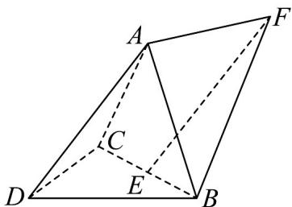

> [!faq]- 《专题1.4 空间向量的应用（高效培优讲义）》官方解析
>
> > [!success]- **【答案】**  A. $\frac{\sqrt{5}}{5}$ B. $\frac{2\sqrt{5}}{5}$ C. $\frac{\sqrt{6}}{3}$ D. 1
>
> > [!note]- **【解析】**
> > 如图，连接 $AE, DE$
> >
> > 因为 AB = BC = AC = DB = DC, E 为 BC 中点，
> >
> > 所以 $AE \perp BC, DE \perp BC$
> >
> > 又平面 $ABC \perp$ 底面 $BCD$ ，平面 $ABC \cap$ 底面 $BCD = BC, AE \subset$ 平面 $ABC$
> >
> > 所以 $AE \perp$ 平面 $BCD$ ，故 $ED, EB, EA$ 两两垂直，
> >
> > 以 E 为坐标原点，建立如图所示的空间直角坐标系，
> >
> > 
> >
> > 设 AB = 2，由 $EF = DA$ ，
> >
> > 可得 $A(0,0,\sqrt{3}), D(\sqrt{3},0,0), B(0,1,0), F(-\sqrt{3},0,\sqrt{3})$
> >
> > 则 $AB = (0,1, - \sqrt{3}),AD = (\sqrt{3},0, - \sqrt{3}),AF = (-\sqrt{3},0,0)$
> >
> > 设平面 ABD 的一个法向量为 $m = (x, y, z)$ ,
> >
> > 则有 $\left\{ \begin{array}{l}m\cdot AB = y - \sqrt{3} z = 0\\ \rightarrow \square \square \\ m\cdot AD = \sqrt{3} x - \sqrt{3} z = 0 \end{array} \right.$ ，令 $x = 1$ ，得 $y = \sqrt{3},z = 1$ ，则 $m = (1,\sqrt{3},1)$
> >
> > 设平面 $ABF$ 的一个法向量为 $n = (a, b, c)$
> >
> > 则有 $\left\{ \begin{array}{l} n \cdot AB = b - \sqrt{3}c = 0 \\ \rightarrow \square \square \\ n \cdot AF = -\sqrt{3}a = 0 \end{array} \right.$ ，令 $c = 1$ ，得 $a = 0, b = \sqrt{3}$ ，得 $n = (0, \sqrt{3}, 1)$ ，
> >
> > 则 $\cos \langle m,n\rangle = \frac{m\cdot n}{|m||n|} = \frac{4}{2\times\sqrt{5}} = \frac{2\sqrt{5}}{5}$
> >
> > 则平面 $ADB$ 与平面 $ABF$ 夹角的余弦值为 $\frac{2\sqrt{5}}{5}$
> >
> > 故选 **B**.
