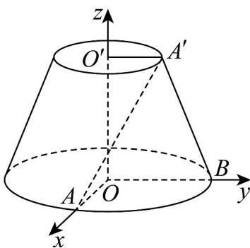

> [!faq]- 《专题1.4 空间向量的应用（高效培优讲义）》官方解析
>
> > [!success]- **【答案】** A. $\frac{\sqrt{6}}{6}$ B. $\frac{\sqrt{5}}{6}$ C. $\frac{\sqrt{6}}{3}$ D. $\frac{1}{6}$
>
> > [!note]- **【分析】**
> > 过 $A^{\prime}$ 的母线为 $A^{\prime}B$ ，连接 $OB$ ，则 $OB / / O'A^{\prime}$ ，以 $O$ 为坐标原点， $OA,OB,OO'$ 为坐标轴建立空间直角坐标系，利用向量法可求 $AA^{\prime}$ 与 $OO^{\prime}$ 所成角的余弦值.
>
> > [!note]- **【解析】**
> > 过 $A'$ 的母线为 $A'B$ ，连接 $OB$ ，则 $OB // O'A'$ ，又因为 $O'A' \perp OA$ ，所以 $OB \perp OA$
> >
> > 
> >
> > 以 O 为坐标原点，OA, OB, OO' 为坐标轴建立如图所示的空间直角坐标系，
> >
> > 则 $A(2,0,0),O(0,0,0),O'(0,0,1),A'(0,1,1)$
> >
> > 所以 $OO'=(0,0,1), AA'=(-2,1,1)$
> >
> > 所以 $\cos OO', AA' = \frac{OQ' \cdot AA'}{|OO'| \cdot |AA'|} = \frac{1}{1 \times \sqrt{4 + 1 + 1}} = \frac{\sqrt{6}}{6}$
> >
> > 所以 $AA'$ 与 $OO'$ 所成角的余弦值为 $\frac{\sqrt{6}}{6}$ .
> >
> > 故选 **A**.
