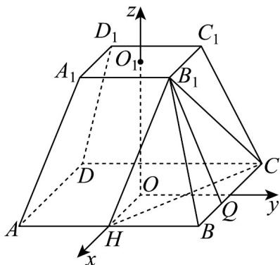
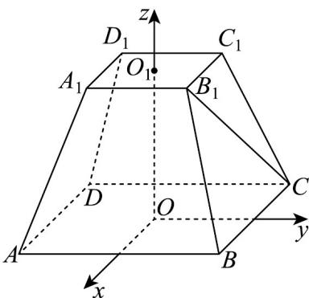

> [!faq]- 《专题1.4 空间向量的应用（高效培优讲义）》官方解析
>
> > [!success]- **【答案】** D
>
> > [!note]- **【分析】**
> > 解法一：通过作辅助线构造异面直线所成角，再利用四棱台体积公式求出高，结合平面几何知识和
> >
> > 余弦定理求解·
> >
> > 解法二：建立空间直角坐标系，求出相关向量，利用向量的夹角公式求解，再根据异面直线所成角的范围得
> >
> > 到结果·
>
> > [!note]- **【解析】**
> > 解法一：过点 $B_{1}$ 作 $B_{1}H // AA_{1}$ ，交AB于点H，则 $\angle HB_{1}C$ 为异面直线 $AA_{1}$ 与 $B_{1}C$ 所成的角或其补角.
> >
> > 设该正四棱台的高为 h，则 $\frac{1}{3}\left(4+\sqrt{4\times16}+16\right)h=28$ ，得 h=3。
> >
> > $AA_{1}=\sqrt{3^{2}+\left(\frac{4\sqrt{2}-2\sqrt{2}}{2}\right)^{2}}=\sqrt{11}$ ，故 $B_{1}H=\sqrt{11}$
> >
> > 过点 $B_{1}$ 作 $B_{1}Q \perp BC$ 交 $BC$ 于点 $Q$ ，则 $B_{1}Q = \sqrt{\left(\sqrt{11}\right)^{2} - 1^{2}} = \sqrt{10}$ ，
> >
> > $B_{1}C=\sqrt{\left(\sqrt{10}\right)^{2}+3^{2}}=\sqrt{19}$ ·连接 CH，易得 $CH = \sqrt{2^{2} + 4^{2}} = 2\sqrt{5}$
> >
> > 在 $\triangle B_{1}CH$ 中，利用余弦定理可得 $\cos \angle HB_{1}C = \frac{\left(\sqrt{19}\right)^{2} + \left(\sqrt{11}\right)^{2} - \left(2\sqrt{5}\right)^{2}}{2\times\sqrt{19}\times\sqrt{11}} = \frac{5\sqrt{209}}{209}$
> >
> > 故异面直线 $AA_{1}$ 与 $B_{1}C$ 所成角的余弦值为 $\frac{5\sqrt{209}}{209}$
> >
> > 
> >
> > 解法二：设该正四棱台的高为 $h$ ，上底面与下底面的中心分别为 $O_{1}$ ， $O$ ，连接 $OO_{1}$ ，由题知
> >
> > $\frac{1}{3}\left(4+\sqrt{4\times16}+16\right)h=28$ ，得 $h=3$ ·由正四棱台的性质知 $OO_{1}\perp$ 平面ABCD，
> >
> > 以 O 为坐标原点，过点 O 分别与 AD, AB 平行的直线为 x 轴，y 轴， $OO_{1}$ 所在直线为 z 轴建立空间直角坐标系
> >
> > 如图所示，
> >
> > 
> >
> > 则 $A(2, - 2,0)$ ， $A_{1}(1, - 1,3)$ ， $B_{1}(1,1,3)$ ， $C(-2,2,0)$
> >
> > 所以 $AA_{1}=\left(-1,1,3\right)$ ， $B_{1}C=\left(-3,1,-3\right)$
> >
> > $$
> > \cos \left\langle A A _ {1}, B _ {1} C \right\rangle = \frac {\square A A _ {1} \cdot B C}{\left| A A _ {1} \right| \cdot \left| B _ {1} C \right|} = \frac {(- 1) \times (- 3) + 1 \times 1 + 3 \times (- 3)}{\sqrt {(- 1) ^ {2} + 1 ^ {2} + 3 ^ {2}} \times \sqrt {(- 3) ^ {2} + 1 ^ {2} + (- 3) ^ {2}}} = - \frac {5 \sqrt {2 0 9}}{2 0 9}
> > $$
> >
> > 故异面直线 $AA_{1}$ 与 $B_{1}C$ 所成角的余弦值为 $\frac{5\sqrt{209}}{209}$
> >
> > 故选 **D**.
