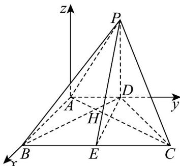

> [!faq]- 《专题1.4 空间向量的应用（高效培优讲义）》官方解析
>
> > [!success]- **【答案】** (1)证明见解析 (2) $\frac{\sqrt{21}}{7}$
>
> > [!note]- **【分析】**
> > （ $^{1}$ ）根据题意，得到 $AB \perp AD$ ，且 $AB \perp AP$ ，证得 $AB \perp$ 平面 ADP，结合线面垂直的性质，即可证
> >
> > $$
> > A B \perp P D
> > $$
> >
> > (2) 方法一：连接 $AC$ ， $BD$ 交于点 $H$ ，得到 $AC \perp BD$ 和 $AC \perp PB$ ，证得 $AC \perp$ 平面 $PDB$ ，得到 $AC \perp PD$
> >
> > 进而证得 $PD \perp$ 平面 $ABCD$ ，得到 $PD \perp BC$ ，作 $DE \perp BC$ ，证得 $BC \perp PE$ ，得到 $\angle PED$ 为平面 $PBC$ 与平面
> >
> > ABCD 所成二面角的平面角，在直角 $\triangle PDE$ 中，即可求解；
> >
> > 法二：以点 A 为原点，建立空间直角坐标系，分别求得平面 ABCD 和平面 PBC 的法向量 $n_{1} = (0, 0, 1)$ 和
> >
> > $n_{2}^{□□}=\left(2,0,\sqrt{3}\right)$ ，结合向量的夹角公式，即可求解·
>
> > [!note]- **【解析】**
> > （1）证明：由翻折的性质，可得 $AB \perp AD$ ，且 $AB \perp AP$
> >
> > 因为 $AD \cap AP = A$ ，且 $AD, AP \subset$ 平面 ADP，所以 $AB \perp$ 平面 ADP，
> >
> > 又因为 $PD \subset$ 平面 ADP ，所以 $AB \perp PD$ .
> >
> > (2) 解：方法一：连接 AC, BD 交于点 H，
> >
> > 在直角VABC中，可得 $\tan \angle BAH = \frac{BC}{AB} = \sqrt{3}$
> >
> > 在直角 $\triangle ABD$ 中，可得 $\tan \angle ADH = \frac{AB}{AD} = \frac{\sqrt{3}}{3}$
> >
> > 所以 $\angle BAH = 60^{\circ}$ ， $\angle ABH = 30^{\circ}$ ，所以 $AC\perp BD$
> >
> > 又因为 $AC \perp PB$ ，且 $PB \cap BD = B$ ， $PB, BD \subset$ 平面 PDB，所以 $AC \perp$ 平面 PDB，
> >
> > 因为 $PD \subset$ 平面 $PDB$ ，所以 $AC \perp PD$
> >
> > 由（1）知： $AB\bot PD$ ，且 $AB\cap AC = A$ ， $AB,AC\subset$ 平面ABCD，所以 $PD\bot$ 平面ABCD
> >
> > 因为 $BC \subset$ 平面ABCD，所以 $PD \perp BC$ ，
> >
> > 作 $DE \perp BC$ ，连接 $PE$ ，因为 $PDI DE = D$ ，且 $PD, DE \subset$ 平面 $PDE$ ，
> >
> > 所以 $BC \perp$ 平面 PDE ，又因为 $PE \subset$ 平面 PDE ，所以 $BC \perp PE$
> >
> > 所以 $\angle PED$ 为平面 $PBC$ 与平面 $ABCD$ 所成二面角的平面角，
> >
> > 在直角 $\triangle PDE$ 中，可得 $\tan\angle PED=\frac{PD}{DE}=\frac{2}{\sqrt{3}}$ ，所以 $\cos\angle PED=\frac{\sqrt{3}}{\sqrt{7}}=\frac{\sqrt{21}}{7}$
> >
> > 法二：以点A为原点，以AB,AD所在直线分别为x轴和y轴，建立空间直角坐标系，
> >
> > 如图所示，可得 $A(0,0,0)$ ， $B(\sqrt{3},0,0)$ ， $C(\sqrt{3},3,0)$ ， $D(0,1,0)$ ，
> >
> > 由（1）知 $AB \perp$ 平面 $ADP$ ，所以平面 $ABCD$ 的法向量为 $\stackrel{\square}{n}_{1} = (0,0,1)$
> >
> > 设 $P(0,a,b)$ ，则 $\left\{ \begin{array}{l} \overline{PB} \cdot \overline{AC} = 0 \\ |\overline{PD}| = 2 \end{array} \right.$ ，即 $\left\{ \begin{array}{l} \sqrt{3} \cdot \sqrt{3} + 3(-a) = 0 \\ (a - 1)^2 + b^2 = 4 \end{array} \right.$ ，解得 $\left\{ \begin{array}{l} a = 1 \\ b = 2 \end{array} \right.$ ，即 $P(0,1,2)$ ，
> >
> > 设平面 $PBC$ 的法向量为 $n_2 = (x,y,z)$ ，且 $BC = (0,3,0)$ ， $BP = (-\sqrt{3},1,2)$
> >
> > 则 $\left\{ \begin{array}{ll}n_{2} & BC = 0\\ n_{2} & BP = 0 \end{array} \right.$ ，即 $\left\{ \begin{array}{ll}y = 0\\ -\sqrt{3} x + y + 2z = 0 \end{array} \right.$ ，取 $x = 2$ ，可得 $y = 0,z = \sqrt{3}$ ，所以 $n_2^{\mathrm{u}} = (2,0,\sqrt{3})$
> >
> > 设平面 $_{PBC}$ 与平面 $_{ABCD}$ 所处二面角的平面角为 $\theta$ ，则 $\left|\cos\theta\right|=\frac{\left|\begin{matrix}\square\\n_{1}\end{matrix}\cdot\begin{matrix}\square\\n_{2}\end{matrix}\right|}{\left|\begin{matrix}n_{1}\end{matrix}\right|\cdot\left|\begin{matrix}n_{2}\end{matrix}\right|}=\frac{\sqrt{3}}{1\cdot\sqrt{7}}=\frac{\sqrt{21}}{7}$ .
> >
> > 
