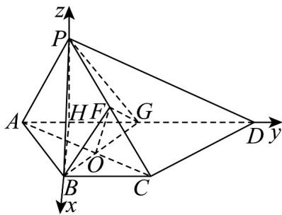

> [!faq]- 《专题1.4 空间向量的应用（高效培优讲义）》官方解析
>
> > [!success]- **【答案】** (1)证明见解析 (2) $\frac{2\sqrt{5}}{5}$
>
> > [!note]- **【分析】**
> > （ $^{1}$ ）只需证明 OF//AP，再结合线面平行的判定定理即可得证；
> >
> > (2) 说明 $HB, HD, HP$ 两两垂直，建立适当的空间直角坐标系，求出平面 $BFG$ 与平面 $PAD$ 的法向量，由向
> >
> > 量夹角的余弦公式以及平方关系即可得解·
>
> > [!note]- **【解析】**
> > （1）连接 AC 交 BG 于点 O，连接 CG
> >
> > 
> >
> > 如图，由平面图易得 ABCG 为平行四边形，则 O 为 AC 的中点，
> >
> > 连接 $OF$ ，则 $OF // AP, OF = \frac{1}{2} AP$
> >
> > 又 $OF \subset$ 平面 $BFG, AP \notin$ 平面 $BFG$ ，故 $AP //$ 平面 $BFG$
> >
> > (2) 取 AG 的中点 H，连接 PH，BH，
> >
> > 由平面图形可知， $AB = BG,AP = PG$ ，则 $BH\perp AG,PH\perp AG$
> >
> > 又平面 $ADP \perp$ 平面 $ABCD$ ，且平面 $ADP \cap$ 平面 $ABCD = AD$ ， $PH \subset$ 面 $ADP$
> >
> > 故 $PH \perp$ 平面 ABCD .
> >
> > 以 HB, HD, HP 分别为 x 轴，y 轴，z 轴建立空间直角坐标系，
> >
> > 设 $AB = 2$ ，则 $B(\sqrt{3},0,0),A(0, - 1,0),P(0,0,\sqrt{3}),G(0,1,0)$
> >
> > 则 $\because \overrightarrow{BG} = (-\sqrt{3}, 1, 0), \overrightarrow{OF} = \frac{1}{2} \overrightarrow{AP} = \left(0, \frac{1}{2}, \frac{\sqrt{3}}{2}\right)$
> >
> > 设平面 BFG 的法向量为 $m = (x, y, z)$ ,
> >
> > $\left\{ \begin{array}{l} m \cdot BG = 0 \\ \rightarrow \square \square \\ m \cdot OF = 0 \end{array} \right.$ 即 $\left\{ \begin{array}{l} -\sqrt{3} x + y = 0 \\ \frac{y}{2} + \frac{\sqrt{3} \cdot z}{2} = 0 \end{array} \right.$ 取 $z = 1, m = (-1, -\sqrt{3}, 1)$ ，
> >
> > 又平面 PAD 的法向量为 $n = (1, 0, 0)$
> >
> > 设平面 BFG 与平面 PAD 所成二面角为 $\theta$ ，
> >
> > $$
> > \therefore \left| \cos \theta \right| = \overrightarrow {\left| \cos n , m \right|} = \frac {\left| n \cdot m \right|}{\left| m \right| \left| n \right|} = \frac {1}{\sqrt {5}} = \frac {\sqrt {5}}{5},
> > $$
> >
> > $\sin \theta = \sqrt{1 - \cos^2\theta} = \frac{2\sqrt{5}}{5}$ 即所求平面 $BFG$ 与平面 $PAD$ 所成二面角的正弦值为 $\frac{2\sqrt{5}}{5}$
