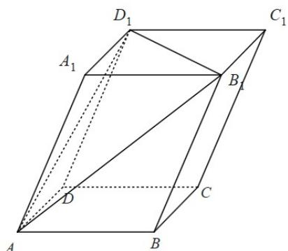

> [!faq]- 《专题1.4 空间向量的应用（高效培优讲义）》官方解析
>
> > [!success]- **【答案】** D
>
> > [!note]- **【分析】**
> > 要是平面 $AB_{1}D_{1}$ 的一个法向量，则要与平面 $AB_{1}D_{1}$ 的两不共线的向量垂直，两向量垂直即数量积为
> >
> > 零，再根据数量积的运算验证即可·
>
> > [!note]- **【解析】**
> > 如下图所示：
> >
> > 
> >
> > 在平行六面体 $ABCD - A_1B_1C_1D_1$ 中， $AB = AD = AA_1 = 1$ ， $\angle BAD = \angle A_1AD = \angle A_1AB = 60^\circ$ 。设 $AB = a$ ， $AD = b$
> >
> > $AA_{1}=c$
> >
> > 所以 $a \cdot b = b \cdot c = a \cdot c = \frac{1}{2}$ ， $AB_{1} = a + c$ ， $AD_{1} = b + c$ ，
> >
> > 对 A， $(a-b-c)\cdot(a+c)=a^{2}+a\cdot c-a\cdot b-b\cdot c-a\cdot c-c^{2}=-1\neq0$ ，故 A 错误；
> >
> > 对 B， $(a+b-c)\cdot(a+c)=a^{2}+a\cdot c+a\cdot b+b\cdot c-a\cdot c-c^{2}=1\neq0$ ，故 B 错误；
> >
> > 对 C， $\left(a+b-\frac{1}{3}c\right)\cdot(a+c)=a^{2}+a\cdot c+a\cdot b+b\cdot c-\frac{1}{3}a\cdot c-\frac{1}{3}c^{2}=2\neq0$ ，故 C 错误；
> >
> > 对 D， $\left(a+b-\frac{5}{3}c\right)\cdot(a+c)=a^{2}+a\cdot c+a\cdot b+b\cdot c-\frac{5}{3}a\cdot c-\frac{5}{3}c^{2}=0$
> >
> > $$
> > \left(a + b - \frac {5}{3} c\right) \cdot (b + c) = a \cdot b + a \cdot c + b ^ {2} + b \cdot c - \frac {5}{3} b \cdot c - \frac {5}{3} c ^ {2} = 0
> > $$
> >
> > $a+b-\frac{5}{3}c$ 与 $AB_{1}$ 、 $AD_{1}$ 都垂直，则 $a+b-\frac{5}{3}c$ 是平面 $AB_{1}D_{1}$ 的一个法向量，故 $^{D}$ 正确；
> >
> > 故选 **D**.
