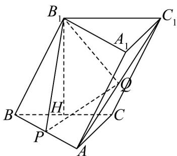

<!-- question-source:start -->
【变式2】如图，在三棱柱 $ABC - A_{1}B_{1}C_{1}$ 中， $H, P, Q$ 分别是 $BC, AB, AC_{1}$ 的中点， $B_{1}H \perp$ 平面 $ABC$ ，且

$B_{1}H=2\sqrt{3}$ ， $AC\perp BC$ ，CA=CB=4·求证： $PQ//$ 平面 $BCC_{1}B_{1}$

<!-- question-source:end -->

![[高中/课堂同步/题库/人教A版高中数学同步讲义(2026)/03_选择性必修第一册/第一章 空间向量与立体几何/专题1.4 空间向量的应用（高效培优讲义）/题型02_利用向量研究平行问题/questions/answers/Q00079884A1.md]]
