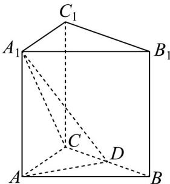
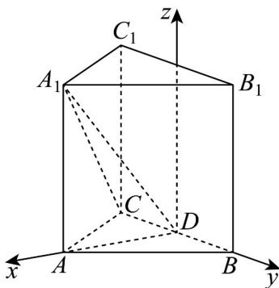

> [!faq]- 《专题1.4 空间向量的应用（高效培优讲义）》官方解析
>
> > [!success]- **【答案】** BD
>
> > [!note]- **【分析】**
> > 法一：对于 $A$ ，利用空间向量的线性运算与数量积运算即可判断；对于 $B$ ，利用线面垂直的判定与性质定理即可判断；对于 $D$ ，利用线面平行的判定定理即可判断；对于 $C$ ，利用反证法即可判断；法二：根据题意建立空间直角坐标系，利用空间向量法逐一分析判断各选项即可得解·
>
> > [!note]- **【解析】**
> > 法一：对于 $\mathsf{A}$ ，在正三棱柱 $ABC - A_{1}B_{1}C_{1}$ 中， $AA_{1}\perp$ 平面 $ABC$
> >
> > 
> >
> > 又 $AD \subset$ 平面 $ABC$ ，则 $AA_{1} \perp AD$ ，则 $\overline{A_{1}} A \cdot \overline{AD} = 0$
> >
> > 因为VABC是正三角形，D为BC中点，则 $AD \perp BC$ ，则 $CD \cdot AD = 0$
> >
> > 又 $A_{1}C = A_{1}A + AD + CD$
> >
> > 所以 $A_{1}C \cdot AD = \left( A_{1}A + AD + CD \right) \cdot AD = A_{1}A \cdot AD + AD^{2} + CD \cdot AD = AD^{2} \neq 0$
> >
> > 则 $AD \perp A_{1}C$ 不成立，故 $\mathsf{A}$ 错误；
> >
> > 对于 B，因为在正三棱柱 $ABC-A_{1}B_{1}C_{1}$ 中， $AA_{1}\perp$ 平面 ABC，
> >
> > 又 $BC \subset$ 平面 ABC ，则 $AA_{1} \perp BC$
> >
> > 因为 VABC 是正三角形，D 为 BC 中点，则 $AD \perp BC$ ，
> >
> > 又 $AA_{1} \cap AD = A, AA_{1}, AD \subset$ 平面 $AA_{1}D$
> >
> > 所以 $BC \perp$ 平面 $AA_{1}D$ ，故 B 正确；
> >
> > 对于 D，因为在正三棱柱 $ABC-A_{1}B_{1}C_{1}$ 中， $CC_{1}//AA_{1}$
> >
> > 又 $AA_{1} \subset$ 平面 $AA_{1}D, CC_{1} \not\subset$ 平面 $AA_{1}D$ ，所以 $CC_{1} //$ 平面 $AA_{1}D$ ，故 D 正确；
> >
> > 对于 C，因为在正三棱柱 $ABC-A_{1}B_{1}C_{1}$ 中， $A_{1}B_{1}//AB$
> >
> > 假设 $AD \parallel A_{1}B_{1}$ ，则 $AD \parallel AB$ ，这与 $AD \cap AB = A$ 矛盾，
> >
> > 所以 $AD \parallel A_{1}B_{1}$ 不成立，故 C 错误；
> >
> > 故选：BD.
> >
> > 法二：如图，建立空间直角坐标系，设该正三棱柱的底边为2，高为h，
> >
> > 
> >
> > 则 $D(0,0,0), A(\sqrt{3}, 0, 0), A_1(\sqrt{3}, 0, h), C(0, -1, 0), C_1(0, -1, h), B(0, 1, 0), B_1(0, 1, h)$
> >
> > 对于 A， $AD = (-\sqrt{3}, 0, 0)$ ， $A_{1}C = (-\sqrt{3}, -1, -h)$
> >
> > 则 $AD \cdot A_1C = (-\sqrt{3}) \times (-\sqrt{3}) + 0 = 3 \neq 0$
> >
> > 则 $AD \perp A_{1}C$ 不成立，故 $\mathsf{A}$ 错误；
> >
> > 对于 BD， $BC=\left(0,-2,0\right),CC_{1}=\left(0,0,h\right),AA_{1}=\left(0,0,h\right),AD=\left(-\sqrt{3},0,0\right)$
> >
> > 设平面 $AA_{1}D$ 的法向量为 $n = (x,y,z)$
> >
> > 则 $\left\{ \begin{array}{l} A A_{1} \cdot n = h z = 0 \\ AD \cdot n = -\sqrt{3} x = 0 \end{array} \right.$ ，得 $x = z = 0$ ，令 $y = 1$ ，则 $n = (0,1,0)$
> >
> > 所以 $BC = (0, -2, 0) = -2n$ $CC_{1} \cdot n = 0$
> >
> > 则 $BC \perp$ 平面 $AA_{1}D$ ， $CC_{1} //$ 平面 $AA_{1}D$ ，故 BD 正确；
> >
> > 对于 C， $\overset{\square\square\square\square}{AD}=\left(-\sqrt{3},0,0\right),\overset{\square\square\square\square\square}{A_{1}}B_{1}=\left(-\sqrt{3},1,0\right)$
> >
> > 则 $\frac{-\sqrt{3}}{-\sqrt{3}} \neq \frac{0}{1}$ ，显然 $AD // A_1B_1$ 不成立，故 $^C$ 错误；
> >
> > 故选 **BD**.
