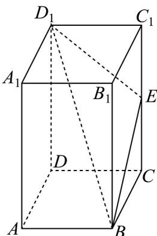

<!-- question-source:start -->
【典例1】如图，已知在长方体 $ABCD - A_{1}B_{1}C_{1}D_{1}$ 中， $AB = 3$ ， $AD = 4$ ， $AA_{1} = 5$ ，点 $E$ 为 $CC_{1}$ 上的一个动点，

平面 $BED_{1}$ 与棱 $AA_{1}$ 交于点 $F$ ，给出下列命题：

①四棱锥 $B_{1} - BED_{1}F$ 的体积为20；

②存在唯一的点 $E$ ，使截面四边形 $BED_{1}F$ 的周长取得最小值 $2\sqrt{74}$ ；

③当点 E 不与 C， $C_{1}$ 重合时，在棱 AD 上均存在点 G，使得 CG // 平面 $BED_{1}$ ；

④存在唯一的点 E，使得 $B_{1}D \perp$ 平面 $BED_{1}$ ，且 $CE = \frac{16}{5}$ .

其中正确的是\_\_\_\_（填写所有正确的序号）.
<!-- question-source:end -->

![[高中/课堂同步/题库/人教A版高中数学同步讲义(2026)/03_选择性必修第一册/第一章 空间向量与立体几何/专题1.4 空间向量的应用（高效培优讲义）/题型03_利用向量研究垂直问题/questions/answers/Q00079886A1.md]]
