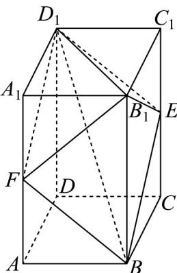
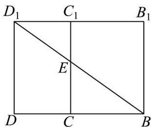
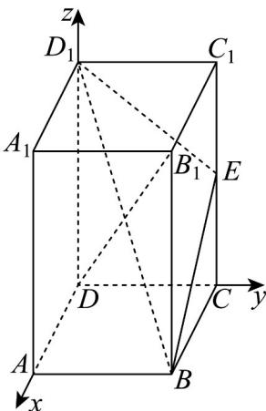

> [!faq]- 《专题1.4 空间向量的应用（高效培优讲义）》官方解析
>
> > [!success]- **【答案】** ①②④
>
> > [!note]- **【分析】**
> > 由给定条件可得 $B{ED}_{1}F$ 是平行四边形，求出三棱锥 ${B}_{1} - B{D}_{1}F$ 体积可判断①；求出 $\square B{ED}_{1}F$ 中
> >
> > $BE + D_{1}E$ 的最小值可判断②；建立空间直角坐标系，借助空间向量计算可判断③，④即可作答·
>
> > [!note]- **【解析】**
> > 平面 $BED_{1}$ 与棱 $AA_{1}$ 交于点 F，连接 $BF, D_{1}F$ ，如图，
> >
> > 
> >
> > 在长方体 $ABCD - A_{1}B_{1}C_{1}D_{1}$ 中，平面 $ADD_{1}A_{1} //$ 平面 $BCC_{1}B_{1}$ ，平面 $ADD_{1}A_{1} \cap$ 平面 $BED_{1} = D_{1}F$ ，平面 $BCC_{1}B_{1} \cap$
> >
> > 平面 $BED_{1} = BE$
> >
> > 则有 $BE // D_1F$ ，同理 $BF // D_1E$ ，因此，四边形 $BED_{1}F$ 是平行四边形，
> >
> > 而 $D_{1}C_{1}\perp$ 平面 $BCC_{1}B_{1}$ ，所以四棱锥 $B_{1} - BED_{1}F$ 的体积 $V_{B_1 - BED_1F} = 2V_{B_1 - BED_1} = 2V_{D_1 - BEB_1} = 2\times \frac{1}{3}\times S_{\triangle BEB_1}\times D_1C_1$
> >
> > $= \frac{2}{3} \times \frac{1}{2} \times 5 \times 4 \times 3 = 20$ ，①正确；
> >
> > 因截面四边形 $BED_{1}F$ 是平行四边形，则 $\square BED_{1}F$ 周长为 $2(BE + D_{1}E)$
> >
> > 把矩形 $BCC_{1}B_{1}$ 与矩形 $CDC_{1}D_{1}$ 展开在同一平面内，如图，连接 $BD_{1}$ 交 $CC_{1}$ 于 $E$ ，从而得 $BE + D_{1}E$ 的最小值为 $BD_{1} = \sqrt{BB_{1}^{2} + (B_{1}C_{1} + C_{1}D_{1})^{2}} = \sqrt{74}$ ，显然点 $E$ 唯一，所以存在唯一的点 $E$ ，使截面四边形 $BED_{1}F$ 的周长取得最小值 $2\sqrt{74}$ ，②正确；在长方体 $ABCD - A_{1}B_{1}C_{1}D_{1}$ 中，建立如图所示的空间直角坐标系，
> >
> > 
> >
> > 
> >
> > 则 $D(0,0,0),B(4,3,0),C(0,3,0),D_{1}(0,0,5),B_{1}(4,3,5)$ ，设点 $E(0,3,t)$ ， $\overline{BD}_1 = (-4, - 3,5)$ ， $\overline{BE} = (-4,0,t)$
> >
> > 令 $n = (x,y,z)$ 是平面 $BED_{1}$ 的一个法向量，则 $\left\{ \begin{array}{l} n \cdot BD_{1} = -4x - 3y + 5z = 0 \\ n \cdot BE = -4x + tz = 0 \end{array} \right.$ ，令 $x = t$ 得 $n = (t, \frac{20 - 4t}{3}, 4)$ ，设 $AD$ 上点 $G(\lambda, 0, 0)(0 \leq \lambda \leq 4)$ ，而 $0 < t < 5$ ， $CG = (\lambda, -3, 0)$ ，
> >
> > 当 $CG //$ 平面 $BED_{1}$ 时，有 $\overline{CG} \perp n$ ，即 $\overline{CG} \cdot n = t\lambda - (20 - 4t) = 0$ ， $\lambda = \frac{20}{t} - 4$ ，
> >
> > 由 $0 \leq \frac{20}{t} - 4 \leq 4$ 得 $\frac{5}{2} \leq t \leq 5$ ，则有 $\frac{5}{2} \leq t < 5$
> >
> > 即当点 E 在棱 $CC_{1}$ 中点到靠近点 $C_{1}$ 的线段（不含点 $C_{1}$ ）上移动时，在棱 AD 上均存在点 G，使得 CG // 平面 $BED_{1}$
> >
> > 当 $0 < t < \frac{5}{2}$ 时， $\lambda > 4$ ，此时点 $G$ 在线段 $AD$ 的延长线上，
> >
> > 即当点 E 在棱 $CC_{1}$ 中点到靠近点 C 的线段（不含两个端点）上移动时，在棱 AD 上不存在点 G，使得 CG // 平
> >
> > 面 $BED_{1}$ ，③不正确；
> >
> > 由③中信息知，要有 $B_{1}D \perp$ 平面 $BED_{1}$ ，必有 $DB_{1} // n$
> >
> > 而 $DB_{1} = (4,3,5)$ ，因此， $\frac{t}{4} = \frac{20 - 4t}{9} = \frac{4}{5}$ ，解得 $t = \frac{16}{5}$
> >
> > 所以存在唯一的点 E，使得 $B_{1}D \perp$ 平面 $BED_{1}$ ，且 $CE = \frac{16}{5}$ ，④正确·
> >
> > 故答案为：①②④
