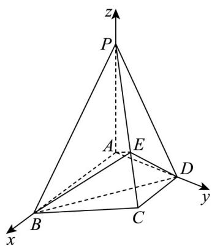

> [!faq]- 《专题1.4 空间向量的应用（高效培优讲义）》官方解析
>
> > [!success]- **【答案】** (1)证明见解析 (2)证明见解析
>
> > [!note]- **【分析】**
> > （1）以 $A$ 为原点， $\overline{AB}$ ， $\overline{AD}$ ， $\overline{AP}$ 的方向分别为 $x$ 轴、 $y$ 轴、 $z$ 轴的正方向，建立空间直角坐标系，
> >
> > 证明 $AE \perp PC$ ， $AE \perp CB$ ，原题即得证；
> >
> > (2) 设平面 BDE 的法向量为 $n = (x_{1}, y_{1}, z_{1})$ ，证明 $PA \perp n$ 即得证.
>
> > [!note]- **【解析】**
> > （1）证明：如图，以 $A$ 为原点， $\overline{AB}$ ， $\overline{AD}$ ， $\overline{AP}$ 的方向分别为 $x$ 轴、 $y$ 轴、 $z$ 轴的正方向，建立空间
> >
> > 直角坐标系，
> >
> > 
> >
> > 则 $A(0,0,0)$ ， $B(2,0,0)$ ， $C(1,1,0)$ ， $D(0,1,0)$ ， $P(0,0,2)$
> >
> > 所以 $\stackrel{\square\square\square}{PC}=\left(1,1,-2\right)$ ， $\stackrel{\square\square\square}{AP}=\left(0,0,2\right)$ ， $\stackrel{\square\square\square}{CB}=\left(1,-1,0\right)$
> >
> > 因为 $PE = \frac{2}{3} PC$ ，所以 $\overrightarrow{PE} = \left(\frac{2}{3},\frac{2}{3}, - \frac{4}{3}\right)$ ，所以 $\overrightarrow{AE} = \overrightarrow{AP} +\overrightarrow{PE} = \left(\frac{2}{3},\frac{2}{3},\frac{2}{3}\right)$
> >
> > 所以 $\overline{AE} \cdot \overline{PC} = \frac{2}{3} + \frac{2}{3} - \frac{4}{3} = 0$ ， $\overline{AE} \cdot \overline{CB} = \frac{2}{3} - \frac{2}{3} + 0 = 0$ ，
> >
> > 所以 $AE \perp PC$ ， $AE \perp CB$ ，即 $AE \perp PC$ ， $AE \perp CB$ ，
> >
> > 又因为 $PC \cap BC = C$ ， $PC, BC \subset$ 平面 PBC。
> >
> > 所以 $AE \perp$ 平面 PBC .
> >
> > (2) 证明：由 (1) 可得 $\overline{BE} = \overline{AE} - \overline{AB} = \left(\frac{2}{3}, \frac{2}{3}, \frac{2}{3}\right) - (2,0,0) = \left(-\frac{4}{3}, \frac{2}{3}, \frac{2}{3}\right)$ ， $\overline{PA} = (0,0,-2)$ ， $\overline{BD} = (-2,1,0)$
> >
> > 设平面 BDE 的法向量为 $n = \left(x_{1}, y_{1}, z_{1}\right)$ ,
> >
> > 则 $\left\{ \begin{array}{l} \overrightarrow{BD} \cdot n = 0 \\ \overrightarrow{BE} \cdot n = 0 \end{array} \right.$ ，即 $\left\{ \begin{array}{l} -2x_1 + y_1 = 0, \\ -\frac{4}{3} x_1 + \frac{2}{3} y_1 + \frac{2}{3} z_1 = 0, \text{令} x_1 = 1, \text{得} y_1 = 2, z_1 = 0, \end{array} \right.$
> >
> > 则 $n = (1,2,0)$ 是平面BDE的一个法向量，
> >
> > 因为 $\stackrel{\square\square}{PA}\cdot n=(0,0,-2)\cdot(1,2,0)=0$ ，所以 $\stackrel{\square\square\square}{PA}\perp n$
> >
> > 因为 $PA \notin$ 平面 $BDE$ ，所以 $PA //$ 平面 $BDE$ 。
