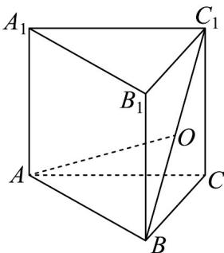
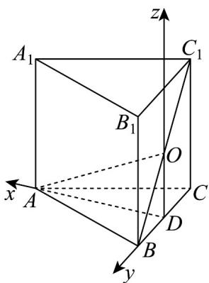

> [!faq]- 《专题1.4 空间向量的应用（高效培优讲义）》官方解析
>
> > [!success]- **【答案】** ( )  A．若 a=b ，则 OA 与平面 ABC 成 $30^{\circ}$ 角 B．若 a=b ，则平面 $OAB \perp$ 平面 $OA_{1}B_{1}$ C．若 $a = \sqrt{2}b$ ，则 $B_{1}C \perp AC_{1}$ D．若 $a = \sqrt{3}b$ ，则三棱柱有内切球
>
> > [!note]- **【分析】**
> > 对于 $A$ ，找到线在平面上的射影，通过相关线段的长度关系求解角度；对于 $B, C$ ，运用空间向量法，
> >
> > 计算判断；对于 $^{D}$ ，三棱柱内切球，找出其半径与三棱柱棱长的关系，计算判断·
>
> > [!note]- **【解析】**
> > 对于选项 A，取 BC 中点 D，连接 AD, OD。因为正三棱柱中 $OD \perp$ 平面 ABC，所以 $\angle OAD$ 就是 OA 与
> >
> > 平面 $ABC$ 所成的角·
> >
> > 已知 $AB = a$ ，则 $AD = \frac{\sqrt{3}}{2} a$ ， $OD = \frac{1}{2} AA_{1} = \frac{1}{2} b$
> >
> > 当时， $\tan \angle OAD = \frac{OD}{AD} = \frac{\frac{1}{2}a}{\frac{\sqrt{3}}{2}a} = \frac{\sqrt{3}}{3}$ ，所以 $\angle OAD = 30^{\circ}$ ，选项A正确。
> >
> > 对于选项 $^{B}$ ，以D为原点，分别以DA,DB,DO所在直线为x、y、z轴建立空间直角坐标系·
> >
> > 
> >
> > 当 $a = b$ 时， $A(\frac{\sqrt{3}}{2} a,0,0)$ ， $B(0,\frac{a}{2},0)$ ， $O(0,0,\frac{a}{2})$ ， $A_{1}(\frac{\sqrt{3}}{2} a,0,a)$ ， $B_{1}(0,\frac{a}{2},a)$ 。
> >
> > 可得 $\overrightarrow{OA} = \left( \frac{\sqrt{3}}{2} a, 0, -\frac{a}{2} \right)$ ， $\overrightarrow{OB} = \left( 0, \frac{a}{2}, -\frac{a}{2} \right)$
> >
> > 设平面 的法向量为 $n_{1}=(x_{1},y_{1},z_{1})$ ，则 $\left\{\begin{aligned}\vec{n}_{1}\cdot\vec{OA}&=\frac{\sqrt{3}}{2}ax_{1}-\frac{a}{2}z_{1}=0\\ \vec{n}_{1}\cdot\vec{OB}&=\frac{a}{2}y_{1}-\frac{a}{2}z_{1}=0\end{aligned}\right.$
> >
> > 令 $z_{1}=\sqrt{3}$ ，解得 $n_{1}=(1,\sqrt{3},\sqrt{3})$ .
> >
> > 又 $\overrightarrow{OA_1} = (\frac{\sqrt{3}}{2} a, 0, \frac{a}{2})$ ， $\overrightarrow{OB_1} = (0, \frac{a}{2}, \frac{a}{2})$
> >
> > 设平面 $OA_{1}B_{1}$ 的法向量为 $n_{2}=(x_{2},y_{2},z_{2})$ ，则 $\left\{\begin{aligned}\vec{n}_{2}\cdot\vec{OA}_{1}&=\frac{\sqrt{3}}{2}ax_{2}+\frac{a}{2}z_{2}=0\\ \vec{n}_{2}\cdot\vec{OB}_{1}&=\frac{a}{2}y_{2}+\frac{a}{2}z_{2}=0\end{aligned}\right.$
> >
> > 令 $z_{2} = -\sqrt{3}$ ，解得 $\overline{n}_{2} = (1, \sqrt{3}, -\sqrt{3})$
> >
> > 计算 $\stackrel{\sqcup}{n_1} \cdot \stackrel{\sqcup\sqcup}{n_2} = 1 \times 1 + \sqrt{3} \times \sqrt{3} + \sqrt{3} \times (-\sqrt{3}) = 1 \neq 0$
> >
> > 所以平面 OAB 与平面 $OA_{1}B_{1}$ 不垂直，选项 B 错误
> >
> > 对于选项 C， $B_{1}C = BC - BB_{1}$ ， $AC_{1} = AC + CC_{1}$
> >
> > 已知 $AB = a$ ， $AA_{1} = b$ ， $BC \cdot AC = \frac{1}{2} a^{2}$ ， $BC \cdot CC_{1} = 0$ ， $BB_{1} \cdot AC = 0$ ， $BB_{1} \cdot CC_{1} = b^{2}$
> >
> > 当 $a = \sqrt{2} b$ 时， $\overline{B_1C} \cdot \overline{AC_1} = (\overline{BC} - \overline{BB_1}) \cdot (\overline{AC} + \overline{CC_1})$
> >
> > $= BC \cdot AC + BC \cdot CC_{1} - BB_{1} \cdot AC - BB_{1} \cdot CC_{1} = \frac{1}{2} a^{2} - b^{2} = \frac{1}{2} \times 2b^{2} - b^{2} = 0$ ，故 $B_{1}C \perp AC_{1}$ ，选项 C 正确。
> >
> > 对于选项 D，若正三棱柱有内切球，则内切球的半径 R 等于底面正三角形的内切圆半径 r 且等于侧棱长的一半，
> > 即 $R = \frac{1}{3} \times \frac{\sqrt{3}}{2} a = \frac{\sqrt{3}}{6} a = \frac{b}{2}$ ，此时 $a = \sqrt{3} b$ ，选项 D 正确.
> >
> > 故选 **ACD**.
