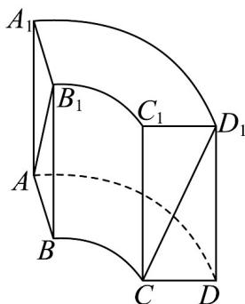

<!-- question-source:start -->
【变式2】中国古代数学著作《九章算术》记载了一种被称为“曲池”的几何体，该几何体的上、下底面平行，
且均为扇环形（扇环是指圆环被扇形截得的部分）·现有一个如图所示的曲池，它的高为2， $AA_{1}$ 、 $BB_{1}$ 、 $CC_{1}$ $DD_{1}$ 均与曲池的底面 ABCD 垂直，底面扇环对应的两个圆的半径分别为 $1$ 和 $2$ ，对应的圆心角为 $90^{\circ}$ ，则图中
异面直线 $AB_{1}$ 与 $CD_{1}$ 所成角的余弦值为（）

A. $\frac{4}{5}$ B. $\frac{3}{5}$ C. $\frac{\sqrt{10}}{10}$ D. $\frac{3\sqrt{10}}{10}$
<!-- question-source:end -->

![[高中/课堂同步/题库/人教A版高中数学同步讲义(2026)/03_选择性必修第一册/第一章 空间向量与立体几何/专题1.4 空间向量的应用（高效培优讲义）/题型04_异面直线所成的角/questions/answers/Q00079894A1.md]]
