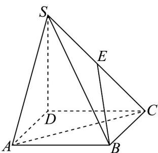

<!-- question-source:start -->
【变式3】如图，四棱锥 S-ABCD 的底面是正方形， $SD \perp$ 平面 ABCD，点 E 为 SC 中点，SD = AD，则异面

直线 EB 与 AC 所成角的余弦值为（）

A. $\frac{\sqrt{3}}{6}$ B. $\frac{\sqrt{10}}{5}$ C. $\frac{\sqrt{6}}{6}$ D. $\frac{1}{2}$
<!-- question-source:end -->

![[高中/课堂同步/题库/人教A版高中数学同步讲义(2026)/03_选择性必修第一册/第一章 空间向量与立体几何/专题1.4 空间向量的应用（高效培优讲义）/题型04_异面直线所成的角/questions/answers/Q00079895A1.md]]
