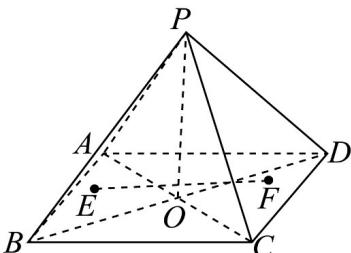

> [!faq]- 《专题1.4 空间向量的应用（高效培优讲义）》官方解析
>
> > [!success]- **【答案】** A
>
> > [!note]- **【分析】**
> > 应用直线与面内直线所成角的最小值是直线和面上射影所成角，再结合边长计算求解·
>
> > [!note]- **【解析】**
> > 设正四棱锥 P-ABCD 的高为 PO，则 $\frac{1}{3} \times 2^{2} \times PO = 4\sqrt{2}$ ，解得 $PO = 3\sqrt{2}$ ，
> > 所以 $PA = \sqrt{OA^{2} + h^{2}} = 2\sqrt{5}$ .
> >
> > 由已知 $PO\cdot AC = 0$ ， $PO\cdot BD = 0$ ， $AC\cdot BD = 0$
> >
> > 设 $EF = xAC + yBD$ ，且 $x^{2} + y^{2} \neq 0$ ，又 $PA = PO + OA$
> >
> > 所以 $EF \cdot PA = (xAC + yBD) \cdot (PO + OA) = xAC \cdot OA = -4x$
> >
> > 所以 $\left|\cos\left\langle\begin{matrix}\vec{PA},\vec{EF}\end{matrix}\right\rangle\right|=\frac{\left|\begin{matrix}P_{A}\cdot EF\\ \vec{PA}\end{matrix}\right|}{\left|PA\right|\left|EF\right|}=\frac{\left|4x\right|}{2\sqrt{5}\times\sqrt{8x^{2}+8y^{2}}}\leq\frac{4}{4\sqrt{10}}=\frac{\sqrt{10}}{10}$ ，当且仅当 y=0 时等号成立，
> >
> > 设直线 PA 与直线 EF 所成角为 $\theta$
> >
> > 所以当直线 EF 与直线 AC 平行或重合时， $\cos\theta$ 取得最大值，最大值为 10
> >
> > $$
> > \sqrt {1 0}
> > $$
> >
> > 故选：A.
> >
> > 
