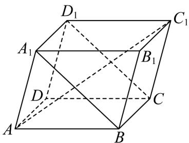

> [!faq]- 《专题1.4 空间向量的应用（高效培优讲义）》官方解析
>
> > [!success]- **【答案】** BC
>
> > [!note]- **【分析】**
> > 对于选项 A，用向量的线性定理将向量 $AC_{1}$ 表示出来，然后求向量的模即可；对于选项 B，可计算
> >
> > $BC \cdot BA_{1}$ 是否为 $^{0}$ 来验证四边形 $A_{1}BCD_{1}$ 是否为矩形，然后结合线段长度验证其是否为正方形；对于选项 $^{C}$ ，求
> >
> > 出平面 $ABCD$ 的法向量后可求 $AA_{1}$ 与平面 $ABCD$ 所成角的正弦值，故可求其余弦值，对于 $\mathbf{D}$ ，设
> >
> > $\overline{AP}=\overline{AD}+\overline{mDD_{1}}+\overline{nDC}$ ，根据线线角可得 $m,n$ 的方程，结合判别式可判断其正误·
>
> > [!note]- **【解析】**
> > 对于选项 A：
> >
> > 因为 $AC_{1} = AA_{1} + A_{1}C_{1} = AA_{1} + A_{1}D_{1} + A_{1}B_{1} = AA_{1} + AD + AB$
> >
> > 所以 $\left|AC_1\right|^2 = \left(AA_1 + AD + AB\right)^2$
> >
> > $$
> > = \left| \overline {{A A}} _ {1} \right| ^ {2} + \left| \overline {{A D}} \right| ^ {2} + \left| \overline {{A B}} \right| ^ {2} + 2 \overline {{A A}} _ {1} \cdot \overline {{A D}} + 2 \overline {{A D}} \cdot \overline {{A B}} + 2 \overline {{A A}} _ {1} \cdot \overline {{A B}},
> > $$
> >
> > 因为 $\left|AA_1\right|^2 = \left|A_1D_1\right|^2 = \left|A_1B_1\right|^2 = 36$
> >
> > 而 $AA_{1}\cdot AD=\left|AA_{1}\right|\left|AD\right|\cos\angle A_{1}AD=6\times6\times\frac{1}{2}=18$
> >
> > 同理 $A_{1}D_{1}\cdot AB = 18$ ， $AA_{1}\cdot AB = 18$
> >
> > 所以 $\left|AC_{1}\right|^{2}=36+36+36+2\times18+2\times18+2\times18=216$
> >
> > 所以 $AC_{1}=\sqrt{216}=6\sqrt{6}$ ，A 错误；
> >
> > 
> >
> > <!-- source-part:2 pages:51-100 -->
> >
> > 对于选项 B :
> >
> > 因为 $BC \cdot BA_{1} = AD \cdot (AA_{1} - AB) = AD \cdot AA_{1} - AD \cdot AB = 18 - 18 = 0$ ，所以 $BC \perp BA_{1}$
> >
> > 又 $\left|AA_{1}\right|=\left|AB\right|=6,\angle A_{1}AB=60^{\circ}$ ，故 $\triangle A_{1}AB$ 为等边三角形，故 $BA_{1}=6$
> >
> > 因为 $BC // A_{1}D_{1}, BC = BA_{1} = A_{1}D_{1} = 6, BA_{1} \perp BC$
> >
> > 所以平行四边形 $A_{1}BCD_{1}$ 为正方形， $^{B}$ 正确；
> >
> > 对于选项 $^{C}$ ：设平面 ABCD 的法向量为 n 且 $n = aAB + bAD + cAA_{1}$
> >
> > 则 $\left\{\begin{aligned}\vec{n}\cdot AB&=aAB^{2}+bAD\cdot AB+cAA_{1}\cdot AB=0\\ \vec{n}\cdot AD&=aAD\cdot AB+bAD^{2}\cdot+cAA_{1}\cdot AD=0\end{aligned}\right.$ ，故 $\left\{\begin{aligned}36a+18b+18c=0\\ 18a+36b+18c=0\end{aligned}\right.$
> >
> > 取 $a = b = -1, c = 3$ ，故 $n = -AB - AD + 3AA_{1}$
> >
> > 结合 $^{A}$ 中计算可得：
> >
> > $$
> > \vec {| n |} = \sqrt {\left(- A B - A D + 3 A A _ {1}\right) ^ {2}} = \sqrt {1 1 \times 3 6 - 1 2 \times 6 \times 6 \times \frac {1}{2} + 2 \times 6 \times 6 \times \frac {1}{2}} = 6 \sqrt {6}
> > $$
> >
> > 设 $AA_{1}$ 与平面 ABCD 所成角的为 $\alpha$ ，
> >
> > $$
> > \text {故} \sin \alpha = \left| \cos n, A A _ {1} \right| = \frac {\left| \vec {n} \cdot A A _ {1} \right|}{\left| n \right| \cdot \left| A A _ {1} \right|} = \frac {\left| (- A B - A D + 3 A A _ {1}) \cdot A A _ {1} \right|}{\left| A A _ {1} \right| \cdot \left| - A B - A D + 3 A A _ {1} \right|} = \frac {7 2}{6 \times 6 \sqrt {6}} = \frac {\sqrt {6}}{3},
> > $$
> >
> > 故 $\cos\alpha=\frac{\sqrt{3}}{3}$ ，故 C 正确；
> >
> > 对于选项D：因为P在四边形 $D_{1}DCC_{1}$ 内的动点，故可设 $AP=AD+mDD_{1}+nDC$
> >
> > 其中 $0 < m < 1, 0 < n < 1$ ，故 $AP = AD + mAA_{1} + nAB$
> >
> > $$
> > \text {故} \left| A P \right| = \sqrt {\left(A D + m A A _ {1} + n A B\right) ^ {2}} = \sqrt {3 6 \left(1 + m ^ {2} + n ^ {2}\right) + 3 6 (m + n) + 3 6 m n},
> > $$
> >
> > $$
> > \left| \overline {{B D _ {1}}} \right| = \sqrt {\left(A D + A A _ {1} - A B\right) ^ {2}} = \sqrt {3 \times 3 6 - 3 6 - 3 6 + 3 6} = 6 \sqrt {2},
> > $$
> >
> > $$
> > A P \cdot B D _ {1} = \left(A D + m A A _ {1} + n A B\right) \cdot \left(A D + A A _ {1} - A B\right)
> > $$
> >
> > $$
> > = 3 6 + 1 8 - 1 8 + 1 8 m + 3 6 m - 1 8 m + 1 8 n + 1 8 n - 3 6 n
> > $$
> >
> > $$
> > = 3 6 + 3 6 m
> > $$
> >
> > $$
> > \text {故} \cos \frac {\pi}{6} = \frac {\sqrt {3}}{2} = \frac {\left| \begin{array}{c c} \square & \square \\ A P & B D _ {1} \\ \square & \square \end{array} \right|}{\left| A P \right| \cdot \left| B D _ {1} \right|} = \frac {\left| 3 6 (1 + m) \right|}{6 \sqrt {2} \times 6 \sqrt {(1 + m ^ {2} + n ^ {2}) + (m + n) + m n}},
> > $$
> >
> > 整理得 $3(1 + m^2 + n^2) + 3(m + n) + 3mn = 2(m + 1)^2$
> >
> > 整理得 $m^{2} + (3n - 1)m + 3n^{2} + 3n + 1 = 0$
> >
> > 此时 $\Delta=(3n-1)^{2}-12n^{2}-12n-4=-3n^{2}-18n-3<0$ ，故方程无解，
> >
> > 故四边形 $CC_{1}D_{1}D$ 内不存在点 P，使得直线 AP 与 $BD_{1}$ 所成角为 $\frac{\pi}{6}$ ，故 D 错误，
> >
> > 故选：BC.
> >
> > ## 方法技巧
> >
> > 已知 $a, b$ 为两异面直线， $A, C$ 与 $B, D$ 分别是 $a, b$ 上的任意两点， $a, b$ 所成的角为 $\theta$ ，则 $\cos \theta = \frac{|AC \cdot BD|}{|AC| \cdot |BD|}$ .
