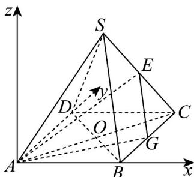

> [!faq]- 《专题1.4 空间向量的应用（高效培优讲义）》官方解析
>
> > [!success]- **【答案】** A
>
> > [!note]- **【分析】**
> > 建立空间直角坐标系结合向量求解异面直线的夹角·
>
> > [!note]- **【解析】**
> > 建立如图所示的空间直角坐标系：
> >
> > 
> >
> > 设点 $A(0,0,0)$ ， $B(a,0,0)$ ， $C(a,a,0)$ ， $D(0,a,0)$ .
> >
> > 则 O 为 $\left(\frac{a}{2},\frac{a}{2},\frac{a}{2}\right)$ .
> >
> > 因为在正四棱锥中，所以由图形可知 $S\left(\frac{a}{2},\frac{a}{2},\frac{a}{\sqrt{2}}\right)$ .
> >
> > 因为 E 是 SC 的中点，所以由 $S\left(\frac{a}{2}, \frac{a}{2}, \frac{a}{\sqrt{2}}\right)$ ， $C(a, a, 0)$
> >
> > 得到中点坐标：
> >
> > $$
> > E \left(\frac {3 a}{4}, \frac {3 a}{4}, \frac {a}{2 \sqrt {2}}\right)
> > $$
> >
> > $$
> > \text {所以} \quad A E = \left(\frac {3 a}{4}, \frac {3 a}{4}, \frac {a}{2 \sqrt {2}}\right), B S = \left(- \frac {a}{2}, \frac {a}{2}, \frac {a}{\sqrt {2}}\right)
> > $$
> >
> > $$
> > \stackrel {\square \square \square} {A E} \cdot \stackrel {\square \square \square} {B S} = \left(\frac {3 a}{4}\right) \cdot \left(- \frac {a}{2}\right) + \left(\frac {3 a}{4}\right) \cdot \left(\frac {a}{2}\right) + \left(\frac {a}{2 \sqrt {2}}\right) \cdot \left(\frac {a}{\sqrt {2}}\right) = \frac {a ^ {2}}{4},
> > $$
> >
> > $$
> > A \vec {E} = \sqrt {\left(\frac {3 a}{4}\right) ^ {2} + \left(\frac {3 a}{4}\right) ^ {2} + \left(\frac {a}{2 \sqrt {2}}\right) ^ {2}} = \sqrt {2 \cdot \frac {9 a ^ {2}}{1 6} + \frac {a ^ {2}}{8}} = \frac {\sqrt {5}}{2} a, B \vec {S} = \sqrt {\left(- \frac {a}{2}\right) ^ {2} + \left(\frac {a}{2}\right) ^ {2} + \left(\frac {a}{\sqrt {2}}\right) ^ {2}} = a,
> > $$
> >
> > 设这两条异面直线夹角为 $\theta$
> >
> > 则 $\cos\theta=\frac{\left|\begin{matrix}A E\cdot B S\\|A E|\cdot B S\end{matrix}\right|}{\left(\frac{\sqrt{5}}{2}a\right)\cdot a}=\frac{\frac{a^{2}}{4}}{\left(\frac{\sqrt{5}}{2}a\right)\cdot a}=\frac{1}{2\sqrt{5}}=\frac{\sqrt{5}}{10}.$
> >
> > 故选 **A**.
