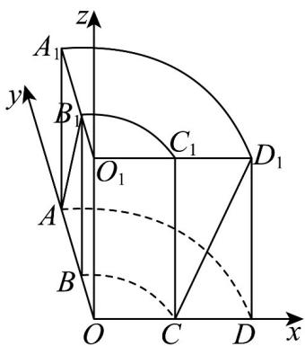

> [!faq]- 《专题1.4 空间向量的应用（高效培优讲义）》官方解析
>
> > [!success]- **【答案】** A
>
> > [!note]- **【分析】**
> > 建立空间直角坐标系，用向量法求解即可·
>
> > [!note]- **【解析】**
> > 设上底面圆心为 $O_{1}$ ，下底面圆心为 $O$ ，连接 $OO_{1}$ 、 $OC$ 、 $OB$
> >
> > 以 O 为坐标原点，分别以 OC 、 OB 、 $OO_{1}$ 所在直线为 x 、 y 、 z 轴，建立空间直角坐标系，如图所示：
> >
> > 
> >
> > 则 $C(1,0,0)$ 、 $A(0,2,0)$ 、 $B_{1}(0,1,2)$ 、 $D_{1}(2,0,2)$
> >
> > 所以 $\overrightarrow{CD_{1}}=(1,0,2)$ ， $\overrightarrow{AB_{1}}=(0,-1,2)$ ， $\cos AB_{1}, CD_{1}=\frac{\overrightarrow{AB_{1}}\cdot\overrightarrow{CD_{1}}}{\left|\overrightarrow{AB_{1}}\right|\cdot\left|\overrightarrow{CD_{1}}\right|}=\frac{4}{\sqrt{5}\cdot\sqrt{5}}=\frac{4}{5}$
> >
> > 所以异面直线 $AB_{1}$ 与 $CD_{1}$ 所成角的余弦值为 $\frac{4}{5}$ .
> >
> > 故选 **A**.
