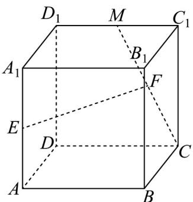

<!-- question-source:start -->
【典例2】如图，在棱长为 $^{2}$ 的正方体 $ABCD-A_{1}B_{1}C_{1}D_{1}$ 中，M、E分别是 $C_{1}D_{1}$ 、 $A_{1}A$ 的中点，点F在线段

CM 上， $EF \parallel$ 平面 ABCD

(1)证明： $F$ 是 $MC$ 的中点；

(2)求直线 EF 与平面 BCM 所成角的正弦值.
<!-- question-source:end -->

![[高中/课堂同步/题库/人教A版高中数学同步讲义(2026)/03_选择性必修第一册/第一章 空间向量与立体几何/专题1.4 空间向量的应用（高效培优讲义）/题型05_线面角/questions/answers/Q00079897A1.md]]
