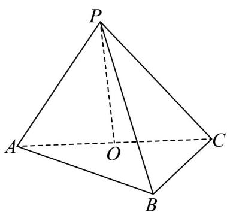

<!-- question-source:start -->
【变式2】如图所示，在三棱锥 $P - ABC$ 中， $AB \perp BC$ ， $\left|AB\right| = \left|BC\right| = \frac{1}{2}\left|PA\right|$ ， $O$ 是 $AC$ 的中点，且 $OP \perp$ 底面

$ABC$ ，则直线 $PA$ 与平面 $PBC$ 所成角的正弦值为\_\_\_\_.

<!-- question-source:end -->

![[高中/课堂同步/题库/人教A版高中数学同步讲义(2026)/03_选择性必修第一册/第一章 空间向量与立体几何/专题1.4 空间向量的应用（高效培优讲义）/题型05_线面角/questions/answers/Q00079899A1.md]]
