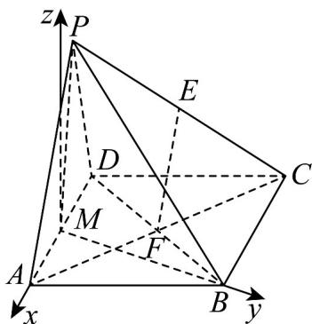

> [!faq]- 《专题1.4 空间向量的应用（高效培优讲义）》官方解析
>
> > [!success]- **【答案】** (1)证明见解析 (2)证明见解析 (3) $\frac{\sqrt{2}}{3}$
>
> > [!note]- **【分析】**
> > （ $^{1}$ ）根据中位线性质得线线平行，即可证线面平行；
> >
> > (2) 运用等腰三角形和等边三角形三线合一的性质证出两组线线垂直，从而得到线面垂直，线面垂直可直接
> >
> > 推出面面垂直；
> >
> > (3)
> > 解法一：由正四面体的性质求出点 $C$ 到平面 $PAD$ 的距离，即可求解；解法二：建立空间直角坐标系，
> >
> > 算出直线的方向向量和平面的法向量，代入线面所成角的正弦公式即可·
>
> > [!note]- **【解析】**
> > （1）四边形ABCD是菱形，则F是BD中点的同时也是AC中点，
> >
> > ∵ E, F 分别为 PC, AC 的中点，∴ EF 是 $\triangle PAC$ 的中位线，EF // PA
> >
> > ∵ $PA \subset_{平面} PAD$ ， $EF \not\subset_{平面} PAD$ ，
> >
> > $$
> > \therefore E F / / _ {\text { 平面 }} P A D.
> > $$
> >
> > (2) $\because PA = PD$ ， $M$ 是 $AD$ 中点，等腰三角形三线合一， $\therefore PM \perp AD$
> >
> > ∵ DA = AB， $\angle DAB = 60^{\circ}$ ，∴ $\triangle DAB$ 是等边三角形，
> >
> > ∵ M AD 是中点，等边三角形三线合一，∴ $BM \perp AD$
> >
> > ∵ $BM \cap PM = M$ ， $BM, PM \subset PMB$ ，平面
> >
> > $\therefore AD \perp_{平面} PMB$
> >
> > ∵ $AD \subset$ 平面 PAD
> >
> > 故平面 $PMB \perp$ 平面 $PAD$ .
> >
> > (3)
> > 解法一：由题意， $PA = AD = PB = PD = BD = AB$ ，
> >
> > 所以三棱锥 P-ABD 为正四面体，设棱长为 $^{2}$ ，则 $AC = 2\sqrt{3}$
> >
> > 设 BM, AF 交于点 O，连接 PO，
> >
> > 则点 O 为底面 $\triangle ABD$ 的中心， $PO \perp$ 平面 ABD，
> >
> > 由正三角形的性质可得 $BO=\frac{2\sqrt{3}}{3}$ ，所以 $PO=\sqrt{PB^{2}-BO^{2}}=\frac{2\sqrt{6}}{3}$ ，
> >
> > 由正四面体的性质可得点 $B$ 到平面 $PAD$ 的距离也为 $\frac{2\sqrt{6}}{3}$
> >
> > 又 $BC \parallel AD, BC \notin$ 平面 $APD$ , $AD \subset$ 平面 $APD$ , 所以 $BC \parallel$ 平面 $APD$ ,
> >
> > 所以点 C 到平面 PAD 的距离也为 $\frac{2\sqrt{6}}{3}$ ，
> >
> > 所以直线 $AC$ 与平面 $PAD$ 夹角的正弦值 $\frac{\frac{2\sqrt{6}}{3}}{AC} = \frac{\frac{2\sqrt{6}}{3}}{2\sqrt{3}} = \frac{\sqrt{2}}{3}$
> >
> > 
> >
> > 解法二：由（2）可知 $BM \perp MA$ ，故以 $M$ 为原点， $MA$ 为 $x$ 轴， $MB$ 为 $y$ 轴，过点 $M$ 垂直于平面 $ABCD$ 的直
> >
> > 线为 z 轴，建立空间直角坐标系，
> >
> > 设 $PA = AD = PB = 2$ ，易知， $M(0,0,0)$ ， $A(1,0,0)$ ， $D(-1,0,0)$ ， $C(-2,\sqrt{3},0)$ ， $B(0,\sqrt{3},0)$ ， $\overline{AC} = (-3,\sqrt{3},0)$ ， $\overline{AD} = (-2,0,0)$
> >
> > 再设 $P(x,y,z)$ ，由 $PA = PD = 2$ ， $PM = \sqrt{3}$ ， $PB = 2$ ，可得：
> >
> > $\left\{ \begin{array}{l}(x - 1)^2 +y^2 +z^2 = 4\\ (x + 1)^2 +y^2 +z^2 = 4\\ x^2 +y^2 +z^2 = 3\\ x^2 +(y - \sqrt{3})^2 +z^2 = 4 \end{array} \right.$ ，解得 $\left\{ \begin{array}{l}x = 0\\ y = \frac{\sqrt{3}}{3}\\ z = \frac{2\sqrt{6}}{3} \end{array} \right.,$
> >
> > 即 $P(0, \frac{\sqrt{3}}{3}, \frac{2\sqrt{6}}{3})$ ， $AP = (-1, \frac{\sqrt{3}}{3}, \frac{2\sqrt{6}}{3})$
> >
> > 设平面 PAD 的法向量 $n = (a, b, c)$
> >
> > $$
> > \left\{\begin{array}{l}n \cdot A D = 0\\\rightarrow \square \square\\n \cdot A P = 0\end{array}, \left\{\begin{array}{c}(a, b, c) \cdot (- 2, 0, 0) = 0\\(a, b, c) \cdot (- 1, \frac {\sqrt {3}}{3}, \frac {2 \sqrt {6}}{3}) = 0\end{array}, \left\{\begin{array}{c}- 2 a = 0\\- a + \frac {\sqrt {3}}{3} b + \frac {2 \sqrt {6}}{3} c = 0\end{array}, \right. \right. \right.
> > $$
> >
> > 解得 $n = (0,2\sqrt{2}, - 1)$
> >
> > 设直线 AC 与平面 PAD 夹角为 $\theta$
> >
> > $$
> > \sin \theta = \frac {\left| \overrightarrow {A C} \cdot n \right|}{\left| \overrightarrow {A C} \right| \left| n \right|} = \frac {\left| (- 3 , \sqrt {3} , 0) \cdot (0 , 2 \sqrt {2} , - 1) \right|}{2 \sqrt {3} \times 3} = \frac {2 \sqrt {6}}{6 \sqrt {3}} = \frac {\sqrt {2}}{3},
> > $$
> >
> > 故直线 AC 与平面 PAD 夹角的正弦值为 $\frac{\sqrt{2}}{3}$
> >
> > 
