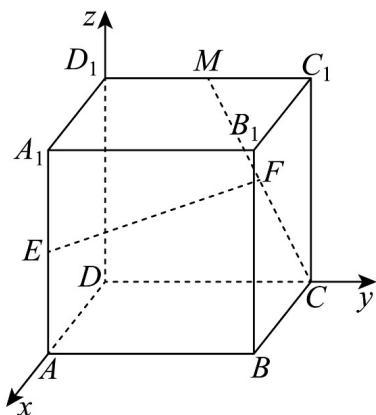

> [!faq]- 《专题1.4 空间向量的应用（高效培优讲义）》官方解析
>
> > [!success]- **【答案】** (1)证明见解析 (2) $\frac{6\sqrt{5}}{25}$
>
> > [!note]- **【分析】**
> > （1）根基线面平行的向量表示，设出 F 的坐标，根据线面平行，说明 F 是 MC 的中点.
> >
> > (2) 建立空间直角坐标系，根据线面角的向量方法，求出线面角的正弦值.
>
> > [!note]- **【解析】**
> > （1）
> >
> > 
> >
> > 如图所示，以 D 为坐标原点，分别以 DA, DC, $DD_{1}$ 为 x, y, z 轴，建立空间直角坐标系.
> >
> > 因为正方体的棱长为 $^{2}$ ，则 $E(2,0,1), C(0,2,0), M(0,1,2)$
> >
> > 设 $F(x,y,z),CF = \lambda CM$
> >
> > $\overline{CF}=(x,y-2,z),\overline{CM}=(0,-1,2)$ ，可得 $(x,y-2,z)=\lambda(0,-1,2)$ ，解得 $\left\{\begin{aligned}x&=0\\ y&=2-\lambda\\ z&=2\lambda\end{aligned}\right.$
> >
> > 可得 $F(0,2 - \lambda ,2\lambda)$ ，则 $\overline{EF} = (-2,2 - \lambda ,2\lambda -1)$ 设平面ABCD的一个法向量 $n = (0,0,1)$
> >
> > 则 $\overline{EF} \cdot n = 0$ ，得 $2\lambda - 1 = 0$ ，解得 $\lambda = \frac{1}{2}$ ，所以 F 是 MC 的中点.
> >
> > (2)
> >
> > 
> >
> > 如图所示， $B(2,2,0)$ ， $BC=(-2,0,0)$ ， $CM=(0,-1,2)$ ，当 $\lambda=\frac{1}{2}$ 时， $EF=(-2,\frac{3}{2},0)$
> >
> > 设面 $BCM$ 的法向量 $m = (a, b, c)$ ，则 $\left\{ \begin{array}{l} m \cdot BC = 0 \\ \rightarrow \square \square \square \\ m \cdot CM = 0 \end{array} \right.$ ，即 $\left\{ \begin{array}{l} -2a = 0 \\ -b + 2c = 0 \end{array} \right.$ ，
> >
> > 令 $b = 2$ ，解得 $\left\{ \begin{array}{ll}a = 0\\ b = 2\\ c = 1 \end{array} \right.$ ，面的一个法向量 $m = (0,2,1)$
> >
> > 设直线 与平面 所成角为 $\sin \theta = \cos < \overrightarrow{EF} \cdot \overrightarrow{m} > = \frac{3}{\sqrt{5} \times \frac{5}{2}} = \frac{6\sqrt{5}}{25}$
> >
> > 所以直线 $EF$ 与平面 $BCM$ 所成角的正弦值为 $\frac{6\sqrt{5}}{25}$
> >
> > ## 方法技巧
> >
> > 设直线 $l$ 的方向向量为 $a$ ，平面 $\alpha$ 的法向量为 $u$ ，直线与平面所成的角为 $\theta$ ， $a$ 与 $u$ 的角为 $\varphi$
> >
> > 则有 $\sin \theta = |\cos \varphi| = \frac{|\vec{a} \cdot u|}{|a| \cdot |u|}$
