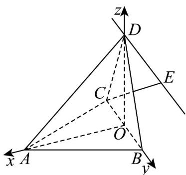

> [!faq]- 《专题1.4 空间向量的应用（高效培优讲义）》官方解析
>
> > [!success]- **【答案】** (1)证明见解析 (2) $\frac{\sqrt{7}}{3}$
>
> > [!note]- **【分析】**
> > （ $^{1}$ ）要证明线线垂直，可通过线面垂直推导出线线垂直，即证明 $BC \perp$ 平面 AOD 即可·
> >
> > (2) 首先根据垂直关系建立空间直角坐标系，求出平面 ABD 的法向量以及 CE 的坐标，利用向量夹角的余弦
> >
> > 值公式将直线与平面所成角的正弦值表示出来，并确定其最大值·
>
> > [!note]- **【解析】**
> > （1）证明：如图所示，取 BC 中点 O，连接 OA, OD
> >
> > 在 $\triangle ACD$ 中，根据余弦定理得
> >
> > $$
> > C D ^ {2} = A D ^ {2} + A C ^ {2} - 2 A D \cdot A C \cdot \cos \angle C A D = 9 + 4 - 2 \times 3 \times 2 \times \frac {1}{2} = 7,
> > $$
> >
> > 得 $CD = \sqrt{7}$ .同理 $BD = \sqrt{7}$
> >
> > 所以 CD = BD ，又 O 为 BC 中点，所以 $DO \perp BC$
> >
> > 又 VABC 是正三角形，O 为 BC 中点，所以 $AO \perp BC$ ，
> >
> > 又 $AO \cap DO = O, AO, DO \subset$ 平面 AOD ，
> >
> > 故 $BC \perp$ 平面 $AOD$ ，因为 $AD \subset$ 平面 $AOD$ ，因此 $AD \perp BC$
> >
> > (2) 在 $\triangle BCD$ 中， $OD = \sqrt{BD^{2} - BO^{2}} = \sqrt{6}$
> >
> > 又 $AO = \sqrt{3}$ , AD = 3 ，所以 $AO^{2} + OD^{2} = AD^{2}$
> >
> > 由勾股定理逆定理得 $\angle AOD = \frac{\pi}{2}$ ，即 $DO \perp AO$ ，
> >
> > 由（1）可知 $DO \perp BC$ ，又 $AO \cap BC = O$ ， $AO, BC \subset$ 平面 $ABC$ ，
> >
> > 所以 $DO \perp$ 平面 ABC
> >
> > 因此建立如图所示建立空间直角坐标系， $O(0,0,0), A(\sqrt{3},0,0), B(0,1,0), C(0,-1,0), D(0,0,\sqrt{6})$
> >
> > $CB = (0,2,0)$ ，设 $E(a,b,c)$ ，则 $DE = (a,b,c - \sqrt{6})$
> >
> > 
> >
> > 由 $DE = \lambda CB$ ，得 $E(0,2\lambda ,\sqrt{6})$
> >
> > $$
> > \stackrel {\square \sqcup \sqcup} {C E} = (0, 2 \lambda + 1, \sqrt {6}), \stackrel {\square \sqcup \sqcup} {A B} = (- \sqrt {3}, 1, 0), \stackrel {\square \sqcup \sqcup} {A D} = (- \sqrt {3}, 0, \sqrt {6})
> > $$
> >
> > 设平面 ABD 的法向量为 $n = (x, y, z)$ ，则
> >
> > $\left\{ \begin{array}{l} AB \cdot n = -\sqrt{3} x + y = 0 \\ AD \cdot n = -\sqrt{3} x + \sqrt{6} z = 0 \end{array} \right.$ ，令 $z = 1$ 得 $x = \sqrt{2}, y = \sqrt{6}$ ，即 $n = (\sqrt{2}, \sqrt{6}, 1)$ ：
> >
> > 设 CE 与平面 ABD 所成角为 $\theta$ ，
> >
> > 则 $\sin \theta = \frac{\left|\overrightarrow{CE} \cdot n\right|}{\left|CE\right| \cdot |n|} = \frac{2\sqrt{6} |\lambda + 1|}{3\sqrt{(2\lambda + 1)^2 + 6}}$
> >
> > 设 $y = \frac{\left(\lambda + 1\right)^2}{\left(2\lambda + 1\right)^2 + 6}$ ，则 $(4y - 1)\lambda^2 + (4y - 2)\lambda + 7y - 1 = 0$ ，
> >
> > 由 $\Delta = (4y - 2)^2 - 4(4y - 1)(7y - 1) \quad 0$ ，得 $0 \leq y \leq \frac{7}{24}$ ，所以 $y_{\max} = \frac{7}{24}$ ，
> >
> > 此时 $\lambda = \frac{5}{2}$ ，因此 $(\sin \theta)_{\max} = \frac{2\sqrt{6}}{3}\times \sqrt{\frac{7}{24}} = \frac{\sqrt{7}}{3}$
