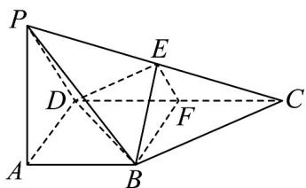

<!-- question-source:start -->
【变式1】如图，在四棱锥P-ABCD中，PA⊥底面ABCD，∠DAB为直角，AB//CD，AD=CD=2AB

$E$ ， $F$ 分别为 $PC$ ， $CD$ 的中点， $PA = kAB(k > 0)$ ，且二面角 $E - BD - C$ 的平面角大于 $30^{\circ}$ ，则 $k$ 的取值范围是

<!-- question-source:end -->

![[高中/课堂同步/题库/人教A版高中数学同步讲义(2026)/03_选择性必修第一册/第一章 空间向量与立体几何/专题1.4 空间向量的应用（高效培优讲义）/题型06_二面角/questions/answers/Q00079903A1.md]]
