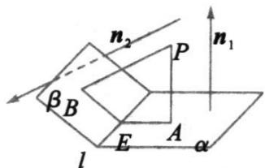

> [!faq]- 《专题1.4 空间向量的应用（高效培优讲义）》官方解析
>
> > [!success]- **【答案】** $2 \sqrt{2}$
>
> > [!note]- **【分析】**
> > 根据二面角、空间向量运算等知识来求得点 B 与点 D 之间的距离.
>
> > [!note]- **【解析】**
> > 分别作 $BE \perp AC$ ， $DF \perp AC$ ，垂足为 $E$ ， $F$ ，则 $\theta = <EB, FD>$
> >
> > 由已知可得， $EB = FD = \sqrt{3}$ ， $AE = CF = 1$ ， $EF = 2$ 。因为 $\overline{BD} = \overline{BE} +\overline{EF} +\overline{FD}$
> >
> > 则 $|\overline{BD}|^2 = \overline{BD}^2 = (BE + EF + FD)^2 = \overline{BE}^2 + \overline{EF}^2 + \overline{FD}^2 + 2BE \cdot FD = 3 + 4 + 3 + 2\sqrt{3} \cdot \sqrt{3} \cos(\pi - \theta) = 8$ ，所以
> >
> > $$
> > \left| \stackrel {\sqcup \sqcup \sqcup} {B D} \right| = 2 \sqrt {2}
> > $$
> >
> > 故答案为： $2 \sqrt{2}$
> >
> > 
> >
> > ## 方法技巧
> >
> > 如图，若 $PA \perp \alpha$ 于 $A, PB \perp \beta$ 于 $B$ ，平面 $PAB$ 交 $l$ 于 $E$ ，则 $\angle AEB$ 为二面角 $\alpha - l - \beta$ 的平面角， $\angle AEB + \angle APB = 180^{\circ}$
> >
> > 
> >
> > 若 $n_1, n_2$ 分别为面 $\alpha, \beta$ 的法向量， $\cos \left\langle n_1, n_2 \right\rangle = \frac{n_1 \cdot n_2}{|n_1| \cdot |n_2|}$ 则二面角的平面角 $\angle AEB = \left\langle n_1, n_2 \right\rangle$ 或 $\pi - \left\langle n_1, n_2 \right\rangle$
