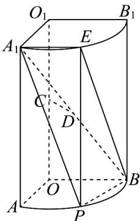

<!-- question-source:start -->
【变式2】如图，几何体 $OAB - O_{1}A_{1}B_{1}$ 是圆柱的四分之一部分，其中底面 $OAB$ 是半径为1的扇形，母线长为2

$C$ 是 $OO_{1}$ 的中点， $D$ 为 $A_{1}B$ 的中点， $P$ 是 $\square A B$ 上的动点（ $P$ 不与 $A$ 、 $N$ 重合）， $PE$ 是圆柱的母线。

(1)证明： $CD / /$ 平面 $OAB$ ；

(2)求三棱锥 $B - A_{1}EP$ 的体积的最大值；

(3)求二面角 $B - A_{1}E - P$ 余弦值的取值范围.
<!-- question-source:end -->

![[高中/课堂同步/题库/人教A版高中数学同步讲义(2026)/03_选择性必修第一册/第一章 空间向量与立体几何/专题1.4 空间向量的应用（高效培优讲义）/题型07_距离问题/questions/answers/Q00079909A1.md]]
