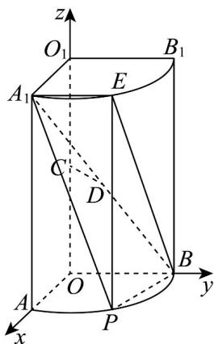

> [!faq]- 《专题1.4 空间向量的应用（高效培优讲义）》官方解析
>
> > [!success]- **【答案】** (1)证明见解析 (2) $\frac{\sqrt{2}-1}{3}$ (3) $\left(\frac{2\sqrt{5}}{5},1\right)$
>
> > [!note]- **【分析】**
> > （1）以点 $O$ 为坐标原点， $OA$ 、 $OB$ 、 $^{OO_{1}}$ 所在直线分别为 $x$ 、 $y$ 、 $z$ 轴建立空间直角坐标系，利用
> >
> > 空间向量法可证得结论成立；
> >
> > (2) 设点 $P(\cos\theta,\sin\theta,0)$ ，其中 $0<\theta<\frac{\pi}{2}$ ，利用空间向量法求出点 B 到平面 $A_{1}PE$ 的距离 d，再利用锥体的
> >
> > 体积公式以及三角函数的有界性可求得三棱锥 $B-A_{1}EP$ 的体积的最大值；
> >
> > (3) 利用空间向量法可求得二面角 $B - A_{1}E - P$ 余弦值的取值范围.
>
> > [!note]- **【解析】**
> > （1）由题意可知， $OA \perp OB$ ， $OO_{1} \perp$ 平面OAB，
> >
> > 以点 O 为坐标原点，OA、OB、 $OO_{1}$ 所在直线分别为 x、y、z 轴建立如下图所示的空间直角坐标系，
> >
> > 
> >
> > 则 $A_{1}(1,0,2)$ 、 $B(0,1,0)$ 、 $C(0,0,1)$ 、 $D\left(\frac{1}{2},\frac{1}{2},1\right)$ ，所以 $CD=\left(\frac{1}{2},\frac{1}{2},0\right)$
> >
> > 易知平面 $OAB$ 的一个法向量为 $a = (0,0,1)$ ，则 $\overline{CD} \cdot a = 0$ ，即 $\overline{CD} \perp a$
> >
> > 又因为 $CD \notin$ 平面 $OAB$ ，所以 $CD \parallel$ 平面 $OAB$ .
> >
> > (2) 不妨设点 $P(\cos\theta,\sin\theta,0)$ ，其中 $0<\theta<\frac{\pi}{2}$
> >
> > 则 $A_{1}(1,0,2)$ 、 $E(\cos \theta ,\sin \theta ,2)$ 、 $B(0,1,0)$
> >
> > $\stackrel{\mathrm{uu}}{PE} = (0,0,2)$ ， $A_{1}E = (\cos \theta -1,\sin \theta ,0)$ ， $BA_{1} = (1, - 1,2)$
> >
> > 设平面 $A_{1}PE$ 的一个法向量为 $m = (x_{1},y_{1},z_{1})$ ，则 $\left\{ \begin{array}{ll}m\cdot \overline{PE} = 2z_1 = 0\\ \overrightarrow{\square}\overline{\square}\\ m\cdot A_1E = (\cos \theta -1)x_1 + y_1\sin \theta = 0 \end{array} \right.$
> >
> > 取 $x_{1} = \sin \theta$ ，可得 $m = (\sin \theta, 1 - \cos \theta, 0)$ ，所以 $\left|A_{1}E\right| = |m|$
> >
> > 所以点到平面 $A_{1}PE$ 的距离为 $d = \frac{\left|\overrightarrow{BA_1}\cdot m\right|}{\left|m\right|} = \frac{\left|\sin\theta + \cos\theta - 1\right|}{\sqrt{\sin^2\theta + (1 - \cos\theta)^2}}$
> >
> > 因为 PE 为是圆柱的一条母线，故 $PE \perp$ 平面 $O_{1}A_{1}B_{1}$ ，
> >
> > 因为 $A_{1}E \subset$ 平面 $O_{1}A_{1}B_{1}$ ，故 $PE \perp A_{1}E$ ，则 $S_{\triangle A_1PE} = \frac{1}{2}\left|\overline{A_1E}\right| \cdot \left|\overline{PE}\right|$ ，
> >
> > 所以 $V_{B-A_{1}PE}=\frac{1}{3}S_{\triangle A_{1}PE}\cdot d=\frac{1}{3}\times\frac{1}{2}\left|\stackrel{\square\square\square}{A_{1}}E\right|\cdot\left|\stackrel{\square\square\square}{PE}\right|\cdot\frac{\left|\sin\theta+\cos\theta-1\right|}{\left|m\right|}=\frac{1}{6}\times2\times\left|\sin\theta+\cos\theta-1\right|$
> >
> > $$
> > = \frac {\left| \sqrt {2} \sin \left(\theta + \frac {\pi}{4}\right) - 1 \right|}{3}
> > $$
> >
> > 因为 $0 < \theta < \frac{\pi}{2}$ ，则 $\frac{\pi}{4} < \theta + \frac{\pi}{4} < \frac{3\pi}{4}$ ，故 $\frac{\sqrt{2}}{2} < \sin \left(\theta + \frac{\pi}{4}\right) \leq 1$ ，所以 $\sqrt{2} \sin \left(\theta + \frac{\pi}{4}\right) > 1$
> >
> > 则 $V_{B - A_1PE} = \frac{\left|\sqrt{2}\sin\left(\theta + \frac{\pi}{4}\right) - 1\right|}{3} = \frac{\sqrt{2}}{3}\sin \left(\theta + \frac{\pi}{4}\right) - \frac{1}{3} \leq \frac{\sqrt{2} - 1}{3}$
> >
> > 即三棱锥 $B-A_{1}EP$ 的体积的最大值为 $\frac{\sqrt{2}-1}{3}$
> >
> > (3) 设平面 $A_{1}BE$ 的一个法向量为 $n = (x_{2}, y_{2}, z_{2})$ ,
> >
> > $A_{1}E = (\cos \theta - 1, \sin \theta, 0)$ ， $BA_{1} = (1, -1, 2)$ ，则 $\left\{ \begin{array}{l} n \cdot A_{1}E = x_{2} (\cos \theta - 1) + y_{2} \sin \theta = 0 \\ n \cdot BA_{1} = x_{2} - y_{2} + 2z_{2} = 0 \end{array} \right.$
> >
> > 取 $x_{2} = 2\sin \theta$ ，则 $n = (2\sin \theta, 2 - 2\cos \theta, 1 - \sin \theta - \cos \theta)$
> >
> > $$
> > \left| \cos m, n \right| = \frac {\left| \stackrel {\rightarrow} {m} \cdot n \right|}{\left| m \right| \cdot \left| n \right|} = \frac {\left| 2 \sin^ {2} \theta + 2 (1 - \cos \theta) ^ {2} \right|}{\sqrt {\sin^ {2} \theta + (1 - \cos \theta) ^ {2}} \cdot \sqrt {4 \sin^ {2} \theta + 4 (1 - \cos \theta) ^ {2} + (1 - \sin \theta - \cos \theta) ^ {2}}}
> > $$
> >
> > $$
> > = 2 \sqrt {\frac {\sin^ {2} \theta + (1 - \cos \theta) ^ {2}}{4 \sin^ {2} \theta + 4 (1 - \cos \theta) ^ {2} + (1 - \sin \theta - \cos \theta) ^ {2}}} = \frac {2}{\sqrt {5 - \sin \theta}},
> > $$
> >
> > 因为 $0 < \theta < \frac{\pi}{2}$ ，则 $0 < \sin \theta < 1$ ，故 $\left|\cos m, n\right| = \frac{2}{\sqrt{5 - \sin \theta}} \in \left(\frac{2\sqrt{5}}{5}, 1\right)$ .
> >
> > 结合图形可知，二面角 $B - A_{1}E - P$ 的平面角为锐角，
> >
> > 因此，二面角 $B - A_{1}E - P$ 余弦值的取值范围为 $\left(\frac{2\sqrt{5}}{5},1\right)$
