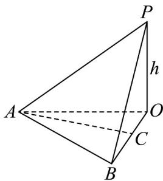

> [!faq]- 《专题1.4 空间向量的应用（高效培优讲义）》官方解析
>
> > [!success]- **【答案】** (1) $h = 20\mathrm{m}$ (2) $10\sqrt{3}m$
>
> > [!note]- **【分析】**
> > （1）由题意 $AO = \sqrt{3}h, BO = h$ ，结合余弦定理即可求解；
> >
> > (2) 过点 A 作 $AC \perp BO$ 于点 C，说明所求为线段 AC 的长度，解三角形即可得解.
>
> > [!note]- **【解析】**
> > （1）由题意 $AO = \sqrt{3} h, BO = h$ ，而 $AB = 20\mathrm{m}$ ， $\angle AOB = 30^{\circ}$
> >
> > 所以由余弦定理有 $400 = 3h^{2} + h^{2} - 2h \cdot \sqrt{3}h \times \frac{\sqrt{3}}{2}$ ，即 $h^{2} = 400$ ，解得 $h = 20\mathrm{m}$ ；
> >
> > (2) 如图所示，过点 A 作 $AC \perp BO$ 于点 C，
> >
> > 由题意 $PO \perp$ 平面 $ABO$ ，又 $AC \subset$ 平面 $ABO$ ，所以 $AC \perp PO$ ，
> >
> > 又因为 $AC \perp BO$ ， $BO \cap PO = O, BO, PO \subset$ 平面 PBO，
> >
> > 所以 $AC \perp$ 平面 PBO ，
> >
> > 故所求为线段 $AC$ 的长度，
> >
> > 由（1）可知 $AO = \sqrt{3}h = 20\sqrt{3}m$
> >
> > 所以 $AC = AO \sin 30^{\circ} = 10\sqrt{3}m$ .
> >
> > 
