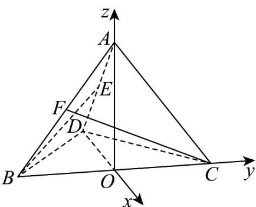

> [!faq]- 《第一章 空间向量与立体几何（高效培优单元测试·强化卷）》官方解析
>
> > [!success]- **【答案】** A
>
> > [!note]- **【分析】**
> > 作 $AO \perp$ 平面 BCD 于点 O，证点 O 为斜边 BC 的中点，且 $DO \perp BC$ ，建立空间直角坐标系，设
> > BD = DC = 4
> > ，求出相关点和向量的坐标，利用空间向量的夹角公式计算即得·
>
> > [!note]- **【解析】**
> > 如图，作 $AO \perp$ 平面 $BCD$ 于点 $O$
> >
> > 因 AB = AC = AD ，则 O 为 $\triangle BCD$ 的外心，
> >
> > 又 $BD \perp DC$ ， $BD = DC$ 故点 $O$ 为斜边 $BC$ 的中点，且 $DO \perp BC$
> >
> > 故可以点 O 为原点，分别以 DO, OC, OA 所在直线为 x, y, z 轴建立空间直角坐标系如图.
> >
> > 
> >
> > 设 $BD = DC = 4$ ，则 $BC = 4\sqrt{2}$ ，则 $OD = OB = OC = 2\sqrt{2}$
> >
> > $$
> > O A = \sqrt {A D ^ {2} - D O ^ {2}} = \sqrt {4 ^ {2} - (2 \sqrt {2}) ^ {2}} = 2 \sqrt {2}
> > $$
> >
> > 则有 $A(0,0,2\sqrt{2}), B(0, -2\sqrt{2}, 0), C(0, 2\sqrt{2}, 0), D(-2\sqrt{2}, 0, 0)$
> >
> > 因 $E, F$ 分别为棱 $AD, AB$ 的中点，故 $E\left(-\sqrt{2}, 0, \sqrt{2}\right), F\left(0, -\sqrt{2}, \sqrt{2}\right)$
> >
> > 则 $\overset{\square\square\square}{BE}=\left(-\sqrt{2},2\sqrt{2},\sqrt{2}\right)$ ， $\overset{\square\square\square}{CF}=\left(0,-3\sqrt{2},\sqrt{2}\right)$
> >
> > 设直线 $BE, CF$ 所成的角为 $\theta$
> >
> > $$
> > \cos \theta = \left| \cos \langle B E, C F \rangle \right| = \frac {\left| \begin{array}{l l} \square & \square \\ B E & C F \end{array} \right|}{\left| \begin{array}{l l} B E & C F \end{array} \right|} = \frac {1 0}{2 \sqrt {3} \times 2 \sqrt {5}} = \frac {\sqrt {1 5}}{6}
> > $$
> >
> > 故选 **A**.
