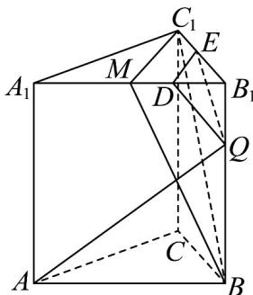
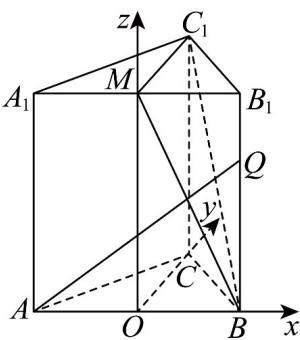

> [!faq]- 《第一章 空间向量与立体几何（高效培优单元测试·强化卷）》官方解析
>
> > [!success]- **【答案】** ABD
>
> > [!note]- **【分析】**
> > 对于选项 $^{A}$ ，利用线面垂直的性质可得到线线垂直；对于选项 $^{B}$ ，首先通过证明面面平行确定点P
> >
> > 的轨迹，进而可求得轨迹的长度；对于选项 $^{C}$ ，首先建立空间直角坐标系，然后将向量AQ, $BC_{1}$ 的坐标表
> >
> > 示出来，利用向量夹角的余弦值公式即可求出结果；对于选项 $^{D}$ ，首先求出平面 $MBC_{1}$ 的法向量，然后利
> >
> > $$
> > \stackrel {{\mathrm{UUU}}} {{Q A}}
> > $$
> >
> > 用旋转角将A的坐标及向量 $QA$ 的坐标表示出来，用向量夹角的余弦值公式求出表达式，然后根据旋转角
> >
> > 的范围求出结果即可·
>
> > [!note]- **【解析】**
> > 对于选项 A：
> >
> > 因为三棱柱 $ABC - A_{1}B_{1}C_{1}$ 为正三棱柱，点 M 为 $A_{1}B_{1}$ 的中点，
> >
> > 所以 $C_{1}M \perp A_{1}B_{1}, C_{1}M \perp AA_{1}$ ，因为 $A_{1}B_{1} \cap AA_{1} = A_{1}$ ，
> >
> > 所以 $C_{1}M \perp$ 平面 $ABB_{1}A_{1}$ ，又 $AQ \subset$ 平面 $ABB_{1}A_{1}$
> >
> > 所以 $C_{1}M \perp AQ$ · 所以 A 正确·
> >
> > 对于选项 B :
> >
> > 取 $MB_{1}, B_{1}C_{1}$ 的中点D,E，连接DE,DQ,EQ.
> >
> > 
> >
> > 在 $\triangle BB_{1}M$ 中， $DQ$ 为中位线，所以 $DQ // MB$ ，又 $MB \subset$ 平面 $MBC_{1}$ ， $DQ \notin$ 平面 $MBC_{1}$ ，则 $DQ //$ 平面 $MBC_{1}$ .
> >
> > 在 $\triangle BB_{1}C_{1}$ 中， $QE$ 为中位线，所以 $QE // BC_{1}$ 又 $BC_{1} \subset$ 平面 $MBC_{1}$ ， $QE \notin$ 平面 $MBC_{1}$ ，则 $EQ //$ 平面 $MBC_{1}$
> >
> > 又 $DQ \cap EQ = Q$ ， $DQ, EQ \subset$ 平面 DEQ，所以平面 $DEQ //$ 平面 $MBC_{1}$ .
> >
> > 又 P 为上底面的动点，则 P 的轨迹为 DE·
> >
> > 又 $MC_{1}=\sqrt{2^{2}-1}=\sqrt{3}$ ，所以 $DE=\frac{\sqrt{3}}{2}$ . B 正确.
> >
> > 取 AB 的中点 O，连接 OC, OM，
> >
> > 则以 O 为原点，以 OB, OC, OM 所在直线为 x, y, z 轴建立空间直角坐标系，
> >
> > 则 $A(-1,0,0)$ ， $Q\left(1,0,\frac{3}{2}\right)$ ， $B(1,0,0)$ ， $C_{1}(0,\sqrt{3},2)$ .
> >
> > 
> >
> > 所以 $\stackrel{\square\square\square}{AQ}=\left(2,0,\frac{3}{2}\right)$ ， $BC_{1}=\left(-1,\sqrt{3},2\right)$ .
> >
> > $$
> > \cos A Q, B C _ {1} = \frac {\overrightarrow {A Q} \cdot \overrightarrow {B C}}{\left| A Q \right| \left| B C _ {1} \right|} = \frac {- 2 + 3}{\sqrt {4 + \frac {9}{4}} \times \sqrt {1 + 4 + 3}} = \frac {1}{5 \sqrt {2}} = \frac {\sqrt {2}}{1 0}
> > $$
> >
> > 所以 AQ 与 $BC_{1}$ 夹角的余弦值为 $\frac{\sqrt{2}}{10}$ · 所以 C 错误.
> >
> > 对于选项 D：
> >
> > 因为 $M(0,0,2)$ ， $C_{1}(0,\sqrt{3},2)$ ， $B(1,0,0)$ .
> >
> > $$
> > \stackrel {{\sqcup \sqcup \sqcup}} {{M B}} = (1, 0, - 2), \stackrel {{\sqcup \sqcup \sqcup \sqcup}} {{M C _ {1}}} = (0, \sqrt {3}, 0).
> > $$
> >
> > 设平面 $MBC_{1}$ 的法向量为 $m=(x,y,z)$ ，则
> >
> > $\left\{ \begin{array}{l} MB \cdot m = 0 \\ MC_{1} \cdot m = 0 \end{array} \right.$ 则 $\left\{ \begin{array}{l} x - 2z = 0 \\ \sqrt{3}y = 0 \end{array} \right.$ ，令 $z = 1$ ，则 $m = (2,0,1)$ .
> >
> > 因为点 Q 为 $BB_{1}$ 的中点，则 $Q(1,0,1)$ .
> >
> > 在QA绕QB旋转过程中，设旋转角为 $\theta$ ，则 $\theta\in\left[0,\frac{\pi}{2}\right]$ .
> >
> > 所以 $A(-2\cos\theta+1,2\sin\theta,0)$ ，所以 $QA=(-2\cos\theta,2\sin\theta,-1)$ .
> >
> > 所以 $QA$ 与平面 $MBC_{1}$ 所成角的正弦值为 $\cos \left\langle QA, m \right\rangle = \frac{\left|\overrightarrow{QA} \cdot m\right|}{\left|QA\right|\left|m\right|} = \frac{4\cos\theta + 1}{\sqrt{5} \times \sqrt{5}} = \frac{4\cos\theta + 1}{5}$ .
> >
> > 因为 $\theta \in \left[0, \frac{\pi}{2}\right]$ ，所以 $\cos \theta \in [0,1]$ ，所以 $\frac{4\cos\theta + 1}{5} \in \left[\frac{1}{5}, 1\right]$ ，所以 $^D$ 正确·
> >
> > 故选 **ABD**.
