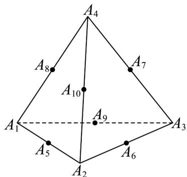

<!-- question-source:start -->
12．如图，在正四面体 $A_{1}A_{2}A_{3}A_{4}$ 中，点 $A_{5}$ 、 $A_{6}$ 、 $A_{7}$ 、 $A_{8}$ 、 $A_{9}$ 、 $A_{10}$ 分别是所在棱的中点，空间中的点 $P$ 满

足 $A_{4}P = xA_{4}A_{1} + yA_{4}A_{2} + zA_{4}A_{3}$ 且 $x + y + z = 1$ ，当 $\left|A_4P\right|$ 取到最小值时，记此时的点 $P$ 为 $P_0$ ，则当 $1\leq i$ 、

$j \leq 10$ 且 $i \neq j$ 时，数量积 $A_{4}P_{0} \cdot A_{i}A_{j}$ 的不同取值的个数是\_\_\_\_。

<!-- question-source:end -->

![[高中/课堂同步/题库/人教A版高中数学同步讲义(2026)/03_选择性必修第一册/第一章 空间向量与立体几何/第一章 空间向量与立体几何（高效培优单元测试·强化卷）/三_填空题/questions/answers/Q00079937A1.md]]
