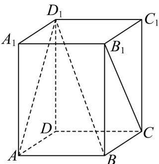

<!-- question-source:start -->
13．如图，在正四棱柱 $ABCD-A_{1}B_{1}C_{1}D_{1}$ 中，AB=BC=3， $AA_{1}=4$ ，则异面直线 $AD_{1}$ 与 $B_{1}C$ 所成角的余弦

值为\_\_\_\_；二面角 $D_{1}-AB-C$ 的正弦值为\_\_\_\_。

<!-- question-source:end -->

![[高中/课堂同步/题库/人教A版高中数学同步讲义(2026)/03_选择性必修第一册/第一章 空间向量与立体几何/第一章 空间向量与立体几何（高效培优单元测试·强化卷）/三_填空题/questions/answers/Q00079938A1.md]]
