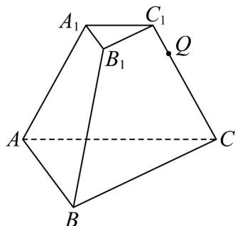

<!-- question-source:start -->
14．如图·已知正三棱台 $ABC - A_{1}B_{1}C_{1}$ 的上、下底面边长分别为2和6，侧棱长为4，点 $Q$ 为 $CC_{1}$ 上一点，且

$CQ = 3QC_{1}$ ，则过点 $A,B,Q$ 的平面截该棱台内最大的球所得的截面面积为

<!-- question-source:end -->

![[高中/课堂同步/题库/人教A版高中数学同步讲义(2026)/03_选择性必修第一册/第一章 空间向量与立体几何/第一章 空间向量与立体几何（高效培优单元测试·强化卷）/三_填空题/questions/answers/Q00079939A1.md]]
