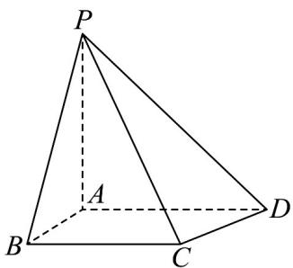

<!-- question-source:start -->
15. 如图所示的四棱锥 $P - ABCD$ 中， $PA \perp$ 平面 $ABCD$ ， $BC \parallel AD, AB \perp AD$

(1)证明：平面 $PAB \perp$ 平面 $PAD$ ；

(2) $PA = AB = \sqrt{2}, AD = 1 + \sqrt{3}, BC = 2, P, B, C, D$ 在同一个球面上，设该球面的球心为 $O$

(i) 证明： $O$ 在平面 $ABCD$ 上；

(ii) 求直线 $AC$ 与直线 $PO$ 所成角的余弦值.
<!-- question-source:end -->

![[高中/课堂同步/题库/人教A版高中数学同步讲义(2026)/03_选择性必修第一册/第一章 空间向量与立体几何/第一章 空间向量与立体几何（高效培优单元测试·强化卷）/三_填空题/questions/answers/Q00079940A1.md]]
