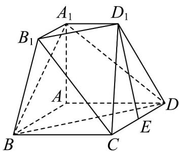

<!-- question-source:start -->
17. 如图，多面体 $A_{1}B_{1}D_{1} - ABCD$ 是三棱台 $A_{1}B_{1}D_{1} - ABD$ 和四棱锥 $C - BDD_{1}B_{1}$ 的组合体，底面四边形

$ABCD$ 为菱形， $\angle ABC = 60^{\circ}$ ， $AB = 2A_{1}B_{1} = 4$ ， $E$ 为 $CD$ 的中点，平面 $AA_{1}B_{1}B\perp$ 平面 $ABCD$ ， $AA_{1}\perp AB$

(1)证明： $D_{1}E//$ 平面 $A_{1}BD;$

(2)若平面 $A_{1}BD$ 与平面 $BB_{1}C$ 夹角的余弦值为 $\frac{\sqrt{42}}{7}$ ，求三棱台 $A_{1}B_{1}D_{1}-ABD$ 的体积.
<!-- question-source:end -->

![[高中/课堂同步/题库/人教A版高中数学同步讲义(2026)/03_选择性必修第一册/第一章 空间向量与立体几何/第一章 空间向量与立体几何（高效培优单元测试·强化卷）/三_填空题/questions/answers/Q00079942A1.md]]
