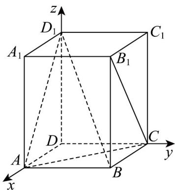

> [!faq]- 《第一章 空间向量与立体几何（高效培优单元测试·强化卷）》官方解析
>
> > [!success]- **【答案】** $\frac{7}{25}$ $\frac{4}{5} /0.8$
>
> > [!note]- **【分析】**
> > 建立空间直角坐标系 $O - xyz$ ，求得 $\overline{AD_1} = (-3,0,4),\overline{B_1C} = (-3,0,-4)$ 结合向量的夹角公式，即可求出直线 $AD_{1}$ 与 $B_{1}C$ 所成角的余弦值；分别求得平面 $D_{1}AB$ 和平面 $ABC$ 的一个法向量为 $\overline{n_1,n_2}$ ，结合向量的夹
> >
> > 角公式，即可求解·
>
> > [!note]- **【解析】**
> > 如图，以点 $D$ 为原点 $O$ ， $\overline{DA}, \overline{DC}, \overline{DD}_1$ 分别为 $x, y, z$ 轴的正方向，建立空间直角坐标系 $O - xyz$ ，则
> >
> > $$
> > D (0, 0, 0), B (3, 3, 0), A (3, 0, 0), C (0, 3, 0), A _ {1} (3, 0, 4), B _ {1} (3, 3, 4), C _ {1} (0, 3, 4), D _ {1} (0, 0, 4)
> > $$
> >
> > 
> >
> > $$
> > \stackrel {{\sqcup \sqcup \sqcup}} {{A D _ {1}}} = (- 3, 0, 4), \stackrel {{\sqcup \sqcup \sqcup}} {{B _ {1} C}} = (- 3, 0, - 4),
> > $$
> >
> > 所以 $\cos AD_{1}, B_{1}C = \frac{\left|AD_{1}\cdot B_{1}C\right|}{\left|AD_{1}\right|\cdot\left|B_{1}C\right|} = \frac{\left|9-16\right|}{\sqrt{(-3)^{2}+4^{2}}\cdot\sqrt{(-3)^{2}+(-4)^{2}}} = \frac{7}{25}.$
> >
> > 异面直线 $AD_{1}$ 与 $B_{1}C$ 所成角的余弦值为 $\frac{7}{25}$ .
> >
> > $$
> > \stackrel {{\square \square \square}} {{A D}} _ {1} = (- 3, 0, 4), \stackrel {{\square \square \square}} {{A B}} = (0, 3, 0),
> > $$
> >
> > 设面 $D_{1}AB$ 一个法向量为 $\stackrel{\square}{n}_{1} = (x,y,z)$
> >
> > 由 $\left\{\begin{aligned}\overline{n_{1}}\cdot\overline{AD}_{1}&=0\\ n_{1}\cdot AB&=0\end{aligned}\right.$ ，得 $\left\{\begin{aligned}-3x+4z&=0\\ 3y&=0\end{aligned}\right.$ ，令 x=4,z=3,y=0，
> >
> > 则 $n_1 = (4,0,3)$ ，设面ABC一个法向量为 $n_2 = (0,0,1)$
> >
> > $$
> > \cos n _ {1}, n _ {2} = \frac {\vec {n} _ {1} \cdot \vec {n} _ {2}}{\left| n _ {1} \right| \left| n _ {2} \right|} = \frac {3}{5}
> > $$
> >
> > 所以二面角 $D_{1} - AB - C$ 的正弦值为 $\sqrt{1 - \left(\frac{3}{5}\right)^2} = \frac{4}{5}$
> >
> > 故答案为： $\frac{7}{25}$ ; $\frac{4}{5}$ .
