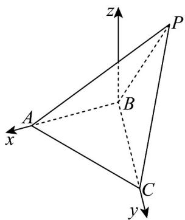

> [!faq]- 《第一章 空间向量与立体几何（高效培优单元测试·强化卷）》官方解析
>
> > [!success]- **【答案】** $^{(1)}$ 证明见解析 (2) $\frac{\sqrt{15}}{5}$
>
> > [!note]- **【分析】**
> > （1）在三角形里用余弦定理求边长，由勾股定理逆定理得 $BC \perp BP$ ，再 $BC \perp AB$ 证得 $BC \perp$ 平面
> >
> > PAB，进而得面面垂直·
> >
> > (2) 先建空间直角坐标系，确定相关点坐标，得到向量坐标，通过法向量与平面内向量垂直列方程组求
> >
> > 平面 ACP 法向量，已知平面 ABC 法向量，最后用公式求两平面夹角余弦值
>
> > [!note]- **【解析】**
> > （1）证明：Rt△ ABC 中，AB = BC = 2， $AB \perp BC$ ，则有 $AC = 2\sqrt{2}$ ；
> >
> > 在 $\triangle ABP$ 中，AB=BP=2， $\angle PAB=30^{\circ}$ ，
> >
> > 由余弦定理， $BP^{2}=AB^{2}+AP^{2}-2AB\cdot AP\cdot\cos\angle PAB$ ，解得 $AP=2\sqrt{3}$
> >
> > $\therefore^{\triangle}ACP$ 中，由余弦定理： $CP^{2}+8-2\times2\sqrt{2}\times CP\times\frac{1}{4}=12\Rightarrow CP=2\sqrt{2}$
> >
> > $\therefore BC^{2} + BP^{2} = CP^{2}\Rightarrow BC\perp BP$
> >
> > 又 $BC \perp AB$ ， $AB \cap BP = B$ ，所以 $BC \perp$ 平面 PAB，
> >
> > 又 $BC \subset$ 平面 ABC ，所以平面 $PAB \perp$ 平面 ABC .
> >
> > (2) 解：建系如图，以点 B 为原点，BA 为 x 轴，BC 为 y 轴建立坐标系，
> >
> > 
> >
> > 在等腰三角形 $PAB$ 中， $PA = 2\sqrt{3}$ ，则 $P\left(-1,0,\sqrt{3}\right)$
> >
> > $$
> > \therefore A (2, 0, 0) \quad B (0, 0, 0) \quad C (0, 2, 0)
> > $$
> >
> > $$
> > \therefore P A = (3, 0, - \sqrt {3}) \quad A C = (- 2, 2, 0).
> > $$
> >
> > 设 $n=(x,y,z)$ 是平面 ACP 的一个法向量，
> >
> > $$
> > \therefore \left\{\begin{array}{l}n \cdot P A = 0,\\\rightarrow \square \square \square\\n \cdot A C = 0\end{array}\Rightarrow \left\{\begin{array}{l}3 x - \sqrt {3} z = 0,\\- 2 x + 2 y = 0,\end{array}\right. \right.
> > $$
> >
> > 令 $x = 1$ ，则 $n = (1,1,\sqrt{3})$
> >
> > 平面 $ABC$ 的一个法向量 $m = (0,0,1)$
> >
> > 设平面 ABC 与平面 ACP 夹角为 $\theta$ ，
> >
> > 则 $\cos \theta = \frac{\left|\underset{\rightarrow}{n} \cdot m\right|}{\left|n\right| \cdot \left|m\right|} = \frac{\sqrt{15}}{5}$
> >
> > ∴平面 ABC 与平面 ACP 夹角的余弦值为 $\frac{\sqrt{15}}{5}$
