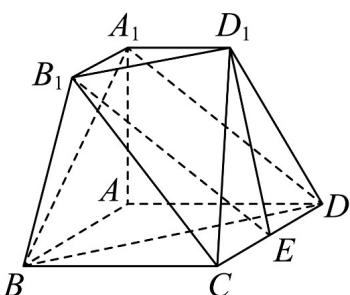
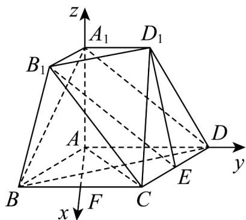

> [!faq]- 《第一章 空间向量与立体几何（高效培优单元测试·强化卷）》官方解析
>
> > [!success]- **【答案】** (1)证明见解析 (2) $\frac{14\sqrt{3}}{3}$
>
> > [!note]- **【分析】**
> > （1）利用线面平行的判定定理即可证明·
> >
> > (2) 利用两个平面夹角的向量求法求出 $AA_{1}=2$ ，再利用棱台的体积公式即可求得结果.
>
> > [!note]- **【解析】**
> > （1）
> >
> > 
> >
> > 证明：连接 $B_{1}E$ ，因为 $BD // B_{1}D_{1}$ ， $BD \notin$ 平面 $B_{1}D_{1}E$ ， $B_{1}D_{1} \subset$ 平面 $B_{1}D_{1}E$
> >
> > 所以 $BD / /$ 平面 $B_{1}D_{1}E$
> >
> > 因为 $A_{1}B_{1} \parallel AB$ ， $A_{1}B_{1} = \frac{1}{2} AB$ ，DE // AB， $DE = \frac{1}{2} AB$ ，
> >
> > 所以 $A_{1}B_{1} //DE$ ， $A_{1}B_{1} = DE$
> >
> > 所以四边形 $A_{1}B_{1}ED$ 为平行四边形，所以 $A_{1}D // B_{1}E$
> >
> > 又 $A_{1}D \not\subset$ 平面 $B_{1}D_{1}E$ ， $B_{1}E \subset$ 平面 $B_{1}D_{1}E$ ，所以 $A_{1}D //$ 平面 $B_{1}D_{1}E$ ，
> >
> > 因为 $A_{1}D \cap BD = D$ ， $A_{1}D$ ， $BD \subset$ 平面 $A_{1}BD$ ，
> >
> > 所以平面 $A_{1}BD \parallel$ 平面 $B_{1}D_{1}E$ ，又 $D_{1}E \subset$ 平面 $B_{1}D_{1}E$ ，
> >
> > 所以 $D_{1}E \parallel$ 平面 $A_{1}BD$ ;
> >
> > (2) 因为平面 $AA_{1}B_{1}B \perp$ 平面 ABCD，
> >
> > 平面 $AA_{1}B_{1}B\subset$ 平面 $ABCD = AB$ ， $AA_{1}\bot AB$ ， $AA_{1}\subset$ 平面 $AA_{1}B_{1}B$
> >
> > 所以 $AA_{1} \perp$ 平面 ABCD ，
> >
> > 取 $BC$ 的中点 $F$ ，连接 $AF$ ， $AC$ ，因为四边形 $ABCD$ 为菱形， $\angle ABC = 60^{\circ}$
> >
> > 所以 VABC 为等边三角形，所以 $AF \perp BC$ ，
> >
> > 又 $AD \parallel BC$ ，所以 $AF \perp AD$ ，
> >
> > 所以 AF，AD， $AA_{1}$ 两两垂直，
> >
> > 则以 A 为原点，A F，A D， $AA_{1}$ 所在直线分别为 x，y，z 轴，建立如图所示的空间直角坐标系，
> >
> > 
> >
> > 设 $AA_{1}=t,\quad t>0$
> >
> > 则 $A_{1}(0,0,t)$ ， $B\left(2\sqrt{3}, - 2,0\right)$ ， $C\left(2\sqrt{3},2,0\right)$ ， $B_{1}\left(\sqrt{3}, - 1,t\right)$ ， $D(0,4,0)$
> >
> > 所以 $\overset{\cup\cup\cup}{BA}_{1}=\left(-2\sqrt{3},2,t\right)$ ， $\overset{\cup\cup\cup}{BD}=\left(-2\sqrt{3},6,0\right)$ ， $\overset{\cup\cup\cup}{BC}=\left(0,4,0\right)$ ， $\overset{\cup\cup\cup}{BB}_{1}=\left(-\sqrt{3},1,t\right)$
> >
> > 设平面 $A_{1}BD$ 的法向量为 $n = (x_{1}, y_{1}, z_{1})$ ,
> >
> > 则 $\left\{ \begin{array}{l} n \cdot BA = 0 \\ n \cdot BD = 0 \end{array} \right.$ 即 $\left\{ \begin{array}{c} -2\sqrt{3} x_1 + 2y_1 + tz_1 = 0 \\ -2\sqrt{3} x_1 + 6y_1 = 0 \end{array} \right.$ ，
> >
> > 取 $x_{1} = \sqrt{3}$ ，得 $y_{1} = 1, z_{1} = \frac{4}{t}$
> >
> > 故平面 $A_{1}BD$ 的一个法向量为 $\vec{n} = \left(\sqrt{3}, 1, \frac{4}{t}\right)$
> >
> > 设平面 $BB_{1}C$ 的法向量为 $m = (x_{2},y_{2},z_{2})$
> >
> > 则 $\left\{ \begin{array}{l} m \cdot BC = 0 \\ m \cdot BB_{1} = 0 \end{array} \right.$ 即 $\left\{ \begin{array}{l} 4y_{2} = 0 \\ -\sqrt{3}x_{2} + y_{2} + tz_{2} = 0 \end{array} \right.$
> >
> > 取 $x_{2} = \sqrt{3}$ ，得 $y_{2} = 0$ ， $z_{2} = \frac{3}{t}$
> >
> > 故平面 $BB_{1}C$ 的一个法向量为 $\vec{m} = \left(\sqrt{3},0,\frac{3}{t}\right)$
> >
> > 设平面 $A_{1}BD$ 与平面 $BB_{1}C$ 的夹角为 $\theta$ ，
> >
> > 则 $\cos\theta=\left|\cos\left\langle\overrightarrow{m,n}\right\rangle\right|=\frac{\left|\underline{m}\cdot n\right|}{\left|m\right|\cdot\left|n\right|}$
> >
> > $= \frac{3 + \frac{12}{t^2}}{\sqrt{3 + 1 + \frac{16}{t^2}}\cdot\sqrt{3 + \frac{9}{t^2}}} = \frac{\sqrt{42}}{7}$ ，解得或舍，即 $t = 2 - 2(\quad)\quad AA_{1} = 2$ 因为 $\triangle A_{1}B_{1}D_{1}$ 的面积为 $\frac{1}{2}\times 2\times 2\times \frac{\sqrt{3}}{2} = \sqrt{3}$
> >
> > $\triangle ABD$ 的面积为 $\frac{1}{2} \times 4 \times 4 \times \frac{\sqrt{3}}{2} = 4\sqrt{3}$
> >
> > 所以三棱台 $A_{1}B_{1}D_{1}-ABD$ 的体积
> >
> > $$
> > V = \frac {1}{3} \times \left(\sqrt {3} + 4 \sqrt {3} + \sqrt {\sqrt {3} \times 4 \sqrt {3}}\right) \times 2 = \frac {1 4 \sqrt {3}}{3}
> > $$
