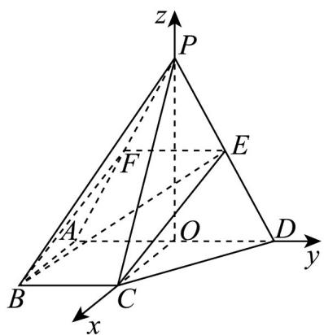

> [!faq]- 《第一章 空间向量与立体几何（高效培优单元测试·强化卷）》官方解析
>
> > [!success]- **【答案】** (1)证明见解析 (2) $\frac{\sqrt{21}}{14}$
>
> > [!note]- **【分析】**
> > （1）取 PA 的中点 F，证明 $CE \parallel BF$ ，再利用线面平行的判定定理即可；
> >
> > (2) 取 $AD$ 的中点为 $O$ ，以 $O$ 为原点建系，求出平面 $PCD$ 的法向量，再根据向量夹角与线面角的关系即可
> >
> > 求出·
>
> > [!note]- **【解析】**
> > （1）取 $PA$ 的中点 $F$ ，连接 $EF$ ， $BF$ ，
> >
> > ∵ E 为 PD 的中点，∴ EF // AD 且 $EF = \frac{1}{2} AD$ ，
> >
> > 又 $BC = \frac{1}{2} AD$ ， $BC / / AD$ ，则 $EF / / BC$ 且 $EF = BC$ ，
> >
> > ∴四边形 BCEF 是平行四边形，∴ CE//BF，
> >
> > ∵CE∉平面PAB，BF⊂平面PAB，
> >
> > ∴ CE// 平面 PAB·
> >
> > (2) 取 $AD$ 的中点为 $O$ ，连接 $OC$ ，因 $PA = PD$ ，则 $PO \perp AD$
> >
> > 因平面 $PAD \perp$ 平面 $ABCD$ ，平面 $PAD \cap$ 平面 $ABCD = AD$ ， $PO \subset$ 平面 $PAD$ ，
> >
> > 则 $PO \perp$ 平面 $ABCD$ ，又 $CO \subset$ 面 $ABCD$ ，则 $PO \perp CO$ ，
> >
> > 又 $AO = BC$ ， $AO // BC$ ， $AB \perp AD$ ，则 $OC \perp AD$ ，故 $OP$ ， $OD$ ， $OC$ 两两垂直，
> >
> > 以 O 为坐标原点，分别以 OC，OD，OP 所在直线为 x，y，z 轴，建立如图所示的空间直角坐标系，
> >
> > 由 $\triangle PAD$ 是边长为 $^4$ 的等边三角形，得 $PO = 2\sqrt{3}$
> >
> > $\therefore B(2,-2,0)$ , $P(0,0,2\sqrt{3})$ , $D(0,2,0)$ , $C(2,0,0)$ , $E(0,1,\sqrt{3})$ ,
> >
> > $$
> > \therefore B E = (- 2, 3, \sqrt {3}) \quad C P = (- 2, 0, 2 \sqrt {3}) \quad C D = (- 2, 2, 0)
> > $$
> >
> > 设平面 $PCD$ 的法向量为 $n = (x,y,z)$ ，则 $\left\{ \begin{array}{l} \square \square \square \\ CD \cdot n = -2x + 2y = 0 \end{array} \right.$ ，
> >
> > $$
> > \left\{ \begin{array}{l} \square \square \square \\ C P \cdot n = - 2 x + 2 \sqrt {3} z = 0 \\ \square \square \square \\ C D \cdot n = - 2 x + 2 y = 0 \end{array} \right.
> > $$
> >
> > 令 $x = \sqrt{3}$ ，得 $y = \sqrt{3}$ ， $z = 1$ ，即平面PCD的一个法向量为 $n = (\sqrt{3},\sqrt{3},1)$ ；
> >
> > $$
> > \cos <   \overrightarrow {B E}, n > = \frac {\overrightarrow {B E} \cdot n}{| B E | | n |} = \frac {- 2 \sqrt {3} + 3 \sqrt {3} + \sqrt {3}}{\sqrt {4 + 9 + 3} \times \sqrt {3 + 3 + 1}} = \frac {2 \sqrt {3}}{4 \sqrt {7}} = \frac {\sqrt {2 1}}{1 4}
> > $$
> >
> > $$
> > \sqrt {2 1}
> > $$
> >
> > ∴直线 BE 与平面 PCD 所成角的正弦值为 14
> >
> > 
