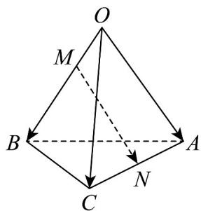

<!-- question-source:start -->
5．如图，在四面体OABC中， $\overline{OA}=a,\overline{OB}=b,\overline{OC}=c$ 点M在OB上，且 $OM=\frac{1}{2}MB$ ，点N是AC的中点，

则 $MN =$ （

A. $\frac{1}{2} a - \frac{1}{3} b + \frac{1}{2} c$ B. $-\frac{1}{2} a + \frac{1}{3} b - \frac{1}{2} c$ C. $\frac{1}{2} a - \frac{2}{3} b + \frac{1}{2} c$ D. $-\frac{1}{2} a + \frac{2}{3} b - \frac{1}{2} c$
<!-- question-source:end -->

![[高中/课堂同步/题库/人教A版高中数学同步讲义(2026)/03_选择性必修第一册/第一章 空间向量与立体几何/第一章 空间向量与立体几何（高效培优单元测试·提升卷）/一_选择题/questions/answers/Q00079948A1.md]]
